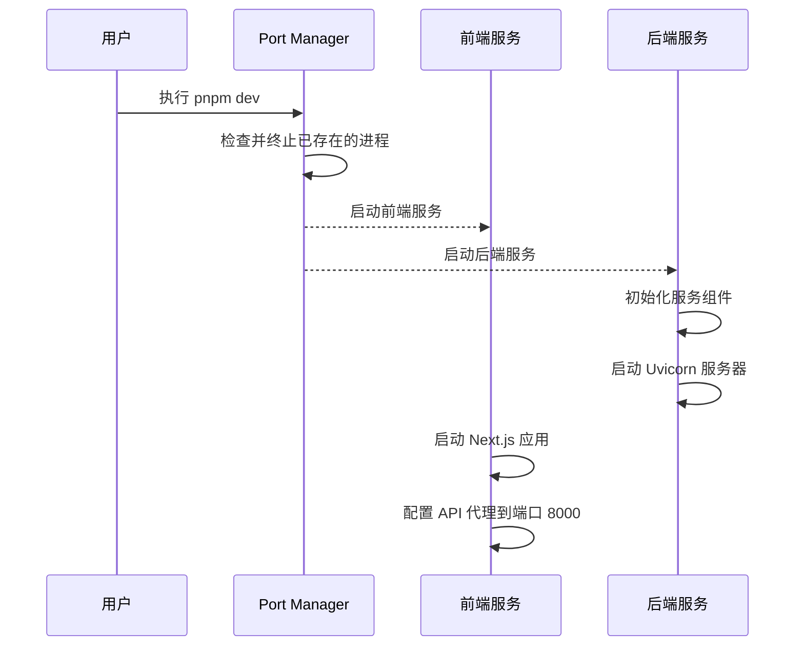
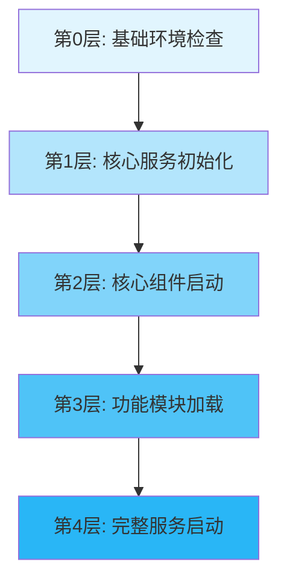

# Unified AI Project 开发服务器启动问题分析与解决方案

## 1. 概述

本文档分析了在执行 `pnpm dev` 命令启动 Unified AI Project 开发环境时出现的后端服务连接失败问题，并提供相应的解决方案。问题表现为前端仪表板可以正常启动并监听3000端口，但无法连接到后端API服务（localhost:8000）。

## 2. 问题分析

### 2.1 错误现象
- 前端仪表板成功启动，监听端口 3000
- 后端服务启动失败，无法建立与 localhost:8000 的连接
- 浏览器显示连接被拒绝错误

### 2.2 系统架构
Unified AI Project 采用前后端分离架构：
- 前端：Next.js 仪表板应用，运行在端口 3000
- 后端：FastAPI 服务，应运行在端口 8000
- 通信：前端通过代理将 API 请求转发到后端

### 2.3 启动流程分析



## 3. 根本原因分析

### 3.1 后端服务启动失败
通过分析 `scripts/smart_dev_runner.py` 和 `src/services/main_api_server.py` 文件发现：

1. 后端服务在启动过程中未能成功初始化所有依赖组件
2. 在 `main_api_server.py` 中存在复杂的导入逻辑，可能在某些环境下无法正确解析模块路径
3. 服务初始化时可能因为缺少必要的环境变量或配置文件导致启动失败

### 3.2 导入路径问题
后端服务使用了复杂的导入路径处理机制：
- 尝试使用绝对导入
- 失败后回退到相对导入
- 可能在某些开发环境中无法正确解析模块路径

### 3.3 服务依赖问题
后端服务依赖多个核心组件：
- EconomyManager
- PetManager
- HAMMemoryManager
- HSPConnector
- DialogueManager

如果任何一个组件初始化失败，可能导致整个服务启动失败。

## 4. 解决方案

### 4.1 优化后端服务启动流程

#### 4.1.1 简化导入路径处理
修改 `apps/backend/src/services/main_api_server.py` 文件中的导入逻辑：

```python
# 简化导入路径处理
project_root = os.path.abspath(os.path.join(os.path.dirname(__file__), '..', '..'))
src_dir = os.path.join(project_root, 'src')
apps_backend_dir = os.path.join(project_root)

# 确保路径添加顺序正确
if project_root not in sys.path:
    sys.path.insert(0, project_root)
if src_dir not in sys.path:
    sys.path.insert(0, src_dir)
if apps_backend_dir not in sys.path:
    sys.path.insert(0, apps_backend_dir)
```

#### 4.1.2 增强错误处理和日志记录
在服务初始化过程中增加更详细的错误处理和日志记录：

```python
# 在 initialize_services 函数中增加详细的错误处理
try:
    await initialize_services(ai_id=ai_id, use_mock_ham=True)
    print("Services initialized successfully")
except Exception as e:
    print(f"Failed to initialize services: {e}")
    import traceback
    traceback.print_exc()
    raise
```

### 4.2 改进开发服务器运行脚本

#### 4.2.1 增强错误检测机制
修改 `scripts/smart_dev_runner.py` 文件，增强错误检测和自动修复机制：

```python
def detect_dev_errors(stderr_output, stdout_output):
    """检测开发服务器启动错误"""
    errors = []
    
    # 合并输出
    full_output = (stdout_output or "") + (stderr_output or "")
    
    # 检测导入错误
    import_error_patterns = [
        r"ModuleNotFoundError: No module named '([^']+)'",
        r"ImportError: cannot import name '([^']+)'",
        r"ImportError: No module named '([^']+)'",
        r"NameError: name '([^']+)' is not defined",
    ]
    
    for pattern in import_error_patterns:
        matches = re.findall(pattern, full_output)
        for match in matches:
            if match not in errors:
                errors.append(match)
    
    # 检测路径错误
    path_error_patterns = [
        r"No module named 'core_ai",
        r"No module named 'hsp",
        r"from \.\.core_ai",
    ]
    
    for pattern in path_error_patterns:
        if re.search(pattern, full_output):
            errors.append("path_error")
            
    # 检测Uvicorn错误
    if "uvicorn" in full_output.lower() and "error" in full_output.lower():
        errors.append("uvicorn_error")
        
    # 检测端口占用错误
    if "Address already in use" in full_output:
        errors.append("port_in_use")
        
    return errors
```

#### 4.2.2 增加重试机制
在启动失败时增加重试机制：

```python
def start_uvicorn_server(max_retries=3):
    """启动Uvicorn服务器"""
    for attempt in range(max_retries):
        print(f"🚀 尝试启动Uvicorn服务器 (尝试 {attempt + 1}/{max_retries})...")
        
        try:
            # 构建命令
            cmd = [
                sys.executable, "-m", "uvicorn", 
                "src.services.main_api_server:app", 
                "--reload", "--host", "127.0.0.1", "--port", "8000"
            ]
            
            print(f"执行命令: {' '.join(cmd)}")
            
            # 启动Uvicorn服务器
            uvicorn_process = subprocess.Popen(
                cmd,
                cwd=PROJECT_ROOT,
                stdout=subprocess.PIPE,
                stderr=subprocess.STDOUT,
                text=True,
                env={**os.environ, "PYTHONPATH": str(PROJECT_ROOT)}
            )
            
            # 等待更长时间让服务器启动
            time.sleep(15)
            
            # 检查进程是否仍在运行
            if uvicorn_process.poll() is None:
                print("✅ Uvicorn服务器启动成功")
                return uvicorn_process, ""
            else:
                # 获取错误输出
                stdout, stderr = uvicorn_process.communicate()
                print(f"❌ Uvicorn服务器启动失败: {stderr}")
                print(f"标准输出: {stdout}")
                if attempt < max_retries - 1:
                    print("等待5秒后重试...")
                    time.sleep(5)
                else:
                    return None, stderr
                
        except Exception as e:
            print(f"❌ 启动Uvicorn服务器时出错: {e}")
            import traceback
            traceback.print_exc()
            if attempt < max_retries - 1:
                print("等待5秒后重试...")
                time.sleep(5)
            else:
                return None, str(e)
```

### 4.3 前端代理配置优化

#### 4.3.1 增强代理错误处理
修改 `apps/frontend-dashboard/server.ts` 文件中的代理配置：

```typescript
const apiProxy = createProxyMiddleware({
  target: `http://127.0.0.1:${PORT_CONFIG.BACKEND_API}`, // 使用IP地址而非localhost
  changeOrigin: true,
  pathRewrite: {},
  onProxyReq: (proxyReq, req, res) => {
    console.log(`Proxying: ${req.method} ${req.url} -> http://127.0.0.1:${PORT_CONFIG.BACKEND_API}${proxyReq.path}`);
  },
  onProxyRes: (proxyRes, req, res) => {
    console.log(`Proxy response: ${proxyRes.statusCode} for ${req.url}`);
  },
  onError: (err, req, res) => {
    console.error('Proxy error:', err);
    if (!res.headersSent) {
      res.writeHead(502, { 'Content-Type': 'text/plain' });
      res.end('Backend service is not available. Please check if the backend server is running.');
    }
  }
});
```

### 4.4 分层启动策略

您的想法非常好！分层启动确实是一种有效的解决方案。通过按优先级顺序启动服务，可以确保核心服务先启动并稳定运行，然后再启动依赖它们的组件。这种策略可以显著提高系统稳定性和启动成功率。

#### 4.4.1 分层启动架构设计



#### 4.4.2 各层启动内容

**第0层：基础环境检查**
- 检查Python环境和依赖包
- 验证必要的环境变量
- 检查端口可用性
- 创建必要的目录结构
- 检查配置文件完整性

**第1层：核心服务初始化**
- 初始化HAM内存管理系统
- 启动多LLM服务接口
- 初始化服务发现机制

**第2层：核心组件启动**
- 启动HSP连接器
- 初始化对话管理系统
- 启动信任管理器

**第3层：功能模块加载**
- 加载经济系统管理器
- 启动宠物管理系统
- 初始化其他业务模块

**第4层：完整服务启动**
- 启动API服务器
- 初始化WebSocket连接
- 启动定时任务调度器

#### 4.4.2.1 未启动服务的错误处理

在分层启动过程中，如果某个服务未能成功启动，系统将执行以下操作：

1. **错误捕获**：立即捕获并记录错误信息，包括错误类型、错误消息和堆栈跟踪
2. **错误分类**：根据错误类型将错误分为以下几类：
   - 环境错误：如Python环境不正确、依赖包缺失等
   - 配置错误：如配置文件缺失或配置项不正确
   - 网络错误：如端口被占用、网络连接失败等
   - 代码错误：如语法错误、逻辑错误等
3. **错误报告**：生成详细的错误报告，包括：
   - 错误发生的时间和位置
   - 错误的详细描述
   - 可能的解决方案建议
   - 相关的日志信息
4. **错误恢复**：根据错误类型尝试自动恢复：
   - 对于环境错误，提示用户安装缺失的依赖包
   - 对于配置错误，尝试使用默认配置或提示用户修复配置
   - 对于网络错误，尝试重新连接或更换端口
   - 对于代码错误，记录错误信息并停止启动过程
5. **服务隔离**：确保一个服务的启动失败不会影响其他服务的启动

#### 4.4.3 实施方案

1. 修改 `scripts/smart_dev_runner.py` 实现分层启动：

```python
def start_services_layered():
    """分层启动服务"""
    print("🚀 开始分层启动服务...")
    
    # 第0层: 基础环境检查
    print("📋 第0层: 基础环境检查")
    try:
        if not check_environment():
            print("❌ 环境检查失败")
            return False
        print("✅ 环境检查通过")
    except Exception as e:
        print(f"❌ 环境检查时发生错误: {e}")
        import traceback
        traceback.print_exc()
        return False
    
    # 第1层: 核心服务初始化
    print("🔧 第1层: 核心服务初始化")
    try:
        if not initialize_core_services():
            print("❌ 核心服务初始化失败")
            return False
        print("✅ 核心服务初始化完成")
    except Exception as e:
        print(f"❌ 核心服务初始化时发生错误: {e}")
        import traceback
        traceback.print_exc()
        return False
    
    # 第2层: 核心组件启动
    print("⚙️ 第2层: 核心组件启动")
    try:
        if not start_core_components():
            print("❌ 核心组件启动失败")
            return False
        print("✅ 核心组件启动完成")
    except Exception as e:
        print(f"❌ 核心组件启动时发生错误: {e}")
        import traceback
        traceback.print_exc()
        return False
    
    # 第3层: 功能模块加载
    print("🔌 第3层: 功能模块加载")
    try:
        if not load_functional_modules():
            print("❌ 功能模块加载失败")
            return False
        print("✅ 功能模块加载完成")
    except Exception as e:
        print(f"⚠️ 功能模块加载时发生错误: {e}")
        import traceback
        traceback.print_exc()
        # 功能模块失败不影响核心服务
    
    # 第4层: 完整服务启动
    print("🌐 第4层: 完整服务启动")
    try:
        if not start_full_services():
            print("❌ 完整服务启动失败")
            return False
        print("✅ 所有服务启动完成")
    except Exception as e:
        print(f"❌ 完整服务启动时发生错误: {e}")
        import traceback
        traceback.print_exc()
        return False
    
    return True
```

2. 在 `src/services/main_api_server.py` 中实现分层初始化：

```python
async def initialize_services_layered():
    """分层初始化服务"""
    print("🔧 开始分层初始化服务...")
    
    # 第1层: 核心服务初始化
    print("🔧 第1层: 核心服务初始化")
    try:
        # 初始化HAM内存管理
        ham_manager = await initialize_ham_service()
        print("✅ HAM服务初始化完成")
        
        # 初始化多LLM服务
        llm_interface = await initialize_llm_service()
        print("✅ LLM服务初始化完成")
        
        # 初始化服务发现
        service_discovery = await initialize_service_discovery()
        print("✅ 服务发现初始化完成")
    except Exception as e:
        print(f"❌ 核心服务初始化失败: {e}")
        import traceback
        traceback.print_exc()
        return False
    
    # 第2层: 核心组件启动
    print("⚙️ 第2层: 核心组件启动")
    try:
        # 初始化HSP连接器
        hsp_connector = await initialize_hsp_connector()
        print("✅ HSP连接器初始化完成")
        
        # 初始化对话管理器
        dialogue_manager = await initialize_dialogue_manager()
        print("✅ 对话管理器初始化完成")
    except Exception as e:
        print(f"❌ 核心组件启动失败: {e}")
        import traceback
        traceback.print_exc()
        return False
    
    # 第3层: 功能模块加载
    print("🔌 第3层: 功能模块加载")
    try:
        # 加载经济系统
        economy_manager = await initialize_economy_manager()
        print("✅ 经济系统初始化完成")
        
        # 加载宠物系统
        pet_manager = await initialize_pet_manager()
        print("✅ 宠物系统初始化完成")
    except Exception as e:
        print(f"⚠️ 功能模块加载失败: {e}")
        import traceback
        traceback.print_exc()
        # 功能模块失败不影响核心服务
    
    print("✅ 服务分层初始化完成")
    return True
```

#### 4.4.3.1 与现有代码的集成

分层启动机制将与现有代码无缝集成，通过以下方式实现：

1. **兼容性设计**：新的分层启动机制将保持与现有启动流程的兼容性，确保现有功能不受影响
2. **模块化实现**：将分层启动的各个组件实现为独立的模块，便于维护和扩展
3. **配置驱动**：通过配置文件控制分层启动的行为，允许根据需要调整启动顺序和策略
4. **渐进式迁移**：逐步将现有服务迁移到分层启动机制，避免一次性大规模修改带来的风险

#### 4.4.3.2 配置与设置的自动化

为了最大程度减少手动配置，系统将实现以下自动化机制：

1. **环境自动检测**：自动检测Python环境、依赖包和必要的环境变量
2. **配置文件自动生成**：根据默认模板自动生成配置文件，并提供合理的默认值
3. **端口自动分配**：在默认端口被占用时，自动选择可用端口并更新相关配置
4. **依赖自动安装**：检测缺失的依赖包并提供自动安装选项
5. **配置验证**：在启动前自动验证配置文件的完整性和正确性
6. **手动配置选项**：为特殊情况提供手动配置选项，确保系统灵活性

## 5. 实施计划

### 5.1 短期解决方案
1. 修改后端服务导入路径处理逻辑
2. 增强错误日志记录
3. 优化前端代理配置
4. 实现基础的分层启动机制
5. 增加详细的错误报告机制

### 5.2 中期解决方案
1. 实现自动重试机制
2. 增强错误检测和自动修复功能
3. 完善服务健康检查机制
4. 优化分层启动策略，增加层间依赖检查
5. 实现与现有代码的无缝集成

### 5.3 长期解决方案
1. 建立完整的开发环境自检工具
2. 实现服务依赖关系的可视化管理
3. 提供一键式环境修复功能
4. 实现智能的分层启动优化，根据系统资源动态调整启动顺序
5. 实现配置与设置的自动化

## 6. 验证方案

### 6.1 验证步骤
1. 执行 `pnpm dev` 命令启动开发环境
2. 检查前端服务是否正常启动并监听3000端口
3. 检查后端服务是否正常启动并监听8000端口
4. 验证前端能否成功代理API请求到后端服务
5. 测试核心功能是否正常工作
6. 验证分层启动是否按预期顺序执行
7. 验证错误报告机制是否正常工作
8. 验证新功能与现有代码的集成效果
9. 验证配置与设置的自动化程度

### 6.2 验证标准
- 前端仪表板能够正常访问
- 后端API服务能够正常响应请求
- 前后端之间能够正常通信
- 无明显的错误日志输出
- 服务按分层顺序正确启动
- 错误能够被准确捕获和报告
- 新功能与现有代码无缝集成
- 配置与设置实现最大程度的自动化

## 7. 风险评估与缓解措施

### 7.1 风险识别
1. 修改导入路径可能引入新的兼容性问题
2. 增强错误处理可能掩盖真实的错误信息
3. 重试机制可能导致启动时间延长
4. 分层启动机制可能增加系统复杂性
5. 自动化配置可能无法处理所有特殊情况

### 7.2 缓解措施
1. 在修改前备份原始文件
2. 分步骤实施修改并逐一验证
3. 提供回滚机制以应对意外情况
4. 增加详细的日志记录以便问题排查
5. 为自动化配置提供手动配置选项
6. 实现分层启动的可配置化，允许根据需要调整启动策略