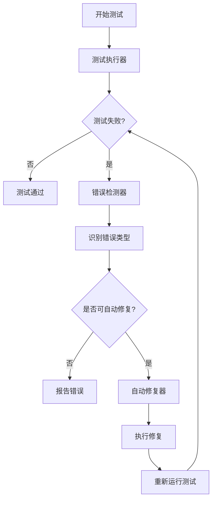

# Unified AI Project 分离测试和自动修复系统

## 概述

本系统实现了测试执行和自动修复功能的分离，确保它们在终端中有清晰的分离显示，同时保持完整的功能流程（测试>错误>自动修复>继续测试）。

## 系统架构



## 组件说明

### 1. 测试执行器 (test_runner.py)
- 负责运行测试并收集结果
- 将测试结果保存到 `test_results.json` 文件中
- 在终端中显示测试输出

### 2. 错误分析器 (error_analyzer.py)
- 分析测试结果文件，识别不同类型的错误
- 生成详细的错误报告保存到 `error_report.json`
- 支持多种错误类型的识别：
  - 异步测试协程警告
  - 对象初始化错误
  - 属性错误
  - 断言失败
  - 超时错误
  - 导入路径错误
  - 配置问题

### 3. 修复执行器 (fix_executor.py)
- 根据错误报告执行相应的修复操作
- 支持多种自动修复功能
- 生成修复日志

### 4. 流程控制器 (workflow_controller.py)
- 协调整个测试-修复流程
- 支持在不同终端中运行测试和修复

### 5. 增强版自动修复工具 (enhanced_auto_fix.py)
- 提供更多自动修复功能
- 专门针对特定类型的错误进行修复

## 使用方法

### 方法1: 在同一终端中运行（推荐用于CI/CD）

```bash
cd apps/backend
python scripts/workflow_controller.py
```

### 方法2: 在不同终端中运行（推荐用于开发）

```bash
cd apps/backend
powershell -ExecutionPolicy Bypass -File scripts/start_separate_terminals.ps1
```

或者直接运行：

```bash
cd apps/backend
python scripts/workflow_controller.py --separate-terminals
```

### 方法3: 分别运行各组件

1. 在第一个终端中运行测试：
```bash
cd apps/backend
python scripts/test_runner.py
```

2. 在第二个终端中分析错误和执行修复：
```bash
cd apps/backend
python scripts/error_analyzer.py
python scripts/fix_executor.py
```

## 错误类型和修复策略

### 1. 异步测试协程警告
- **检测方法**: 匹配 `RuntimeWarning: coroutine .* was never awaited`
- **修复策略**: 在协程调用前添加 `await` 关键字

### 2. 对象初始化错误
- **检测方法**: 匹配 `TypeError: .*.__init__.* missing .* required positional arguments`
- **修复策略**: 使用 `unittest.mock` 创建必要的依赖对象

### 3. 属性错误
- **检测方法**: 匹配 `AttributeError: .* object has no attribute .*`
- **修复策略**: 需要人工检查确认方法名是否正确

### 4. 断言失败
- **检测方法**: 匹配 `AssertionError: .* != .*`
- **修复策略**: 需要人工确认期望值是否正确

### 5. 超时错误
- **检测方法**: 匹配 `TimeoutError` 或 `test timeout exceeded`
- **修复策略**: 增加测试超时设置

### 6. 导入路径错误
- **检测方法**: 匹配 `ModuleNotFoundError` 或 `No module named .*`
- **修复策略**: 修正导入路径，添加正确的模块前缀

### 7. 配置问题
- **检测方法**: 分析配置文件内容和运行时行为
- **修复策略**: 检查配置文件中的相关设置，确保必要配置项正确设置

## 输出格式

系统在终端中的输出采用清晰的分离格式：

```
==========================================
[TEST] 开始运行测试套件
==========================================
...测试输出...

==========================================
[ERROR] 检测到测试失败
==========================================
错误类型: 异步测试协程警告
错误详情: RuntimeWarning: coroutine 'TestAudioService.test_02_s...' was never awaited

==========================================
[FIX] 正在自动修复错误
==========================================
修复操作: 在test_audio_service.py中添加await关键字
修复状态: 成功

==========================================
[TEST] 重新运行测试套件
==========================================
...测试输出...
```

## 注意事项

1. 系统会自动处理测试-修复的循环流程，最多执行3轮以防止无限循环
2. 某些错误类型（如属性错误和断言失败）需要人工干预
3. 修复操作会直接修改源代码文件，请确保在版本控制下使用
4. 建议在运行自动修复前备份代码