# Unified AI Project 功能图谱

## 1. 核心功能模块

### 1.1 AI代理系统
**功能描述**: 统一AI代理框架，支持多种专业AI代理
**实现状态**: ✅ 完整实现

#### 子功能
- **BaseAgent**: 所有代理的基础类，处理HSP连接与任务分发
- **CreativeWritingAgent**: 创意写作与内容生成代理
- **ImageGenerationAgent**: 图像生成代理
- **WebSearchAgent**: 网络搜索代理
- **CodeUnderstandingAgent**: 代码理解代理
- **DataAnalysisAgent**: 数据分析代理
- **VisionProcessingAgent**: 视觉处理代理
- **AudioProcessingAgent**: 音频处理代理
- **KnowledgeGraphAgent**: 知识图谱代理
- **NLPProcessingAgent**: 自然语言处理代理
- **PlanningAgent**: 规划代理

### 1.2 HSP高速同步协议
**功能描述**: 支持内部模块与外部AI协作的高速同步协议
**实现状态**: ✅ 核心功能完成

#### 子功能
- **注册机制**: 新模块/AI加入网络
- **信誉系统**: 评估协作实体可信度
- **热更新**: 动态载入新功能模块
- **消息桥接**: 不同模块间的消息传递
- **协议转换**: 不同协议间的转换和适配

### 1.3 记忆管理系统
**功能描述**: 分层语义记忆管理，支持数据存储和检索
**实现状态**: ✅ 完整实现

#### 子功能
- **DeepMapper**: 语义映射与资料核生成
- **HAMMemoryManager**: 分层语义记忆管理
- **VectorStore**: 基于ChromaDB的向量数据库接口

### 1.4 概念模型系统
**功能描述**: 高级AI认知能力实现
**实现状态**: ✅ 完整实现

#### 子功能
- **EnvironmentSimulator**: 环境模拟器(状态预测、动作效果模型、不确定性估计)
- **CausalReasoningEngine**: 因果推理引擎(因果图、干预规划器、反事实推理)
- **AdaptiveLearningController**: 自适应学习控制器(性能跟踪、策略选择、参数优化)
- **AlphaDeepModel**: Alpha深度模型(数据压缩和学习机制)
- **UnifiedSymbolicSpace**: 统一符号空间(符号管理和关系管理)

## 2. 训练系统功能

### 2.1 自动训练系统
**功能描述**: 支持多种训练场景的自动化训练系统
**实现状态**: ✅ 完整实现

#### 子功能
- **训练场景管理**: 支持11种预设训练场景
- **自动训练调度**: 自动化训练过程管理
- **协作式训练**: 多模型协作训练支持
- **增量学习**: 在线学习和模型更新

### 2.2 训练数据管理
**功能描述**: 训练数据的收集、处理和管理
**实现状态**: ✅ 基本实现

#### 子功能
- **数据收集**: 多源数据收集
- **数据预处理**: 数据清洗和格式化
- **数据版本控制**: 训练数据版本管理

## 3. 工具系统功能

### 3.1 核心工具集
**功能描述**: 支持AI代理和系统功能的基础工具
**实现状态**: ✅ 基本实现

#### 子功能
- **数学计算工具**: 算术运算支持
- **逻辑评估工具**: 逻辑表达式处理
- **翻译工具**: 多语言文本翻译
- **代码理解工具**: 代码结构分析
- **CSV分析工具**: 数据分析支持
- **图像生成工具**: 图像创建功能

### 3.2 高级工具集
**功能描述**: 支持复杂任务处理的高级工具
**实现状态**: ⚠️ 部分实现

#### 子功能
- **文件系统工具**: 文件操作支持
- **语音识别工具**: 语音到文本转换
- **自然语言生成工具**: 文本生成支持
- **网络搜索工具**: 网络信息检索
- **图像识别工具**: 图像内容分析

## 4. 系统管理功能

### 4.1 统一系统管理器
**功能描述**: 系统核心管理功能
**实现状态**: ✅ 基本实现

#### 子功能
- **TransferBlock机制**: 系统间数据传输
- **系统状态管理**: 系统运行状态监控
- **上下文同步**: 系统间上下文同步

### 4.2 工具调度系统
**功能描述**: 工具的统一调度和管理
**实现状态**: ✅ 基本实现

#### 子功能
- **意图识别**: 用户查询意图分析
- **工具分发**: 工具调用分发
- **热重载**: 工具实现动态更新

## 5. 应用功能

### 5.1 后端服务
**功能描述**: 核心后端API服务
**实现状态**: ✅ 基本实现

#### 子功能
- **FastAPI服务**: RESTful API接口
- **AI代理接口**: AI代理调用接口
- **数据管理接口**: 数据存储和检索接口

### 5.2 前端仪表板
**功能描述**: Web可视化界面
**实现状态**: ✅ 基本实现

#### 子功能
- **Next.js应用**: 现代Web应用框架
- **React组件**: 可复用UI组件
- **API集成**: 后端服务集成

### 5.3 桌面应用
**功能描述**: 桌面客户端应用
**实现状态**: ✅ 基本实现

#### 子功能
- **Electron应用**: 跨平台桌面应用
- **游戏客户端**: "Angela's World"游戏实现

## 6. 功能关系图

```mermaid
graph TD
    A[Unified AI Project] --> B[核心功能]
    A --> C[训练系统]
    A --> D[工具系统]
    A --> E[系统管理]
    A --> F[应用功能]
    
    B --> B1[AI代理系统]
    B --> B2[HSP协议]
    B --> B3[记忆管理]
    B --> B4[概念模型]
    
    B1 --> B1A[BaseAgent]
    B1 --> B1B[专业代理]
    
    B2 --> B2A[注册机制]
    B2 --> B2B[信誉系统]
    B2 --> B2C[热更新]
    B2 --> B2D[消息桥接]
    B2 --> B2E[协议转换]
    
    B3 --> B3A[DeepMapper]
    B3 --> B3B[HAMMemoryManager]
    B3 --> B3C[VectorStore]
    
    B4 --> B4A[环境模拟器]
    B4 --> B4B[因果推理引擎]
    B4 --> B4C[自适应学习控制器]
    B4 --> B4D[AlphaDeepModel]
    B4 --> B4E[统一符号空间]
    
    C --> C1[自动训练系统]
    C --> C2[训练数据管理]
    
    C1 --> C1A[训练场景管理]
    C1 --> C1B[自动训练调度]
    C1 --> C1C[协作式训练]
    C1 --> C1D[增量学习]
    
    D --> D1[核心工具集]
    D --> D2[高级工具集]
    
    D1 --> D1A[数学计算]
    D1 --> D1B[逻辑评估]
    D1 --> D1C[翻译工具]
    D1 --> D1D[代码理解]
    D1 --> D1E[CSV分析]
    D1 --> D1F[图像生成]
    
    D2 --> D2A[文件系统]
    D2 --> D2B[语音识别]
    D2 --> D2C[自然语言生成]
    D2 --> D2D[网络搜索]
    D2 --> D2E[图像识别]
    
    E --> E1[统一系统管理器]
    E --> E2[工具调度系统]
    
    E1 --> E1A[TransferBlock机制]
    E1 --> E1B[系统状态管理]
    E1 --> E1C[上下文同步]
    
    E2 --> E2A[意图识别]
    E2 --> E2B[工具分发]
    E2 --> E2C[热重载]
    
    F --> F1[后端服务]
    F --> F2[前端仪表板]
    F --> F3[桌面应用]
    
    F1 --> F1A[FastAPI服务]
    F1 --> F1B[AI代理接口]
    F1 --> F1C[数据管理接口]
    
    F2 --> F2A[Next.js应用]
    F2 --> F2B[React组件]
    F2 --> F2C[API集成]
    
    F3 --> F3A[Electron应用]
    F3 --> F3B[游戏客户端]
```

## 7. 功能完整性分析

### 7.1 已完整实现的功能
- AI代理系统(11个专业代理)
- HSP高速同步协议核心功能
- 记忆管理系统
- 概念模型系统
- 自动训练系统
- 核心工具集
- 统一系统管理器
- 后端服务
- 前端仪表板
- 桌面应用

### 7.2 部分实现的功能
- 高级工具集(缺少完整实现)
- 训练数据管理(基础功能实现)
- 工具调度系统(基础功能实现)

### 7.3 功能差距分析
根据`FUNCTIONALITY_GAP_ANALYSIS.md`的分析，当前系统存在以下功能缺失：
- 机器学习修復模式缺失
- 模式识别功能缺失
- 上下文感知功能缺失
- 性能优化功能缺失
- 自学习能力缺失
- 异步并行检测功能缺失
- 线程池执行功能缺失

## 8. 功能演进路线

### 8.1 当前版本功能 (Level 2-3 AGI)
- 基础AI代理功能
- 核心记忆管理
- 基本工具支持
- 自动训练能力

### 8.2 下一版本目标 (Level 3-4 AGI)
- 完整的机器学习修復能力
- 高级上下文感知
- 性能优化和自学习
- 异步并行处理
- 高级工具集完整实现

### 8.3 长期目标 (Level 5 AGI)
- 群体智慧实现
- 超人类认知能力
- 完全自动化的系统演进