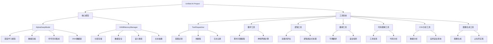

# Unified AI Project 模型与工具图谱

## 1. 核心模型架构

### 1.1 AlphaDeepModel (深度模型)
**文件路径**: `apps/backend/src/ai/concept_models/alpha_deep_model.py`

#### 核心功能
- **深度学习模型**: 基于神经网络的数据处理和学习机制
- **数据压缩**: 支持多种压缩算法 (zlib, bz2, lzma, msgpack)
- **符号空间集成**: 与UnifiedSymbolicSpace集成，实现符号化数据处理
- **DNA数据链**: 支持创建和管理DNA衍生数据链

#### 主要组件
- `DeepParameter`: 深度参数结构，包含摘要、关键词、关系上下文、多模态数据等
- `HAMGist`: HAM基本摘要结构
- `RelationalContext`: 关系上下文，处理实体和关系
- `Modalities`: 多模态数据处理
- `DNADataChain`: DNA数据链管理

#### 核心方法
- `learn()`: 学习机制，基于深度参数和反馈更新模型
- `compress()`: 数据压缩功能
- `decompress()`: 数据解压缩功能
- `create_dna_chain()`: 创建DNA数据链

### 1.2 HAMMemoryManager (分层关联记忆管理器)
**文件路径**: `apps/backend/src/ai/memory/ham_memory_manager.py`

#### 核心功能
- **分层存储**: 核心内存存储、向量内存(通过ChromaDB)和重要性评分
- **数据安全**: 支持Fernet加密和zlib压缩
- **语义搜索**: 集成ChromaDB实现向量搜索
- **文本抽象**: 将文本输入抽象为结构化摘要

#### 主要组件
- `HAMDataPackageInternal`: 内部数据包结构
- `ImportanceScorer`: 重要性评分器
- `VectorMemoryStore`: 向量内存存储

#### 核心方法
- `store_experience()`: 存储新经验
- `retrieve_relevant_memories()`: 检索相关记忆
- `recall_gist()`: 回忆抽象摘要
- `query_core_memory()`: 查询核心内存

## 2. 工具系统架构

### 2.1 ToolDispatcher (工具调度器)
**文件路径**: `apps/backend/src/core/tools/tool_dispatcher.py`

#### 核心功能
- **工具分发**: 根据查询分发到合适的工具
- **意图识别**: 使用DailyLanguageModel进行意图识别
- **热重载**: 支持工具实现的热重载
- **日志记录**: 记录工具调用的操作策略

#### 支持的工具
- `calculate`: 数学计算工具
- `evaluate_logic`: 逻辑表达式评估工具
- `translate_text`: 文本翻译工具
- `inspect_code`: 代码理解工具
- `analyze_csv`: CSV数据分析工具
- `create_image`: 图像生成工具
- `rag_query`: 检索增强生成查询工具(可选)

### 2.2 数学计算工具
**文件路径**: `apps/backend/src/core/tools/math_tool.py`

#### 核心功能
- **算术问题提取**: 从自然语言中提取算术问题
- **神经网络计算**: 使用训练好的模型进行计算预测
- **错误处理**: 处理TensorFlow导入错误和模型文件缺失

#### 核心方法
- `calculate()`: 执行数学计算
- `extract_arithmetic_problem()`: 提取算术问题

### 2.3 逻辑评估工具
**文件路径**: `apps/backend/src/core/tools/logic_tool.py`

#### 核心功能
- **双模式评估**: 神经网络模型优先，解析器作为后备
- **逻辑表达式处理**: 处理AND、OR、NOT等逻辑运算符
- **错误处理**: 处理TensorFlow导入错误和模型文件缺失

#### 核心方法
- `evaluate_expression()`: 评估逻辑表达式

### 2.4 翻译工具
**文件路径**: `apps/backend/src/core/tools/translation_tool.py`

#### 核心功能
- **字典翻译**: 基于JSON字典的翻译实现
- **语言检测**: 基本的语言检测功能
- **错误处理**: 处理字典文件缺失和翻译不可用情况

#### 核心方法
- `translate()`: 执行文本翻译
- `_detect_language()`: 检测文本语言

### 2.5 代码理解工具
**文件路径**: `apps/backend/src/core/tools/code_understanding_tool.py`

#### 核心功能
- **工具检查**: 列出和描述项目中的Python工具
- **轻量级代码模型**: 使用LightweightCodeModel分析代码结构

#### 核心方法
- `list_tools()`: 列出可用工具
- `describe_tool()`: 描述工具结构
- `execute()`: 执行工具操作

### 2.6 CSV分析工具
**文件路径**: `apps/backend/src/core/tools/csv_tool.py`

#### 核心功能
- **基本数据分析**: 提供CSV数据的摘要、列信息和形状信息
- **自然语言查询**: 支持自然语言查询

#### 核心方法
- `analyze()`: 分析CSV数据

### 2.7 图像生成工具
**文件路径**: `apps/backend/src/core/tools/image_generation_tool.py`

#### 核心功能
- **图像生成**: 基于文本提示生成图像
- **占位符实现**: 当前返回静态URL，实际实现可调用DALL-E或Stable Diffusion

#### 核心方法
- `create_image()`: 生成图像

## 3. 模型与工具关系图

## 4. 数据流和交互

### 4.1 工具调用流程
1. 用户查询 → ToolDispatcher → 意图识别 → 工具分发 → 工具执行 → 结果返回

### 4.2 模型数据流
1. 数据输入 → AlphaDeepModel学习/压缩 → HAMMemoryManager存储 → 语义搜索/回忆 → 结果输出

## 5. 扩展性和维护性

### 5.1 工具扩展
- 通过ToolDispatcher的`add_tool()`方法添加新工具
- 工具实现遵循统一的接口规范

### 5.2 模型扩展
- AlphaDeepModel支持自定义深度学习模型
- HAMMemoryManager支持不同的向量存储后端

### 5.3 热重载支持
- ToolDispatcher支持工具实现的热重载
- 无需重启系统即可更新工具功能