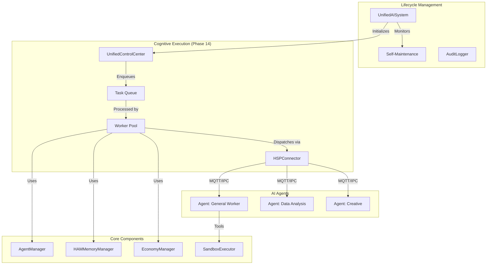

```mermaid
graph TD
    subgraph "Lifecycle Management"
        SYS[UnifiedAISystem]
        MAINT[Self-Maintenance]
        AUDIT[AuditLogger]
    end

    subgraph "Cognitive Execution (Phase 14)"
        UCC[UnifiedControlCenter]
        TQ[Task Queue]
        WP[Worker Pool]
        HSP[HSPConnector]
    end

    subgraph "AI Agents"
        A1[Agent: General Worker]
        A2[Agent: Data Analysis]
        A3[Agent: Creative]
    end

    subgraph "Core Components"
        AM[AgentManager]
        HAM[HAMMemoryManager]
        ECON[EconomyManager]
        SB[SandboxExecutor]
    end

    SYS -->|Initializes| UCC
    SYS -->|Monitors| MAINT
    
    UCC -->|Enqueues| TQ
    TQ -->|Processed by| WP
    WP -->|Dispatches via| HSP
    
    HSP -->|MQTT/IPC| A1
    HSP -->|MQTT/IPC| A2
    HSP -->|MQTT/IPC| A3
    
    WP -->|Uses| AM
    WP -->|Uses| HAM
    WP -->|Uses| ECON
    
    A1 -->|Tools| SB
```
