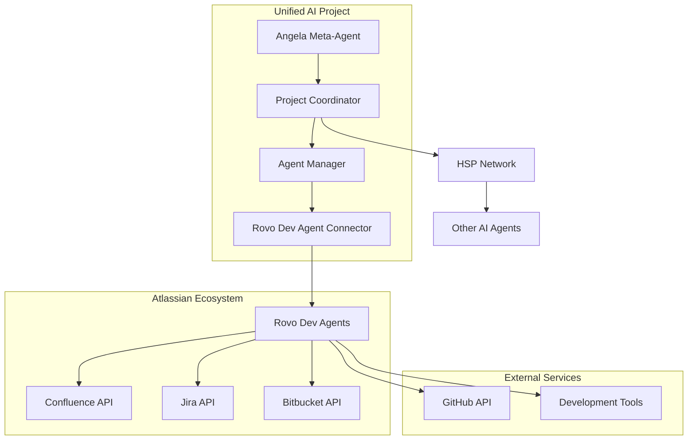
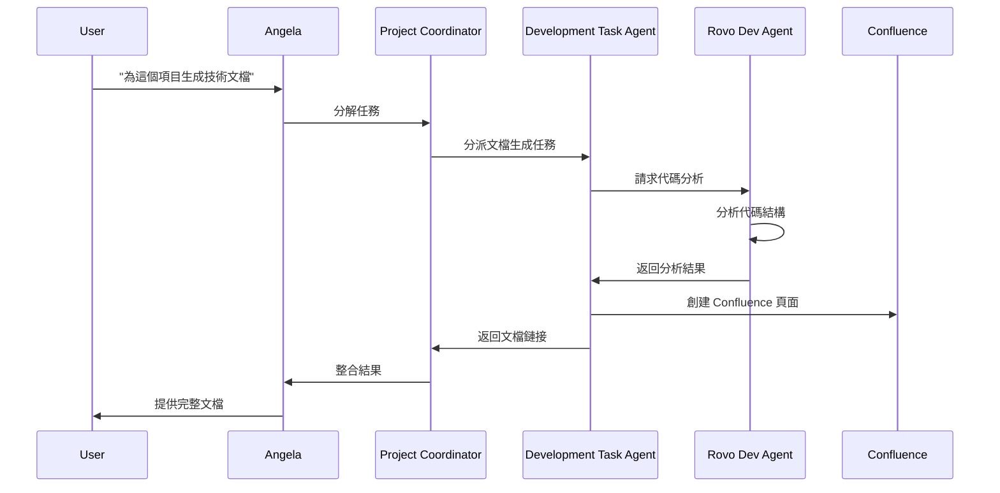
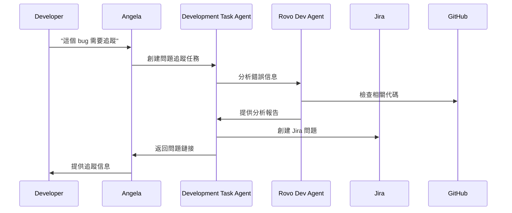

# 🤖 Rovo Dev Agents 集成架構

## 概述

Rovo Dev Agents 是 Atlassian 生態系統中的智能開發助手，專門設計用於協助軟件開發任務。本文檔描述了如何將 Rovo Dev Agents 集成到 Unified AI Project 中，實現更強大的開發協作能力。

---

## 🏗️ 集成架構

### 整體架構圖



### 核心組件

#### 1. Rovo Dev Agent Connector
- **位置**: `src/integrations/enhanced_rovo_dev_connector.py`
- **功能**: 
  - 與 Rovo Dev Agents 建立連接
  - 處理 API 認證和授權
  - 管理請求和響應的序列化/反序列化
  - **增強功能**: 內置容錯機制、重試邏輯和備用端點支持，並提供異步上下文管理器 (`async with`)。

#### 2. Atlassian Service Bridge
- **位置**: `src/integrations/atlassian_bridge.py`
- **功能**:
  - 統一 Atlassian 服務接口
  - 處理 Confluence、Jira、Bitbucket 的 API 調用
  - 提供統一的數據格式轉換

#### 3. Development Task Agent
- **位置**: `src/agents/development_task_agent.py`
- **功能**:
  - 專門處理開發相關任務
  - 與 Rovo Dev Agents 協作
  - 實現代碼分析、文檔生成、問題追蹤等功能

---

## 🔧 技術實現

### 1. 認證與授權

```python
# src/integrations/rovo_dev_connector.py
class RovoDevConnector:
    def __init__(self, config: Dict[str, Any]):
        self.api_token = config.get('atlassian_api_token')
        self.cloud_id = config.get('atlassian_cloud_id')
        self.base_url = f"https://api.atlassian.com/ex/rovo/{self.cloud_id}"
        
    async def authenticate(self) -> bool:
        """驗證 Atlassian API 憑證"""
        headers = {
            'Authorization': f'Bearer {self.api_token}',
            'Accept': 'application/json'
        }
        # 實現認證邏輯
        return True
```

### 2. 任務分派機制

```python
# src/agents/development_task_agent.py
class DevelopmentTaskAgent(BaseAgent):
    def __init__(self):
        super().__init__()
        self.rovo_connector = RovoDevConnector(self.config)
        self.capabilities = [
            "code_analysis",
            "documentation_generation", 
            "issue_tracking",
            "project_management"
        ]
    
    async def handle_task_request(self, task: HSPTaskRequestPayload) -> HSPTaskResultPayload:
        """處理開發任務請求"""
        task_type = task.get('task_type')
        
        if task_type == 'code_analysis':
            return await self._analyze_code(task)
        elif task_type == 'documentation':
            return await self._generate_documentation(task)
        # 其他任務類型...
```

### 3. Atlassian 服務集成

```python
# src/integrations/atlassian_bridge.py
class AtlassianBridge:
    def __init__(self, connector: RovoDevConnector):
        self.connector = connector
        
    async def create_confluence_page(self, space_key: str, title: str, content: str) -> str:
        """在 Confluence 中創建頁面"""
        payload = {
            'type': 'page',
            'title': title,
            'space': {'key': space_key},
            'body': {
                'storage': {
                    'value': content,
                    'representation': 'storage'
                }
            }
        }
        # 實現 API 調用
        
    async def create_jira_issue(self, project_key: str, summary: str, description: str) -> str:
        """在 Jira 中創建問題"""
        payload = {
            'fields': {
                'project': {'key': project_key},
                'summary': summary,
                'description': description,
                'issuetype': {'name': 'Task'}
            }
        }
        # 實現 API 調用
```

---

## 🚀 使用場景

### 1. 自動化文檔生成



### 2. 智能問題追蹤



### 3. 項目狀態同步

- **自動同步**: 定期將 GitHub 項目狀態同步到 Jira
- **智能分析**: 分析代碼變更對項目進度的影響
- **報告生成**: 自動生成項目進度報告到 Confluence

---

## 📊 配置與部署

### 1. 環境配置

```yaml
# configs/atlassian_config.yaml
atlassian:
  api_token: "${ATLASSIAN_API_TOKEN}"
  cloud_id: "${ATLASSIAN_CLOUD_ID}"
  confluence:
    base_url: "https://your-domain.atlassian.net/wiki"
    default_space: "DEV"
  jira:
    base_url: "https://your-domain.atlassian.net"
    default_project: "UAI"
  rovo_dev:
    enabled: true
    max_concurrent_requests: 5
    timeout: 30
```

### 2. 依賴安裝

```bash
# 安裝 Atlassian SDK
pip install atlassian-python-api

# 安裝額外依賴
pip install aiohttp requests-oauthlib
```

### 3. 服務啟動

```python
# src/services/atlassian_service.py
class AtlassianService:
    def __init__(self):
        self.rovo_connector = RovoDevConnector(config)
        self.bridge = AtlassianBridge(self.rovo_connector)
        
    async def start(self):
        """啟動 Atlassian 服務"""
        await self.rovo_connector.authenticate()
        # 註冊到 HSP 網絡
        await self.register_capabilities()
```

---

## 🔒 安全考慮

### 1. API 密鑰管理
- 使用環境變量存儲敏感信息
- 實現密鑰輪換機制
- 加密存儲配置文件

### 2. 權限控制
- 實現細粒度權限檢查
- 限制 API 調用頻率
- 記錄所有操作日誌

### 3. 數據隱私
- 遵循 GDPR 和其他隱私法規
- 實現數據匿名化
- 提供數據刪除機制

---

## 📈 性能優化

### 1. 緩存策略
```python
# 實現智能緩存
class AtlassianCache:
    def __init__(self):
        self.cache = {}
        self.ttl = 300  # 5分鐘
        
    async def get_cached_response(self, key: str) -> Optional[Dict]:
        """獲取緩存響應"""
        if key in self.cache:
            timestamp, data = self.cache[key]
            if time.time() - timestamp < self.ttl:
                return data
        return None
```

### 2. 批量處理
- 實現批量 API 調用
- 使用異步處理提高並發性
- 實現智能重試機制

### 3. 監控與告警
- 監控 API 調用延遲
- 設置錯誤率告警
- 實現健康檢查端點

---

## 🧪 測試策略

### 1. 單元測試
```python
# tests/integrations/test_rovo_dev_connector.py
class TestRovoDevConnector:
    async def test_authentication(self):
        """測試認證功能"""
        connector = RovoDevConnector(test_config)
        result = await connector.authenticate()
        assert result is True
        
    async def test_api_call(self):
        """測試 API 調用"""
        # 實現測試邏輯
```

### 2. 集成測試
- 測試與真實 Atlassian 服務的集成
- 驗證數據流的完整性
- 測試錯誤處理機制

### 3. 性能測試
- 負載測試 API 調用
- 測試並發處理能力
- 驗證緩存效果

---

## 📚 相關文檔

- [Atlassian REST API 文檔](https://developer.atlassian.com/cloud/confluence/rest/v2/)
- [Rovo Dev Agents 指南](https://developer.atlassian.com/platform/rovo/)
- [HSP 協議規範](../communication/hsp-specification/README.md)
- [代理協作框架](../../04-advanced-concepts/agent-collaboration.md)

---

*最後更新：2025年1月*
*維護者：Rovo Dev Team*