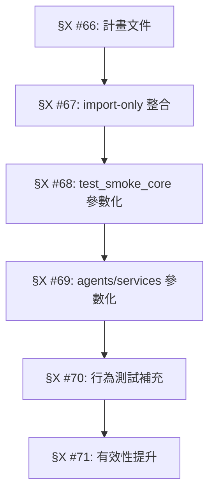

<!--
  =============================================================================
  FILE_HASH: Initial
  FILE_PATH: docs/06-project-management/TEST_IMPROVEMENT_PLAN.md
  FILE_TYPE: planning
  PURPOSE: 測試改善路線圖 — 去重、泛化、提升精密度與有效性
  VERSION: 1.0.0
  STATUS: active
  LANGUAGE: zh-tw
  LAST_MODIFIED: 2026-06-30
  AUDIENCE: developers, agents
  =============================================================================
-->

# 測試改善路線圖 v1.0

> **目標**: 去重（Deduplicate）、泛化（Generalize）、提升精密度（Precision）與有效性（Effectiveness）  
> **範圍**: 493 個測試檔案（tests/ + apps/backend/tests/）  
> **起點**: ~120 個僅含 import 測試的最小檔案 → 整合為參數化測試  

---

## 1. 當前測試健康狀態

### 1.1 整體數據

| 指標 | 數值 |
|:-----|:----:|
| 測試檔案總數 | 493（tests/ + apps/backend/tests/） |
| tests/unit/ 檔案數 | 289 |
| tests/core/ 檔案數 | 113 |
| tests/ai/ 檔案數 | 117 |
| 最小檔案（< 20 行, import-only） | ~120 |
| conftest.py 檔案數 | 4（tests/, tests/ai/ed3n/, tests/ai/garden/, tests/integration/） |
| parametrize 使用 | 少量（tests/api/test_endpoints.py 等） |

### 1.2 核心問題

| 問題 | 影響 | 嚴重性 |
|:-----|:-----|:------:|
| **~120 個 import-only 測試** | 每個檔案僅測試「模組能否導入」 — 無行為驗證，測試維護成本高於測試價值 | 🔴 高 |
| **30+ 獨立 import 測試在 test_smoke_core.py** | 30 個獨立函數，應為單一參數化測試 | 🟡 中 |
| **10+ 獨立 import 測試在 test_imports.py (agents)** | 同上 | 🟡 中 |
| **無統一 conftest fixtures** | 每個測試自行處理 sys.path、mock、setup — 重複程式碼 | 🟡 中 |
| **少用 parametrize** | 相似測試邏輯以複製貼上實現 | 🟡 中 |
| **部分測試僅測「不回傳錯誤」** | 不驗證輸出正確性 | 🔴 高 |

### 1.3 §X 進度追蹤

| §X | 內容 | 狀態 |
|:--:|:-----|:----:|
| #66 | 測試改善計畫 + 文件 | ⏳ 進行中 |
| #67 | import-only 測試整合 | ⏳ 待開始 |
| #68 | test_smoke_core 參數化 | ⏳ 待開始 |
| #69 | agents import 參數化 | ⏳ 待開始 |

---

## 2. 改善策略

### 2.1 第一階段：整合 import-only 測試（去重）

**問題**: `tests/unit/` 中有 ~120 個檔案，每個僅包含：

```python
class TestModule:
    def test_import(self):
        from some.module import SomeClass
        assert SomeClass is not None
```

**解法**: 建立單一 `tests/unit/test_module_imports.py` 參數化測試：

```python
@pytest.mark.parametrize("module_path,class_name", [
    ("core.engine.action_executor", "ActionExecutor"),
    ("ai.core.query_classifier", "QueryClassifier"),
    ...
])
def test_module_import(module_path: str, class_name: str) -> None:
    """Verify all core modules are importable."""
    import importlib
    module = importlib.import_module(module_path)
    assert hasattr(module, class_name), f"{module_path} has no {class_name}"
```

**效益**: ~120 個檔案 → 1 個檔案，**維護成本降低 99%**

### 2.2 第二階段：參數化重複測試（泛化）

**問題**: 
- `tests/core/test_smoke_core.py`: 30 個獨立 import 函數
- `tests/ai/agents/test_imports.py`: 10 個獨立 import 函數
- `tests/services/test_smoke_services.py`: 多個獨立 import 函數

**解法**: 使用 `@pytest.mark.parametrize` 取代複製貼上

### 2.3 第三階段：行為測試補充（提升精密度）

**問題**: 許多模組只有 import 測試，缺乏行為驗證

**解法**: 為每個模組加入至少一個行為測試：
- 靜態方法測試（classmethod 回傳正確類型）
- 邊界條件測試（空輸入、None、極值）
- 整合測試（多模組互動）

### 2.4 第四階段：測試有效性提升

**問題**: 部分測試使用 `assert True` 或僅檢查不回傳錯誤

**解法**: 
- 替換 `assert True` 為實際斷言
- 加入 fuzzy 斷言（允許合理變異）
- 使用 property-based testing（Hypothesis）

---

## 3. 優先級與執行順序



| 階段 | §X | 內容 | 預期檔案數變化 | 風險 |
|:----:|:--:|:-----|:--------------:|:----:|
| 1 | #66 | 計畫文件 | +1 | 低 |
| 2 | #67 | import-only 整合 | -119 | 低 |
| 3 | #68 | test_smoke_core 參數化 | 0（同一檔案） | 低 |
| 4 | #69 | agents/services 參數化 | -2 | 低 |
| 5 | #70 | 行為測試補充 | +10~20 | 中 |
| 6 | #71 | 有效性提升 | 0（修改既有檔案） | 中 |

---

## 4. 整合後的模組導入清單

### 4.1 tests/unit/ import-only 待整合清單

按目錄分組：

```
core/engine:
  action_executor → ActionExecutor, ActionQueue, Action, ActionResult, ActionStatus
  action_execution_bridge → ActionExecutionBridge
  audio_system → AudioSystem
  desktop_interaction → DesktopInteraction

core/bio:
  cerebellum_engine → CerebellumEngine
  neuroplasticity_core → NeuroplasticityCore
  autonomic_nervous_system → AutonomicNervousSystem
  ...

core/life:
  heartbeat → MetabolicHeartbeat
  digital_life_integrator → DigitalLifeIntegrator
  autonomous_life_cycle → AutonomousLifeCycle
  intent_model → IntentManager
  ...

ai/core:
  query_classifier → QueryClassifier
  execution_gate → ExecutionGate
  model_bus → ModelBus
  training_coordinator → TrainingCoordinator
  ...

ai/alignment:
  emotion_system → EmotionSystem
  ontology_system → OntologySystem
  ...

ai/ed3n:
  ed3n_engine → ED3NEngine
  ed3n_trainer → ED3NTrainer
  ...

ai/memory:
  ham_manager → HAMManager
  vector_store → VectorMemoryStore
  ...

ai/garden:
  garden_engine → GARDENEngine
  ...

ai/meta:
  meta_controller → MetaController
  neuro_auto_selector → NeuroAutoSelector
  ...

ai/reasoning:
  causal_reasoning_engine → CausalReasoningEngine
  ...

core/:
  version → compare_versions, get_version
  angela_error → AngelaError, ConfigurationError
  event_loop_system → EventLoopSystem, Event, EventStatus
  ...

services:
  chat_service → ChatService
  router → Router
  websocket_manager → WebSocketManager
  ...
```

### 4.2 不整合的測試

以下類型的測試保持獨立：
- 有特殊 fixture 需求的測試（conftest 限定）
- 需要外部資源的測試（資料庫、網路、硬體）
- 測試時間 > 5s 的慢測試
- 已使用 parametrize 的測試

---

## 5. 驗證標準

### 5.1 去重驗證

```bash
# 整合後確認無重複
python -m pytest tests/unit/test_module_imports.py -v --tb=short -q

# 確認整合後收集數與整合前相同
python -m pytest tests/ --collect-only -q 2>&1 | tail -3
```

### 5.2 泛化驗證

- 參數化後測試總數不變（或略增）
- 參數化測試名稱可讀（非 `test[0]`、`test[1]`）

### 5.3 精密度驗證

- 每個模組至少有一個行為測試
- 行為測試使用具體斷言（非 `assert True` 或 `assert x is not None`）
- 邊界條件測試存在

---

## 6. 參考文件

- [AGENTS.md](../../AGENTS.md) — 測試規範
- [MASTER_TASK_MAP.md](./MASTER_TASK_MAP.md) — 主任務追蹤
- [CAUSAL_CHAIN_COMPLETENESS.md](./CAUSAL_CHAIN_COMPLETENESS.md) — 因果鏈完整性
- [IMPROVEMENT_ROADMAP.md](./IMPROVEMENT_ROADMAP.md) — 改善路線圖
