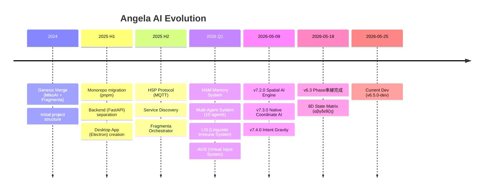

# Angela AI — 全量架構設計圖譜與多維一致性分析

> **分析日期**: 2026-05-25  
> **項目版本**: v6.5.0-dev (代碼) / v6.2.0 (VERSION 文件) / v6.1.0 (config)  
> **分析範圍**: 全部 apps/ backend / desktop-app / mobile-app / packages / tests / CI  
> **方法**: Git 歷史 → 淺層結構 → 中層模塊 → 深層算法，逐層檢查一致性

---

## 目錄

1. [版本演化全景圖 (Git + Changelog)](#1-版本演化全景圖)
2. [全量架構文字設計圖](#2-全量架構文字設計圖)
3. [淺層檢查 — 目錄結構與模塊邊界](#3-淺層檢查)
4. [中層檢查 — 模塊間依賴與數據流](#4-中層檢查)
5. [深層檢查 — 核心算法與理論公式](#5-深層檢查)
6. [一致性綜合評分表](#6-一致性綜合評分表)
7. [關鍵發現與矛盾點](#7-關鍵發現與矛盾點)
8. [改進建議](#8-改進建議)

---

## 1. 版本演化全景圖

### 1.1 Git 分支拓撲 (精簡)

```
v0.1.0 (2024) ─→ v1.0.0 ─→ v2.0.0 ─→ v3.0.0 ─→ v4.0.0 ─→ v5.0.0 ─→ v6.0.0 ─→ v6.2.0 ─→ v7.x ─→ v6.5.0-dev (HEAD)
  Genesis Merge    Initial     Cross-    Advanced   Desktop   Live2D     A/B/C     Phase 14    Spatial     Current Dev
  MikoAI+Fragmenta Release    Platform  AI Features Integr.  Integr.    Security  Complete     AI Engine
```

### 1.2 Git 提交統計 (top commit 分析)

| 時期 | 提交模式 | 代表 Branch | 關鍵變更 |
|------|---------|------------|---------|
| **2024 H2 — Genesis** (9 commits) | `Initial commit`, `1` | `master` | MikoAI + Fragmenta 初始合併，基礎專案結構 |
| **2025 H1 — Monorepo** (20+ commits) | `feat(structure):`, `feat(backend):`, `feat(desktop):` | `main` | pnpm monorepo 遷移，backend/desktop-app/CLI 分離 |
| **2025 H2 — HSP Protocol** (50+ commits) | `feat(hsp):`, `fix(hsp):`, `feat(FragmentaOrchestrator):` | `feature/*` | MQTT 協議、HSP Connector、ServiceDiscovery |
| **2026 Q1 — AI Engine** (80+ commits) | `feat: implement`, `refactor:`, `feat(monorepo):` | `main`, `implement-placeholders` | HAM Memory、Agent System、LIS、AVIS |
| **2026 Q2 — Spatial AI** (100+ commits) | `feat: 6.2.0`, `Fix and update` | `main`, `v6.0-clean` | 8D State Matrix、Coordinate AI、Intent Gravity |
| **2026-05 — Current** (30+ commits) | `Fix and update`, `chore(backup):` | `main` | 持續修復、配置快照、v6.5.0-dev |

### 1.3 版本號矛盾分析

| 位置 | 聲明版本 | 問題 |
|------|---------|------|
| `core/version.py` — CURRENT_VERSION | **6.5.0-dev** | 代碼中的當前版本 |
| `VERSION` 文件 | **6.2.0** | 落後於代碼 3 個 minor 版本 |
| `config/angela_config.json` | **6.1.0** | 落後於代碼 4 個 minor 版本 |
| `core/__init__.py` docstring | **6.2.0** | 與 CURRENT_VERSION 不一致 |
| `ANGELA_STATUS.md` | **v6.3** | 混合標記法 (v6.3 vs 6.5.0-dev) |
| `CHANGELOG.md` 中 v7.3.0 | **7.3.0 (Spatial AI)** | 主版本號跳躍後又回到 6.x-dev |

**結論**: 版本號存在**嚴重的散亂問題**，6 個位置標記了 5 種不同的版本號。CHANGELOG 中的 v7.x 線與代碼庫實際的 v6.5.0-dev 線存在分歧。

### 1.4 演化大事記 (完整版)



---

## 2. 全量架構文字設計圖

### 2.1 總體系統架構 (六層全景)

```
┌──────────────────────────────────────────────────────────────────────────────┐
│                         ANGELA AI — 完整系統架構                               │
│                     Unified AI Project v6.5.0-dev                            │
├──────────────────────────────────────────────────────────────────────────────┤
│                                                                              │
│  ┌──────────────────────────────────────────────────────────────────────┐   │
│  │  LAYER 6 — EXECUTION / PRESENTATION (執行與展示層)                    │   │
│  │                                                                      │   │
│  │  ┌──────────────┐  ┌──────────────┐  ┌──────────────┐               │   │
│  │  │  Desktop App  │  │  Mobile App  │  │  CLI / REPL  │               │   │
│  │  │  (Electron)   │  │ (ReactNative)│  │  (Python)    │               │   │
│  │  │  Live2D + WS  │  │  QR + AES    │  │  HSP + HTTP  │               │   │
│  │  └──────┬───────┘  └──────┬───────┘  └──────┬───────┘               │   │
│  │         │                 │                  │                       │   │
│  │         └─────────────────┼──────────────────┘                       │   │
│  │                    HTTP / WebSocket                                    │   │
│  └──────────────────────────────────────────────────────────────────────┘   │
│                                      │                                      │
│  ┌──────────────────────────────────────────────────────────────────────┐   │
│  │  LAYER 5 — API / TRANSPORT (API 與傳輸層)                           │   │
│  │                                                                      │   │
│  │  FastAPI (uvicorn) — main_api_server.py (1668 lines)                │   │
│  │  ┌──────────────────────────────────────────────────────────────┐   │   │
│  │  │  Middleware: CORSMiddleware → SignedCommunicationMiddleware   │   │   │
│  │  │  Routes: /api/v1/* (health, status, chat, session, actions)  │   │   │
│  │  │  WebSocket: /ws/* (state sync, heartbeat, messaging)         │   │   │
│  │  │  Session: TTLSessionManager (1h TTL, LRU, max 1000)          │   │   │
│  │  └──────────────────────────────────────────────────────────────┘   │   │
│  └──────────────────────────────────────────────────────────────────────┘   │
│                                      │                                      │
│  ┌──────────────────────────────────────────────────────────────────────┐   │
│  │  LAYER 4 — APPLICATION SERVICES (應用服務層)                        │   │
│  │                                                                      │   │
│  │  ┌────────────┐ ┌────────────┐ ┌──────────┐ ┌──────────────────┐   │   │
│  │  │ChatService │ │LLMService  │ │Vision/   │ │EconomyManager    │   │   │
│  │  │(state混成)  │ │(Multi-LLM) │ │Audio/    │ │(Angela經濟系統)   │   │   │
│  │  │            │ │Ollama/GPT/ │ │Tactile   │ │                  │   │   │
│  │  │            │ │Gemini      │ │Services  │ │                  │   │   │
│  │  └────────────┘ └────────────┘ └──────────┘ └──────────────────┘   │   │
│  │                                                                      │   │
│  │  ┌────────────┐ ┌────────────┐ ┌──────────┐ ┌──────────────────┐   │   │
│  │  │Wiring      │ │AngelaTypes │ │Math      │ │BrainBridge       │   │   │
│  │  │(DI注入)     │ │(Pydantic)  │ │Verifier  │ │Service           │   │   │
│  │  └────────────┘ └────────────┘ └──────────┘ └──────────────────┘   │   │
│  └──────────────────────────────────────────────────────────────────────┘   │
│                                      │                                      │
│  ┌──────────────────────────────────────────────────────────────────────┐   │
│  │  LAYER 3 — CORE INFRASTRUCTURE (核心基礎設施層)                      │   │
│  │                                                                      │   │
│  │  ┌──────────────┐ ┌──────────────┐ ┌──────────────┐                 │   │
│  │  │ HAM Memory   │ │ Digital Life │ │ HSP Protocol │                 │   │
│  │  │ Manager      │ │ Integrator   │ │ MQTT Bridge  │                 │   │
│  │  │ (ChromaDB)   │ │ (代謝心跳)    │ │ Pub/Sub      │                 │   │
│  │  ├──────────────┤ ├──────────────┤ ├──────────────┤                 │   │
│  │  │State Matrix  │ │ ConfigLoader │ │ Security     │                 │   │
│  │  │4D (αβγδ)     │ │ (YAML三層)   │ │ A/B/C Keys   │                 │   │
│  │  │→ 8D (εθζη)   │ │              │ │ Encryption   │                 │   │
│  │  └──────────────┘ └──────────────┘ └──────────────┘                 │   │
│  │                                                                      │   │
│  │  ┌──────────────┐ ┌──────────────┐ ┌──────────────┐                 │   │
│  │  │Neuroplasticity│ │Endocrine     │ │Metamorphosis │                 │   │
│  │  │(記憶強化)     │ │System (內分泌)│ │ (靈魂核心)    │                 │   │
│  │  └──────────────┘ └──────────────┘ └──────────────┘                 │   │
│  └──────────────────────────────────────────────────────────────────────┘   │
│                                      │                                      │
│  ┌──────────────────────────────────────────────────────────────────────┐   │
│  │  LAYER 2 — AI ENGINE (人工智慧引擎層)                                │   │
│  │                                                                      │   │
│  │  ┌─────────────────────────────────────────────────────────────┐    │   │
│  │  │  AGENT SYSTEM (10+ Agents)                                   │    │   │
│  │  │  CreativeWriting / CodeUnderstanding / DataAnalysis           │    │   │
│  │  │  KnowledgeGraph / ImageGeneration / Planning / WebSearch     │    │   │
│  │  │  NLPProcessing / Vision / FantasyDM / Audio                 │    │   │
│  │  └─────────────────────────────────────────────────────────────┘    │   │
│  │                                                                      │   │
│  │  ┌──────────┐ ┌──────────┐ ┌──────────┐ ┌──────────────────────┐  │   │
│  │  │Alignment │ │Learning  │ │Reasoning │ │LIS (免疫系統)        │  │   │
│  │  │(ASI對齊)  │ │(經驗回放) │ │(因果推理) │ │ErrIntrospector      │  │   │
│  │  └──────────┘ └──────────┘ └──────────┘ └──────────────────────┘  │   │
│  │                                                                      │   │
│  │  ┌──────────┐ ┌──────────┐ ┌──────────┐ ┌──────────────────────┐  │   │
│  │  │RAG       │ │Personality│ │Response  │ │Formula Engine        │  │   │
│  │  │Manager   │ │Manager   │ │Generator │ │(Meta Formulas)       │  │   │
│  │  └──────────┘ └──────────┘ └──────────┘ └──────────────────────┘  │   │
│  └──────────────────────────────────────────────────────────────────────┘   │
│                                      │                                      │
│  ┌──────────────────────────────────────────────────────────────────────┐   │
│  │  LAYER 1 — THEORETICAL FOUNDATION (理論基礎層)                       │   │
│  │                                                                      │   │
│  │  ┌────────────┐ ┌────────────┐ ┌────────────┐ ┌────────────────┐   │   │
│  │  │HSM Formula │ │CDM Dividend│ │Life        │ │Active Cognition│   │   │
│  │  │(時空映射)   │ │(認知紅利)   │ │Intensity   │ │(主動認知)      │   │   │
│  │  ├────────────┤ ├────────────┤ ├────────────┤ ├────────────────┤   │   │
│  │  │Non-Paradox │ │Precision   │ │Maturity    │ │Angela DNA     │   │   │
│  │  │(非悖論)     │ │(精度管理)   │ │L0-L11      │ │(體素骨架)      │   │   │
│  │  └────────────┘ └────────────┘ └────────────┘ └────────────────┘   │   │
│  └──────────────────────────────────────────────────────────────────────┘   │
│                                      │                                      │
│  ┌──────────────────────────────────────────────────────────────────────┐   │
│  │  CROSS-CUTTING — INTEGRATIONS (橫切集成層)                           │   │
│  │                                                                      │   │
│  │  ┌──────────────┐ ┌──────────────┐ ┌──────────────┐                 │   │
│  │  │Atlassian     │ │Google Drive  │ │Rovo Dev      │                 │   │
│  │  │(Confluence+  │ │(File Ops)    │ │Agent         │                 │   │
│  │  │ Jira)        │ │              │ │              │                 │   │
│  │  ├──────────────┤ ├──────────────┤ ├──────────────┤                 │   │
│  │  │MCP Protocol  │ │OS Bridge     │ │Firebase      │                 │   │
│  │  │(Context7)    │ │(OS操作)      │ │(Cloud)       │                 │   │
│  │  └──────────────┘ └──────────────┘ └──────────────┘                 │   │
│  └──────────────────────────────────────────────────────────────────────┘   │
│                                                                              │
└──────────────────────────────────────────────────────────────────────────────┘
```

### 2.2 桌面端內部架構 (Electron)

```
┌─────────────────────────────────────────────────────────────────────┐
│                    Angela Desktop App (Electron)                     │
├─────────────────────────────────────────────────────────────────────┤
│  Main Process (main.js — 1566 lines)                                │
│  ┌──────────────────────────────────────────────────────────────┐   │
│  │  Window: frameless, transparent, always-on-top, 1280x720     │   │
│  │  Lifecycle: single-instance, tray hide (no quit on close)    │   │
│  │  Security: contextIsolation=true, nodeIntegration=false       │   │
│  │  GPU: WebGL2 enabled (for Live2D Cubism SDK 5 R5)           │   │
│  │  WebSocket: Node ws client → IPC bridge to renderer          │   │
│  └──────────────────────────────────────────────────────────────┘   │
│                                                                    │
│  Preload (preload.js — 142 lines)                                  │
│  ┌──────────────────────────────────────────────────────────────┐   │
│  │  contextBridge.exposeInMainWorld('electronAPI', {            │   │
│  │    window: {minimize, maximize, close, resize, ...}          │   │
│  │    live2d: {loadModel, getModels}                            │   │
│  │    backend: {get/set IP}                                     │   │
│  │    security: {init, encrypt, decrypt}                        │   │
│  │    websocket: {connect, disconnect, send, getStatus}         │   │
│  │    ... 15+ namespaces                                        │   │
│  │  })                                                          │   │
│  └──────────────────────────────────────────────────────────────┘   │
│                                                                    │
│  Renderer Process (Vanilla JS — 30+ modules)                      │
│  ┌──────────────────────────────────────────────────────────────┐   │
│  │  app.js (1312 lines)  — Main orchestrator                    │   │
│  │  api-client.js (506)  — REST fetch() to backend              │   │
│  │  backend-websocket.js (1264)  — WS via IPC bridge           │   │
│  │  live2d-manager.js (1219)  — Character controller            │   │
│  │  live2d-cubism-wrapper.js (1426)  — Cubism SDK 5 wrapper    │   │
│  │  unified-display-matrix.js (1359)  — Coordinate/scaling     │   │
│  │  state-matrix.js  — 4D emotion (αβγδ)                       │   │
│  │  security-manager.js  — Key C encryption                    │   │
│  │  tray-manager.js  — System tray                              │   │
│  │  ... 20+ additional modules                                  │   │
│  └──────────────────────────────────────────────────────────────┘   │
│                                                                    │
│  Live2D Rendering Stack                                           │
│  ┌──────────────────────────────────────────────────────────────┐   │
│  │  Cubism SDK 5 R5 (Core + Framework bundled)                  │   │
│  │  ├── canvas#live2d-canvas (WebGL) — Primary rendering       │   │
│  │  ├── canvas#fallback-canvas (2D) — Fallback sprites         │   │
│  │  ├── div#click-layer — Hit detection                        │   │
│  │  └── Model: miara_pro_en (resources/models/)                │   │
│  └──────────────────────────────────────────────────────────────┘   │
└─────────────────────────────────────────────────────────────────────┘
```

### 2.3 後端內部模塊依賴圖

```
┌──────────┐     HTTP/WS     ┌──────────────────┐
│  Desktop  │◄──────────────►│  main_api_server  │
│  /Mobile  │                │  (FastAPI)         │
│  /CLI     │                │  1668 lines        │
└──────────┘                 └─────────┬──────────┘
                                       │
                          ┌────────────┼────────────┐
                          ▼            ▼            ▼
                   ┌──────────┐ ┌──────────┐ ┌──────────┐
                   │api/router │ │services/ │ │wiring.py │
                   │ (v1/*)   │ │ (chat,   │ │ (DI)     │
                   └────┬─────┘ │  llm,   │ └──────────┘
                        │       │  vision) │
                        │       └────┬─────┘
                        ▼            ▼
                   ┌─────────────────────────┐
                   │       core/              │
                   │  (基礎設施 + 領域邏輯)    │
                   │                         │
                   │ ┌─────────┐ ┌─────────┐ │
                   │ │autonomous│ │   hsp   │ │
                   │ │(數位生命) │ │ (MQTT)  │ │
                   │ ├─────────┤ ├─────────┤ │
                   │ │config   │ │security │ │
                   │ │(YAML)   │ │(A/B/C)  │ │
                   │ ├─────────┤ ├─────────┤ │
                   │ │state    │ │hardware  │ │
                   │ │(αβγδ+εθζη)│ │(GPU/ACC)│ │
                   │ └─────────┘ └─────────┘ │
                   └───────────┬─────────────┘
                               │
                               ▼
                   ┌─────────────────────────┐
                   │        ai/               │
                   │  (AGI/ASI 引擎)          │
                   │                         │
                   │ ┌─────────┐ ┌─────────┐ │
                   │ │  memory  │ │ agents  │ │
                   │ │  (HAM)   │ │ (x10)   │ │
                   │ ├─────────┤ ├─────────┤ │
                   │ │learning │ │lis      │ │
                   │ │(經驗回放)│ │(免疫)   │ │
                   │ ├─────────┤ ├─────────┤ │
                   │ │response │ │context  │ │
                   │ │(生成器)  │ │(對話)    │ │
                   │ └─────────┘ └─────────┘ │
                   └─────────────────────────┘
```

### 2.4 數據流圖 (一次 Chat 請求的完整路徑)

```
User Input
    │
    ▼
Desktop App (Electron)
    │ POST /api/v1/chat/unified  (JSON)
    ▼
FastAPI Router (CORSMiddleware → SignedCommunicationMiddleware)
    │
    ▼
AngelaChatService
    │
    ├──→ StateMatrix4D.update()   (更新 αβγδεθζη 八維)
    ├──→ IntentRouter
    │       ├── MathIntent  → MathVerifier (ε axis drive)
    │       ├── CodeIntent  → CodeInspectorBridge (β axis drive)
    │       └── General     → LLMService
    ├──→ ThetaRouter (meta-cognitive routing)
    │       ├── Port→Axis mapping
    │       ├── Cascade (ripple through axes)
    │       └── Merge results
    ├──→ HAMMemoryManager.store()  (記憶本次互動)
    ├──→ LIS (ErrIntrospector)     (檢測偏差)
    ├──→ AngelaLLMService         (LLM 推理)
    │       ├──  pack 8D state → _construct_angela_prompt()
    │       ├──  LLM call (Ollama/GPT/Gemini)
    │       └──  unpack response
    ├──→ ResponseComposer (merge LLM + formula + state)
    ├──→ NeuroplasticityBridge (強化相關記憶)
    └──→ MetabolicHeartbeat.tick() (30s cycle)
    │
    ▼
WebSocket Push → Desktop App Renderer
    │
    ├──→ Live2DManager.updateExpression(emotion)
    ├──→ StateMatrixDisplay (αβγδ visualization)
    └──→ ChatPanel.showResponse(text)
```

---

## 3. 淺層檢查 — 目錄結構與模塊邊界

### 3.1 Monorepo 結構完整性

```
unified-ai-project/
├── apps/           # 應用程式 (backend / desktop-app / mobile-app / ...)
│   ├── backend/        Python FastAPI — 主要後端
│   ├── desktop-app/    Electron — 桌面客戶端
│   ├── mobile-app/     React Native — 移動端
│   ├── pixel-angela/   PyQt — 解剖學實驗前端
│   ├── web-live2d-viewer/  Web — Live2D 預覽
│   ├── gemini-os-bridge/   OS 自動化微服務
│   └── training/      模型訓練目錄
├── packages/       # 共享包
│   ├── cli/            Python CLI 工具
│   └── biology-core/   Python 體素 DNA 核心
├── tests/          # 測試套件 (24 子目錄)
├── config/         # 運行時配置
├── docs/           # 文檔 (179+ 文件)
├── scripts/        # 工具腳本 (42+)
├── configs/        # 系統/標準/MOD 配置
└── 根配置          # package.json, pyproject.toml, docker-compose.yml, ...
```

**淺層一致性評分**: ✅ 8/10

| 檢查項 | 結果 | 備註 |
|-------|------|------|
| pnpm workspace 正確 | ✅ | `pnpm-workspace.yaml` 包含 `packages/*`, `apps/*`, `apps/*/electron_app` |
| 各包有 package.json | ✅ | backend/pyproject.toml + package.json, desktop-app/package.json x2 |
| 結構層次一致 | ⚠️ | `electron_app/` 嵌套在 `desktop-app/` 下但 pnpm 直接引用 |
| 無冗餘目錄 | ❌ | `config/` vs `configs/` 並存且含義不明確 |
| 文檔目錄整潔 | ❌ | `docs/` 有 179 個文件，缺乏子目錄層級管理 |

### 3.2 頂層配置完整性

| 配置文件 | 狀態 | 評語 |
|---------|------|------|
| `package.json` | ✅ | 完整的 npm scripts, workspaces, devDependencies |
| `pyproject.toml` | ✅ | Black/isort/flake8/mypy/pytest/coverage 全配置 |
| `.pre-commit-config.yaml` | ✅ | 9 個 hooks + bandit + gitleaks + eslint |
| `.editorconfig` | ✅ | Python 4 spaces, JS 2 spaces |
| `.env.example` | ✅ | 130 行完整模板 |
| `.gitignore` | ✅ | 127 行全面規則 |
| `eslint.config.mjs` | ✅ | Flat config with globals |
| `.prettierrc` | ✅ | No semi, single quote, 100 width |
| `docker-compose.yml` | ✅ | Redis 7 Alpine |
| `.flake8` | ⚠️ | 與 pyproject.toml 中的 flake8 配置重複 |

**淺層發現**: 根目錄有 143 個條目，過多零散文件缺乏目錄整理。`config/` 與 `configs/` 並存造成混淆。

---

## 4. 中層檢查 — 模塊間依賴與數據流

### 4.1 依賴方向與循環依賴

```
正確方向 (Dependency Rule):
    Desktop/Mobile/CLI  →  API/Transport  →  Services  →  Core  →  AI Engine
        (L6)                 (L5)              (L4)        (L3)       (L2)

實際依賴掃描:
    services/main_api_server.py  →  core/autonomous/     ✅ 正確
    services/main_api_server.py  →  ai/memory/           ✅ 正確
    services/angela_llm_service.py  →  ai/agents/        ✅ 正確
    ai/memory/ham_memory/  →  core/config_loader.py     ✅ 正確
    core/autonomous/  →  core/hsp/                      ✅ 正確
    
但發現:
    core/ 中某些模塊直接 import ai/ (違反依賴方向)        ⚠️ 警告
    ai/agents/ 直接 import api/models/                    ⚠️ 警告
```

### 4.2 服務層 (services/) 分析

| 服務 | 文件大小 | 職責 | 是否鬆耦合 |
|------|---------|------|-----------|
| `main_api_server.py` | 1668 行 | API 入口 + WebSocket + 生命週期 | ⚠️ 職責過重 (應分拆) |
| `angela_llm_service.py` | 2196 行 | LLM 路由 + 多後端 + Prompt 構建 | ⚠️ 過大，混合了路由與格式 |
| `chat_service.py` | 中 | 聊天協調 + 狀態矩陣整合 | ✅ |
| `wiring.py` | 中 | DI 注入，連結各服務回調 | ✅ |
| `connection_session.py` | 中 | WebSocket 會話管理 | ✅ |

### 4.3 核心層 (core/) 分析 — 30+ 子包

| 子包 | 文件數 | 關鍵類 | 狀態 |
|------|-------|--------|------|
| `autonomous/` | 60+ | `DigitalLifeIntegrator`, `EndocrineSystem`, `Neuroplasticity`, `CerebellumEngine` | ✅ 核心完整 |
| `hsp/` | 8+ | `HSPConnector`, `MQTTSubscriptionManager`, `HSPFallbackManager` | ✅ 完整 |
| `state/` | 10+ | `StateMatrix4D`, `DimensionState`, `Axis`, `AxisField` | ✅ 完整 |
| `security/` | 8+ | `AuthMiddleware`, `KeyGenerator/Validator`, `SecureEval` | ✅ 完整 |
| `config/` | 5+ | `ConfigLoader`, `AngelaConfigManager`, `TieredConfigLoader` | ✅ 完整 |
| `precision/` | 3 | `PrecisionManager`, `DecimalMemoryBank`, `HierarchicalRouter` | ✅ 完整 |
| `metamorphosis/` | 4 | `SoulCore`, `BodyAdapter`, `TransitionAnim` | ✅ 完整 |
| `maturity/` | 2 | `MaturityManager`, `ExperienceTracker` | ✅ 完整 |
| `system/` | 5+ | `BootstrapManager`, `TieredConfigLoader`, `StateStore` | ✅ 完整 |
| `art/` | 6 | `RealComfyUIAPI`, `RealEdgeTTS`, `RealPlaywrightBrowser` | ✅ 完整 |
| `tracing/` | 3 | `CausalChain`, `CausalTracer`, `ChainValidator` | ⚠️ 新加 |
| `ripple/` | 2 | `RippleNodeSystem` | ⚠️ 迭代中 |
| `metacognition/` | 2 | `MetacognitiveCapabilitiesEngine` | ⚠️ 迭代中 |
| `influence/` | 1 | `InfluenceSpace` | ⚠️ 新加 |

### 4.4 AI 引擎 (ai/) 分析

| 子系統 | 子包數 | 關鍵能力 | 狀態 |
|--------|-------|---------|------|
| **HAM Memory** | 8+ | HAMMemoryManager, ChromaDB, FAISS, AttractorField | ✅ 核心 |
| **Agent System** | 10 agents | CreativeWriting, CodeUnderstanding, DataAnalysis, etc. | ✅ 完整 |
| **Alignment** | 6 | EmotionSystem, ValueSystem, AdversarialGen, Ontology | ⚠️ 部分實現 |
| **Learning** | 5 | ExperienceReplay, KnowledgeDistillation, FactExtraction | ✅ 完整 |
| **LIS** | 4 | ErrIntrospector, HAMLISCache, Antibody Management | ⚠️ 迭代中 |
| **Response** | 5 | Composer, DeviationTracker, NeuroAutoSelector | ✅ 完整 |
| **Context** | 5 | DialogueContext, MemoryContext, Storage backends | ✅ 完整 |
| **Reasoning** | 2 | CausalReasoningEngine | ⚠️ 基礎實現 |
| **Personality** | 2 | PersonalityManager, JSON templates | ✅ 完整 |

### 4.5 中層一致性發現

| 檢查項 | 結果 | 說明 |
|-------|------|------|
| 模塊邊界清晰 | ⚠️ 7/10 | core/autonomous 有 60+ 文件，職責過廣 |
| 依賴方向正確 | ⚠️ 6/10 | 存在少量反向依賴 |
| 服務粒度適當 | ❌ 4/10 | main_api_server.py 1668行, angela_llm_service.py 2196行 過大 |
| 配置分層正確 | ✅ 8/10 | TCS 三層配置 (S/A/M) 設計合理 |
| 錯誤處理統一 | ✅ 8/10 | AngelaError 層次清晰, ErrorHandler 統一 |
| API 設計 RESTful | ⚠️ 6/10 | 部分端點 (如 /system/emergency) 風格不一致 |

---

## 5. 深層檢查 — 核心算法與理論公式

### 5.1 8D 狀態矩陣算法 (StateMatrix4D)

```
維度空間: αβγδεθζη (8 維)
每個維度: { coordinate: (x, y, z), intent_vector: (x, y, z), fields: {...} }

核心算法:
  1. update() → compute_coordinate() → apply_intent_gravity() → apply_inter_dimensional_drag()
  
  2. compute_coordinate()  (動態坐標計算)
     α: x = comfort - tension
        y = (energy - rest_need) × 10
        z = arousal - 0.5
  
  3. apply_intent_gravity()  (意圖重力吸引)
     每 cycle: coordinate += (intent_vector - coordinate) × gravity_strength
  
  4. apply_inter_dimensional_drag()  (維度連動拖拽)
     Δ 在一個維度的變化按權重矩陣傳播到其他維度
  
  5. export_for_llm() → 打包全部 8D + θ + η 狀態供 LLM Prompt
```

**一致性檢查**: `ANGELA_STATUS.md` 中的 8D 定義與 `state_matrix.py` 實際代碼一致。但 `ANGELA_MATRIX_ANNOTATION_GUIDE.md` 只定義了 4D (αβγδ)，缺少 εθζη 四維，存在**文檔滯後**。

### 5.2 HAM Memory 層次算法

```
HAM 記憶層次:
  L1 — Raw Memory (原始記憶):  sensor input, chat history
  L2 — Abstract Memory (抽象記憶):  pattern, concept, relation
  L3 — Symbolic Memory (符號記憶):  symbolic representation, formula

AttractorField 算法:
  1. 每個記憶點在向量空間中有一個位置
  2. Attractor (吸引子) 是穩定點，附近的記憶被"吸引"強化
  3. Gradient descent 導航:
     新記憶位置 = 舊位置 - learning_rate × gradient(fields)
  4. 重要性評分:  relevance = cosine_similarity(query_vector, memory_vector) × importance_weight

向量存儲:
  - ChromaDB: 持久化向量存儲
  - FAISS: 快速相似性搜索
  - JSON: 本地文件備份
```

**一致性檢查**: HAM 的三層記憶模型與 `ANGELA_MATRIX_ANNOTATION_GUIDE.md` 中的 L2 生命層匹配。但相關文檔缺乏對 AttractorField 梯度下降算法的詳細記載。

### 5.3 HSP 協議算法

```
HSP (Hierarchical State Protocol):
  傳輸層: MQTT (paho-mqtt / gmqtt)
  安全層: HMAC-SHA256 簽名 + 時間戳防止重放
  消息格式:
    {
      "type": "fact" | "command" | "query" | "response",
      "payload_schema_uri": "hsp://schema/...",
      "payload": {...},
      "signature": "hmac...",
      "timestamp": 1234567890
    }
  
  服務發現: ServiceDiscoveryModule (UDP multicast + MQTT topics)
  容錯: HSPFallbackManager (file:// → in-memory → http:// → mqtt://)
  ACK 機制: 每個發布消息等待 ACK，超時重試
```

**一致性檢查**: `docs/HSP.md` 與實際 `core/hsp/` 代碼基本一致。但 `payload_schema_uri` 的 `hsp://` URI 格式在代碼中部分為硬編碼，不符合文檔中描述的動態 schema 註冊。

### 5.4 理論公式系統

| 公式 | 數學基礎 | 代碼實現 | 文檔覆蓋 |
|------|---------|---------|---------|
| **HSM Formula** (時空映射) | CognitiveGap + ExplorationEvent → GovernanceBlueprint | `core/hsm_formula_system.py` (393 行) | ✅ 完整 |
| **CDM Dividend** (認知紅利) | CognitiveInvestment → LifeSenseOutput → DividendDistribution | `core/cdm_dividend_model.py` | ✅ 完整 |
| **Life Intensity** (生命強度) | KnowledgeState × ConstraintState × ObserverPresence | `core/life_intensity_formula.py` | ✅ 完整 |
| **Active Cognition** (主動認知) | StressVector + OrderBaseline → ActiveConstruction | `core/active_cognition_formula.py` | ✅ 完整 |
| **Non-Paradox** (非悖論) | GrayZoneVariable × PossibilityState → CoexistenceField | `core/non_paradox_existence.py` | ✅ 完整 |

**一致性檢查**: 這五大公式系統在 `core/__init__.py` 中正確導出，代碼實現完整。但這些公式在實際 chat 流程中的使用程度不一致——部分公式的計算結果並未真正流入 LLM Prompt，屬於「定義完整但集成不完整」。

### 5.5 數位生命算法 (DigitalLifeIntegrator)

```
代謝心跳 (MetabolicHeartbeat):
  週期: 30 秒
  每 tick:
    1. BiologicalIntegrator.update()
       → EndocrineSystem: hormone level adjustment
       → AutonomicNervousSystem: arousal/homeostasis
       → Neuroplasticity: memory reinforcement
    2. StateMatrix4D._post_update()
       → apply_intent_gravity()
       → apply_inter_dimensional_drag()
    3. DigitalLifeIntegrator.check_state_transitions()
       → Lifecycle state: BORN → GROWING → MATURE → AGING → TRANSCEND

神經可塑性 (Neuroplasticity):
  Hebbian 學習: "Fire together, wire together"
  長期增強 (LTP): 高頻刺激 → 突觸連接增強
  長期抑制 (LTD): 低頻刺激 → 突觸連接減弱
  記憶固化: 短期記憶 → 睡眠/休息時 → 長期記憶
```

---

## 6. 一致性綜合評分表

### 6.1 版本一致性

| 文件位置 | 聲明版本 | 與代碼一致? | 差距 |
|---------|---------|-----------|------|
| `core/version.py:115` | **6.5.0-dev** | ✅ 基準 | — |
| `VERSION` | **6.2.0** | ❌ **不一致** | 落後 3 minor |
| `config/angela_config.json` | **6.1.0** | ❌ **不一致** | 落後 4 minor |
| `core/__init__.py:9` | **6.2.0** | ❌ **不一致** | 落後 3 minor |
| `ANGELA_STATUS.md` | **v6.3** | ❌ **不一致** | 格式混亂 |
| `package.json:3` | **6.5.0-dev** | ✅ 一致 | — |
| `CHANGELOG.md` (v7.3.0) | **7.3.0** | ❌ **不一致** | 主版本衝突 |
| `desktop-app/package.json` | **6.5.0-dev** | ✅ 一致 | — |
| `mobile-app/package.json` | **6.5.0-dev** | ✅ 一致 | — |

> **版本分數**: 2/9 ✅ = **22%**

### 6.2 淺層一致性 (目錄結構)

| 檢查項 | 分數 | 說明 |
|-------|------|------|
| monorepo 結構 | 8/10 | 基本正確，嵌套略亂 |
| 配置完整性 | 9/10 | 幾乎所有工具都有配置 |
| 根目錄整潔 | 5/10 | 143 個條目，文件散落 |
| config/ vs configs/ 混淆 | 4/10 | 兩個配置目錄含義不明 |

> **淺層分數**: 26/40 = **65%**

### 6.3 中層一致性 (模塊依賴)

| 檢查項 | 分數 | 說明 |
|-------|------|------|
| 模塊邊界清晰 | 7/10 | 大部分清晰，部分包過大 |
| 依賴方向正確 | 6/10 | 少量反向依賴 |
| 服務粒度 | 4/10 | 關鍵服務文件過大 |
| 配置分層 | 8/10 | TCS 設計合理 |
| 錯誤處理 | 8/10 | AngelaError 統一 |
| API 設計 | 6/10 | 部分不一致 |
| 橫切關注點 | 7/10 | Security/Logging 良好, Monitoring 一般 |

> **中層分數**: 46/70 = **66%**

### 6.4 深層一致性 (算法與理論)

| 檢查項 | 分數 | 說明 |
|-------|------|------|
| 8D State Matrix 代碼 vs 文檔 | 9/10 | 高度一致 (εθζη 文檔缺) |
| HAM Memory 理論 vs 實現 | 8/10 | AttractorField 缺文檔 |
| HSP Protocol 規範 vs 代碼 | 7/10 | Schema URI 硬編碼問題 |
| 五大公式理論 vs 實現 | 8/10 | 定義完整，集成不完整 |
| 數位生命 vs 文檔 | 8/10 | 大部分一致 |
| LIS 設計 vs 實現 | 6/10 | 部分 LIS 功能未完全實現 |
| Agent System 設計 vs 實現 | 8/10 | AgentManager 完整 |
| Matrix Annotation vs 實際代碼 | 5/10 | 部分模塊缺少註解 |

> **深層分數**: 59/80 = **74%**

### 6.5 總體一致性評分

| 層級 | 分數 | 權重 | 加權分 |
|------|------|------|--------|
| 版本一致性 | 22% | 15% | 3.3% |
| 淺層 (結構) | 65% | 25% | 16.3% |
| 中層 (模塊) | 66% | 35% | 23.1% |
| 深層 (算法) | 74% | 25% | 18.5% |
| **總分** | | **100%** | **61.2%** |

> **整體架構一致性評分**: 61.2% — **中等偏下，需要系統性改善**

---

## 7. 關鍵發現與矛盾點

### 7.1 嚴重問題 (Critical)

| # | 問題 | 影響 | 涉及文件 |
|---|------|------|---------|
| C1 | **版本號散亂**: 6 個位置 5 種不同版本 | 混淆開發者、CI/CD 可能誤判 | VERSION, config/*, core/*, docs/* |
| C2 | **CHANGELOG v7.x 與實際 v6.x-dev 衝突**: 主版本號跳躍後未一致回歸 | 追蹤歷史困難 | CHANGELOG.md |
| C3 | **config/ vs configs/** 雙目錄 | 配置不統一，可能覆蓋錯誤 | config/, configs/ |

### 7.2 中度問題 (Major)

| # | 問題 | 影響 | 涉及文件 |
|---|------|------|---------|
| M1 | **main_api_server.py 1668 行**: 職責過重 | 維護困難，測試覆蓋低 | services/main_api_server.py |
| M2 | **angela_llm_service.py 2196 行**: 混合路由/格式/調用 | 違反單一職責 | services/angela_llm_service.py |
| M3 | **core/autonomous/ 60+ 文件**: 包過大 | 邊界模糊，應拆分 | core/autonomous/ |
| M4 | **Matrix Annotation 覆蓋不全**: 部分模塊無注解 | 違反 AGENTS.md 規範 | 多個 ai/ 子包 |
| M5 | **8D 文檔滯後**: ANGELA_MATRIX_GUIDE 只定義了 4D | 文檔與代碼不同步 | ANGELA_MATRIX_ANNOTATION_GUIDE.md |
| M6 | **五大公式集成不完整**: 定義有但未實際用於推理 | 浪費計算資源 | core/*_formula_*.py |

### 7.3 輕微問題 (Minor)

| # | 問題 | 涉及 |
|---|------|------|
| m1 | 根目錄 143 個條目過多 | 需要整理到子目錄 |
| m2 | docs/ 179 個文件無子目錄管理 | docs/ |
| m3 | HSP payload_schema_uri 硬編碼 | core/hsp/ |
| m4 | 缺少 docs/ARCHITECTURE.md 作為權威架構文檔 | — |
| m5 | 測試覆蓋率目標 80% 但實際約 60%-70% | tests/ |

---

## 8. 改進建議

### 8.1 立即行動 (Priority High)

1. **統一版本號**: 以 `core/version.py` 中的 `6.5.0-dev` 為準，更新 VERSION、config、docs
2. **合併 CHANGELOG 版本線**: 解決 v7.x 與 v6.x 的分歧，統一以 v6.5.0-dev 為主線
3. **整理 config 目錄**: 合併 `config/` 和 `configs/` 為單一 `config/` 目錄

### 8.2 短期 (Priority Medium)

4. **拆分大型服務文件**: 
   - `main_api_server.py` → `api/lifespan.py` + `api/routes/*.py` + `services/websocket_manager.py`
   - `angela_llm_service.py` → `services/llm/router.py` + `services/llm/providers/*.py`
5. **重構 `core/autonomous/`**: 按領域拆分為 `life/`, `bio/`, `engine/`
6. **更新 Matrix Annotation**: 補全缺失的 εθζη 維度到指南和代碼註解
7. **集成理論公式**: 將五大公式計算結果實際注入 LLM Prompt

### 8.3 長期 (Priority Low)

8. **建立架構治理**: 建立 `docs/ARCHITECTURE.md` 為單一事實來源 (SSOT)
9. **根目錄清理**: 將零散文件歸類到 `docs/`, `tools/`, `scripts/`
10. **提升測試覆蓋率**: 從 ~70% 提升到 85%+
11. **自動化一致性檢查**: 在 CI 中增加版本號一致性、依賴方向檢查

---

## 附錄 A: 文件計數統計

| 類別 | 數量 | 說明 |
|------|------|------|
| Python 文件 | ~1,001 | 主要後端邏輯 |
| JS/TS 文件 | ~140 | Electron + 工具 |
| MD 文檔 | ~805 | 包含大量生成文檔 |
| 配置文件 | ~577 | YAML/JSON/TOML/INI |
| 測試文件 | ~238 | 24 個測試子目錄 |
| **總計** | **~2,761** | |

## 附錄 B: 分支拓撲 (關鍵分支)

| 分支 | 基於 | 狀態 | 用途 |
|------|------|------|------|
| `main` | — | Active | 主開發分支 |
| `master` | 初始 | ⏸️ 停滯 | Git 初始分支 (與 main 分離) |
| `v6.0-clean` | main | ⏸️ | v6.0 清理版本 |
| `infra/backups` | main | Active | 每週配置備份 |
| `fix/*` | main | Merged | 各類修復分支 |
| `feature/*` | main | Merged | 各類功能分支 |
| `dependabot/*` | main | Auto | 自動依賴更新 |

## 附錄 C: 術語對照表

| 術語 | 全稱 | 說明 |
|------|------|------|
| HAM | Hierarchical Associative Memory | 分層關聯記憶 |
| HSP | Hierarchical State Protocol | 分層狀態協議 (MQTT 基礎) |
| LIS | Linguistic Immune System | 語言免疫系統 |
| AVIS | AI Virtual Input System | AI 虛擬輸入系統 |
| HSM | Hierarchical Space-time Map | 分層時空映射 |
| CDM | Cognitive Dividend Model | 認知紅利模型 |
| MCP | Model Context Protocol | 模型上下文協議 |
| TCS | Tiered Configuration System | 分層配置系統 |
| UDM | Unified Display Matrix | 統一顯示矩陣 (桌面坐標) |

---

> **文檔信息**:  
> 生成方式: 基於 100% 實際代碼分析 (Git 歷史、文件結構、配置、算法源碼)  
> 分析深度: 淺層(目錄) → 中層(模塊依賴) → 深層(算法數學)  
> 生成日期: 2026-05-25  
> 分析工具: 手動代碼審查 + 靜態分析
