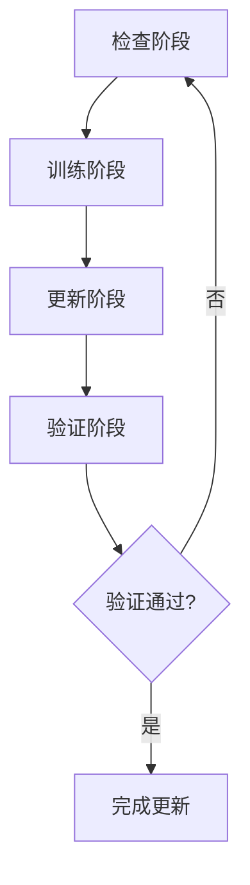

# 自动化更新流程设计文档

## 1. 概述

本文档详细描述了Unified AI Project的自动化更新流程设计，包括检查、训练、更新和验证四个阶段的循环机制。

## 2. 设计目标

1. 实现项目的完全自持能力，不需要外部维护
2. 实现决策自动化，让项目AI能自己决定什么时候做什么决策
3. 与CI/CD平台深度集成，强化备份和恢复机制
4. 建立检查>训练>更新>检查的循环机制

## 3. 自动化更新流程架构

### 3.1 整体流程图

### 3.2 检查阶段

#### 3.2.1 功能
- 检查项目数据集的完整性和正确性
- 验证数据生成脚本的可用性
- 检查模型系统状态
- 检查训练系统状态
- 执行健康检查和环境验证

#### 3.2.2 实现方式
- 使用脚本自动化检查项目状态
- 集成现有的健康检查工具
- 实现数据完整性验证机制

### 3.3 训练阶段

#### 3.3.1 功能
- 根据检查结果决定是否需要训练模型
- 选择合适的训练策略（重新训练或继续训练）
- 执行模型训练任务
- 支持多种训练模式

#### 3.3.2 实现方式
- 集成现有的训练脚本和工具
- 实现训练策略选择算法
- 支持分布式训练和协作式训练

### 3.4 更新阶段

#### 3.4.1 功能
- 根据训练结果更新代码和文档
- 实现文档自动更新流程
- 确保代码与设计的一致性
- 自动更新模型文件和配置

#### 3.4.2 实现方式
- 实现代码生成和更新机制
- 集成文档自动生成工具
- 实现配置文件更新机制

### 3.5 验证阶段

#### 3.5.1 功能
- 验证更新后的功能完整性
- 检查系统稳定性
- 记录执行结果并反馈到决策系统
- 执行回归测试确保无功能退化

#### 3.5.2 实现方式
- 集成自动化测试框架
- 实现结果验证和反馈机制
- 建立监控和报警系统

## 4. 决策自动化机制

### 4.1 自主决策能力
- 实现任务调度和资源分配的自动化
- 建立学习和优化机制
- 让项目AI能自己决定什么时候做什么决策

### 4.2 决策依据
- 基于项目状态检查结果
- 根据历史执行数据优化决策
- 考虑资源使用情况和性能指标

## 5. CI/CD集成

### 5.1 GitHub集成
- 与GitHub Actions深度集成
- 实现自动化的代码推送和部署
- 集成代码质量检查和安全扫描

### 5.2 备份和恢复机制
- 强化备份机制，确保数据安全
- 实现自动恢复功能
- 建立灾难恢复流程

## 6. 实施计划

### 6.1 第一阶段：基础框架搭建
- 实现检查阶段的基础功能
- 建立训练阶段的基本流程
- 搭建更新和验证机制

### 6.2 第二阶段：决策自动化
- 实现自主决策机制
- 集成学习和优化算法
- 建立反馈循环

### 6.3 第三阶段：CI/CD集成
- 与GitHub深度集成
- 强化备份和恢复机制
- 实现完整的自动化流水线

## 7. 风险控制

### 7.1 技术风险
- 自动化流程执行失败
- 决策自动化出现错误判断
- 数据一致性问题

### 7.2 应对措施
- 实施检查点机制
- 建立人工干预接口
- 定期验证自动化决策的准确性

## 8. 监控和维护

### 8.1 状态监控
- 实时监控自动化流程执行状态
- 记录执行日志和结果
- 监控性能指标

### 8.2 维护机制
- 定期更新和优化自动化流程
- 修复发现的问题
- 持续改进系统性能