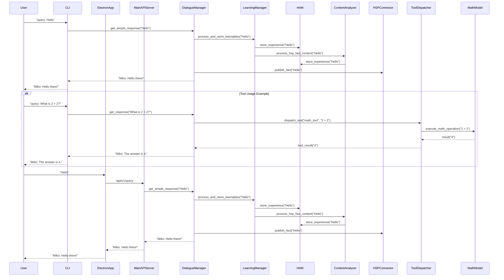

```mermaid
sequenceDiagram
    participant User
    participant CLI
    participant ElectronApp
    participant MainAPIServer
    participant DialogueManager
    participant LearningManager
    participant HAM
    participant ContentAnalyzer
    participant HSPConnector

    User->>CLI: "query: Hello"
    CLI->>DialogueManager: get_simple_response("Hello")
    DialogueManager->>LearningManager: process_and_store_learnables("Hello")
    LearningManager->>HAM: store_experience("Hello")
    LearningManager->>ContentAnalyzer: process_hsp_fact_content("Hello")
    ContentAnalyzer->>HAM: store_experience("Hello")
    DialogueManager->>HSPConnector: publish_fact("Hello")
    DialogueManager-->>CLI: "Miko: Hello there!"
    CLI-->>User: "Miko: Hello there!"

    alt Tool Usage Example
        User->>CLI: "query: What is 2 + 2?"
        CLI->>DialogueManager: get_response("What is 2 + 2?")
        DialogueManager->>ToolDispatcher: dispatch_tool("math_tool", "2 + 2")
        ToolDispatcher->>MathModel: execute_math_operation("2 + 2")
        MathModel-->>ToolDispatcher: result("4")
        ToolDispatcher-->>DialogueManager: tool_result("4")
        DialogueManager-->>CLI: "Miko: The answer is 4."
        CLI-->>User: "Miko: The answer is 4."
    end

    User->>ElectronApp: "Hello"
    ElectronApp->>MainAPIServer: /api/v1/query
    MainAPIServer->>DialogueManager: get_simple_response("Hello")
    DialogueManager->>LearningManager: process_and_store_learnables("Hello")
    LearningManager->>HAM: store_experience("Hello")
    LearningManager->>ContentAnalyzer: process_hsp_fact_content("Hello")
    ContentAnalyzer->>HAM: store_experience("Hello")
    DialogueManager->>HSPConnector: publish_fact("Hello")
    DialogueManager-->>MainAPIServer: "Miko: Hello there!"
    MainAPIServer-->>ElectronApp: "Miko: Hello there!"
    ElectronApp-->>User: "Miko: Hello there!"
```
