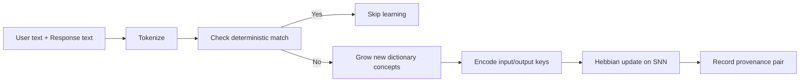
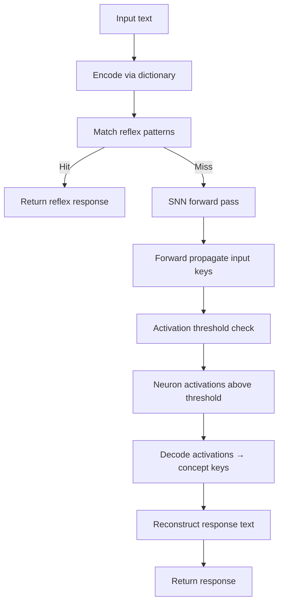
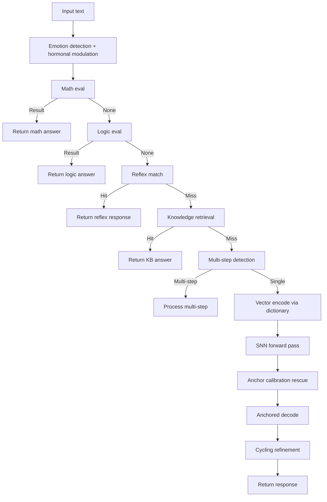

# Angela AI — Training, Learning, and Model Invocation Analysis

> **Status**: Comprehensive technical analysis
> **Scope**: ED3N engine, GARDEN engine, ModelBus, QueryClassifier, TrainingCoordinator, training pipeline (`scripts/train_pipeline.py`), inference routing, and data flow.

---

## 1. Executive Summary

Angela AI uses a **dual-engine architecture** with domain-specialized models orchestrated through a central **ModelBus**:

| Component | Role | Domain | Architecture |
|-----------|------|--------|-------------|
| **ED3N** | Deterministic reflex + symbolic reasoning | reflex, math, logic, greeting, association, reasoning, tooluse | Sparse SNN (Neuron/RelationGroup) + character-exact dictionary |
| **GARDEN** | Vector semantic + knowledge retrieval | knowledge, command, routing, general, unknown | Vector dictionary (TF-IDF/SentenceTransformer) + TensorSNN (PyTorch LIF) |
| **Cloud LLM** | Creative / high-complexity generation | creative, opinion, code, file, search, execute, task, vision, audio | External LLM backend (OpenAI/Anthropic/Ollama/etc.) |

Training is orchestrated by an 8-step pipeline (`scripts/train_pipeline.py`) with resumability. Inference routes through QueryClassifier → ModelBus → engine `process()`. Both engines support online learning: ED3N via `ED3NTrainer` (supervised), GARDEN via `learn_from_interaction` / `learn_batch` (Hebbian).

---

## 2. System Architecture Overview

### 2.1 Dual-Engine Design

```
User Query
    │
    ▼
┌─────────────────────────────────────┐
│   QueryClassifier (query_classifier)│
│   - Regex/keyword pattern matching   │
│   - ED3N dictionary encoding         │
│   - Returns QueryResult{            │
│       primary_type, confidence,      │
│       actionability, action_type}    │
└──────────────┬───────────────────────┘
    │ (query_type + confidence)
    ▼
┌─────────────────────────────────────┐
│   ExecutionGate (execution_gate)    │
│   - Decides auto-execute / confirm / │
│     reject based on action_type      │
│   - IntentRegistry cross-check       │
└──────────────┬───────────────────────┘
    │ (if not gated)
    ▼
┌─────────────────────────────────────┐
│   ModelBus (model_bus)              │
│   - Routes query_type → candidate   │
│     models via _ROUTE_HANDLERS      │
│   - _handle_reflex → ed3n            │
│   - _handle_math → ed3n (+garden)   │
│   - _handle_knowledge → garden       │
│   - _handle_creative → cloud         │
│   - _pick_best: highest confidence   │
└──────────────┬───────────────────────┘
    │
    ├─→ ED3N Engine  (ed3n_engine.process)
    ├─→ GARDEN Engine (garden_engine.process)
    └─→ Cloud LLM    (LLMRouter backend)
```

### 2.2 Inference Context Preparation (router.py)

The `LLMRouter._prepare_generation_context()` method (router.py:1435) assembles the generation context by injecting:

1. **MetaController calibration** — `get_weighted_adjustment()` injects temperature/tokens bias
2. **MetabolicHeartbeat health** — `get_system_health()` for the heartbeat voter
3. **DLI lifecycle state** — `life_cycle_state.name` for the lifecycle voter
4. **NeuroAutoSelector** — dynamic backend switching based on budget/complexity
5. **PriorityNegotiator** — weighted fusion of 8 voters (lifecycle, emotional, intent, angela_emotion, causal, meta_calibration, heartbeat, dli_state) → `routing_mode` (conservative/exploratory/neutral)
6. **CausalRouting** — temperature_bias/max_tokens_bias from CausalReasoningEngine

The negotiated `routing_mode` directly modifies generation parameters:
- `conservative`: temperature -= 0.3, max_tokens ≤ 384
- `exploratory`: temperature += 0.3, max_tokens ≥ 768

---

## 3. Data Types and Sources

### 3.1 Raw Datasets (`apps/backend/data/raw_datasets/`)

| File | Records | Format | Domain | Fields |
|------|---------|--------|--------|--------|
| `arithmetic_train_dataset.json` | 30,000 | JSON array | math | `problem`, `answer` |
| `arithmetic_test_dataset.csv` | ~500 | CSV | math | `problem`, `answer` |
| `logic_train.json` | 10,000 | JSON array | logic | `proposition`, `answer` |
| `logic_test.json` | 200 | JSON array | logic | `proposition`, `answer` |
| `alpaca_data.json` | 53,831 | JSON array | knowledge | `instruction`, `input`, `output` |
| `DummyModel.json` | 1 | JSON | knowledge | prompt/response pairs |
| `ollama_cat_formulas_log.json` | ~100 | JSON array | knowledge | `prompt`, `response` |
| `knowledge_extra.json` | (config) | JSON | knowledge | `input`, `output` |
| `reasoning_train.json` | (config) | JSON | reasoning | `input`, `output` |
| `tooluse_train.json` | (config) | JSON | tooluse | `input`, `output` |
| `association_train.json` | (config) | JSON | association | `input`, `output` |

### 3.2 Knowledge Bases (`apps/backend/data/knowledge_bases/`)

| File | Format | Content | Domain |
|------|--------|---------|--------|
| `LingCat_emotion_map.yaml` | YAML | Emotion mapping (Pleasure-Arousal-Dominance) | emotion |
| `LingCat_neko_quotes.json` | JSON | Cat-themed dialogue quotes | greeting/creative |
| `MikoAI_formulas.json` | JSON | Formula/response patterns | reflex |
| `MikoAI_personality.json` | JSON | Personality traits and responses | personality |
| `Fragmenta_persona_chain.json` | JSON (3 bytes) | Placeholder/fragment | unknown |

### 3.3 Dictionaries (`data/dictionaries/`)

| File | Entries | Format | Backend |
|------|---------|--------|---------|
| `cedict.json` | 124,806 | JSON (Chinese-English) | GARDEN VectorDictionary |
| `wordnet.json` | 117,659 | JSON (English WordNet) | GARDEN VectorDictionary |
| `combined.json` | 242,461 | JSON (merged) | GARDEN VectorDictionary |
| `learned.json` | 243,682 | JSON (post-training) | GARDEN VectorDictionary |
| `angela_knowledge.json` | 244,031 | JSON (knowledge graph) | GARDEN VectorDictionary |
| `cedict_1_0_ts_utf-8_mdbg.txt.gz` | — | Gzipped text dictionary | Source data |
| `WordNet-3.0/` | — | Directory | Source data |

### 3.4 ED3N Presets (`apps/backend/src/ai/ed3n/config/`)

| File | Format | Content | Domain |
|------|--------|---------|--------|
| `presets.json` | JSON | Reflex patterns + dictionary entries | reflex, knowledge |
| `math_presets.json` | JSON | Math reflex patterns + dict entries | math |

### 3.5 GARDEN Configs (`apps/backend/src/ai/garden/config/`)

| File | Content |
|------|---------|
| `conversation.json` | Conversation reflex patterns + dict entries |
| `science_knowledge.json` | Science knowledge entries |
| `emotion_knowledge.json` | Emotion-related knowledge |

### 3.6 Checkpoints (`data/checkpoints/`)

| File/Dir | Size | Content |
|----------|------|---------|
| `ed3n_full.json` | ~20MB | ED3N engine state (dictionary + network + reflex) |
| `garden_checkpoint/` | ~280MB | GARDEN engine state (dictionary.json + snn.pt) |
| `network.json` | — | ED3N CoreNetwork connections |
| `reflex_patterns.json` | — | ED3N reflex patterns |
| `knowledge_graph.json` | — | Entities + triples (28 grounded entries) |
| `grounded_knowledge.json` | — | 28 grounded knowledge entries |
| `training_report.json` | — | Pipeline summary report |
| `training_state.json` | — | Resume state for pipeline |
| `coordinator_state.json` | — | TrainingCoordinator domain records |

---

## 4. Data Transformation Pipeline

### 4.1 The 8-Step Training Pipeline (`scripts/train_pipeline.py:1801`)

```
[1/8] Load + Generate Data
  │  dataset_samples   = load_all_data()       → arithmetic/math, logic/logic, knowledge
  │  alpaca_samples     = load_alpaca_data()    → 10K cap, knowledge domain
  │  template_samples   = load_presets_data()   → ED3N+GARDEN config presets
  │  kb_samples         = load_knowledge_bases() → YAML/JSON knowledge bases
  │  presets_samples    = load_presets_data()   → presets.json/math_presets.json
  │  trpg_samples       = load_trpg_codex()      → TRPG world knowledge
  │  secondary_samples  = load_secondary_raw()  → formula log, DummyModel
  │  knowledge_samples  = generate_knowledge_data() → 500+ hand-written Q&A
  │  all_samples = concatenation of all above (~70K+ samples)
  │
[2/8] Initialize ModelBus + QueryClassifier + TrainingCoordinator
  │  model_bus = ModelBus()  → registers ed3n, garden, cloud backends
  │  query_classifier = QueryClassifier(ed3n_engine=...)
  │  coordinator = TrainingCoordinator(bus=model_bus)
  │
[3/8] Deconflict samples by domain
  │  batches = asyncio.run(coordinator.deconflict_samples(all_samples))
  │  → ALL samples go to BOTH ed3n AND garden batches (not domain-split)
  │  → deterministic-handled samples filtered out (math/logic facts)
  │
[4/8] Train ED3N
  │  ed3n_engine = ED3NEngine() → load_presets()
  │  4a+4b: Expand dictionary for math/logic tokens (grow new entries)
  │  4c: Create TrainingExamples (ONLY for snn_training_domains =
  │       {reflex, greeting, association} — math/logic/reasoning/tooluse/
  │       knowledge EXCLUDED from SNN Hebbian training)
  │  4d: Train network epochs (resumable per-epoch)
  │  4e: Reflex pattern generation
  │  4f: SequenceTrainer
  │  4g: JointTrainer
  │
[5/8] Train GARDEN
  │  garden_engine = GARDENEngine(compatibility_mode=True) → load_presets()
  │  learn_batch() in chunks of 500 with train_associations=True
  │  (knowledge facts go to dictionary only, SNN doesn't mirror them)
  │
[5b/8] Arithmetic digit-cell learner (ArithmeticLearner)
  │  Trains add/subtract/multiply/logic gate cells
  │  Registers as dict-layer fallback for math/logic
[6/8] Sync knowledge (ED3N → GARDEN)
  │  coordinator.sync_reflex_patterns() — top-N high-confidence patterns
  │  model_bus.sync_knowledge() — pattern injection
[7/8] Save all checkpoints
  │  ed3n_full.json, network.json, reflex_patterns.json
  │  garden_checkpoint/ (dictionary.json + snn.pt)
[8/8] Evaluation
  │  Test cases: math, logic, knowledge, greeting
  │  ModelBus routing + direct engine calls
```

### 4.2 Preprocessing Transformation

**File**: `scripts/train_pipeline.py:83-89`

```python
OP_MAP = {"+": " plus ", "-": " minus ", "*": " times ", "/": " over "}

def preprocess(text: str) -> str:
    text = text.lower().strip()
    text = text.replace(s, w)  # operator→word substitution
    text = re.sub(r"(\d)\.(\d)", r"\1 . \2", text)  # decimal splitting
    text = re.sub(r"\d+", lambda m: " ".join(m.group(0)), text)  # digit splitting
    return text
```

This transforms arithmetic problems like `"178 + 101"` → `"1 7 8  plus  1 0 1"` so individual digit concepts exist in the SNN.

### 4.3 Training Data Partitioning

**Step 3 (Deconfliction)** — `training_coordinator.py:230`:

```python
async def deconflict_samples(self, samples):
    batches = {}
    for sample in samples:
        for model_id in ("ed3n", "garden"):
            batches.setdefault(model_id, []).append(sample)
    return batches
```

**Key architectural decision**: Both engines receive **ALL** samples (not domain-split). The specialization happens inside each engine's training:

- **ED3N**: Step 4c filters to `snn_training_domains = {"reflex", "greeting", "association"}` only. Math/logic/reasoning/tooluse/knowledge samples grow dictionary entries but are EXCLUDED from SNN Hebbian training (they're handled by deterministic engines at runtime).
- **GARDEN**: Step 3a filters deterministic-handled samples. `learn_batch` with `train_associations=True` grows dictionary + runs Hebbian updates for all non-deterministic samples.

### 4.4 Dataset Ratios

Based on loaded data (from pipeline output):
- **Arithmetic (math)**: 30,000 train + ~500 test ≈ 30,500 samples
- **Logic**: 10,000 train + 200 test = 10,200 samples
- **Alpaca (knowledge)**: 10,000 (capped at `train.alpaca.max_samples`)
- **ED3N presets**: ~300 reflex + 50 math patterns
- **GARDEN configs**: ~200 entries (conversation/science/emotion)
- **Knowledge bases**: ~50 entries (emotion map, quotes, formulas, personality)
- **TRPG codex**: ~varies
- **Secondary**: ~100 (formula log + DummyModel)
- **Generated knowledge**: 500+ Q&A pairs

**Approximate ratio**: ED3N gets ~40K association-trainable samples (reflex/greeting/association subsets), GARDEN gets ~45K+ knowledge/general samples. Math/logic facts (~40K) are filtered from both engines' SNN training and handled by deterministic engines.

---

## 5. Model Training Systems

### 5.1 ED3N Training (`ed3n_trainer.py`)

**Architecture**: Two-phase training within `train_step()`:

#### Phase 1: Dictionary Training (`train_dictionary_phase()`)
- Encodes input text → input_keys via `DictionaryLayer.encode()`
- For each `TrainingExample`:
  - Checks which expected input_keys were matched during encoding
  - Grows missing keys via `dictionary.grow()`
  - Adjusts relation pairs (synonym/mapping/analogy groups)
  - Updates entry confidence: `entry.confidence += lr * (match - entry.confidence)`
- Rebuilds dictionary index (`_rebuild_index()`)

**TrainingExample structure** (from `training_types.py`):
```python
@dataclass
class TrainingExample:
    input_text: str          # original query text
    expected_output: str     # expected response
    input_keys: List[str]    # encoded concept keys
    output_keys: List[str]   # encoded target concept keys
    relation_pairs: List[Tuple[str, str, str]]  # (key1, relation_type, key2)
    confidence: float        # 0.0-1.0
```

#### Phase 2: Network Training (`train_network_phase()`)
- Forward-propagates input_keys through `CoreNetwork.forward()`
- Checks if expected output_keys activate above threshold
- `train_step()` on `CoreNetwork` adjusts connection weights via Hebbian-like update
- Only trains on `{"reflex", "greeting", "association"}` domains

#### CoreNetwork Training (`core_network.py:297`)
```python
def train_step(self, examples: List[Tuple[str, str, float]]):
    # For each (input_key, output_key, expected_activation):
    # 1. Forward propagate input → get activations
    # 2. Compute error = expected - actual
    # 3. Adjust connection weight: w += lr * error * input_activation
    # 4. Add bidirectional connection if not exists
```

#### SequenceTrainer and JointTrainer
- **SequenceTrainer**: Handles sequential (ordered) key sequences for multi-step reasoning
- **JointTrainer**: Combines dictionary + network training with joint loss

### 5.2 GARDEN Training (`garden_engine.py`)

**Architecture**: Vector dictionary + TensorSNN with Hebbian learning

#### VectorDictionary (`dictionary.py`)
- **Encode**: Multi-strategy text→concept-key mapping:
  1. CJK substring exact match (confidence = len(substring)/len(run))
  2. Non-CJK exact word match (confidence = 1.0)
  3. Prefix dedup for similar tokens (confidence = overlap × 0.85)
  4. TF-IDF similarity for unmatched tokens (confidence ≤ 0.5)
  5. Whole-text phrase-level catch-all (confidence ≤ 0.6)
- **Backend chain**: PyTorch TensorDictionary (SentenceTransformer) → numpy fallback
- **`_dirty` flag**: Prevents redundant index rebuilds
- **`grow()`**: Adds new concept entries with deduplication via `_find_similar_key()`
- **`_rebuild_index()`**: Rebuilds TF-IDF matrix from all entries (batched)

#### TensorSNNCore (`snn_core.py`)
- **Architecture**: Leaky Integrate-and-Spike (LIF) neurons with PyTorch tensor weight matrix
- **Vocabulary**: Dynamic — keys registered via `_register_key()`, pre-allocated via `_pre_allocate()`
- **Forward pass**: Spike propagation over `timesteps` with decay/leak
- **Hebbian update**: `hebbian_update(input_keys, output_keys, lr, target_strength)`
  - Creates/updates bidirectional synaptic weights between input and output concept neurons
  - Weight matrix: `W[i,j]` = connection strength between concept i and concept j
  - Sparse initialization: 5% density, symmetric matrix

#### Training Flow (`learn_batch()`)
1. Filter deterministic-handled samples (math/logic facts)
2. Collect all tokens from non-filtered samples
3. Grow new concepts into dictionary (prefix dedup, threshold=0.90)
4. Rebuild TF-IDF index once
5. For each sample: encode input/output → Hebbian update on SNN weights
6. Auto-regressive pass: SNN forward → teach (input+intermediate)→output for multi-hop reasoning

#### Checkpoint format (`garden_checkpoint/`)
```
garden_checkpoint/
├── dictionary.json    # All concept entries (keys, surface forms, relations)
├── snn.pt             # SNN weight matrix + key registry
└── engine_meta.json   # query_count, learn_count, model_name
```

### 5.3 Online Learning (Inference-time)

#### GARDEN: `learn_from_interaction()` (`garden_engine.py:1094`)
Called during chat when NeuralBridge is enabled or via `ED3NEngine.learn_from_interaction()`.



#### ED3N: `learn_from_interaction()` (`ed3n_engine.py`)
Similar flow — grows dictionary entries and adjusts SNN connections. Called during chat for association learning.

---

## 6. Model Invocation During Inference

### 6.1 Inference Flow

```
User message
    │
    ├── 1. QueryClassifier.classify(user_message)
    │      → QueryType (reflex/math/logic/knowledge/creative/...)
    │      → confidence score
    │
    ├── 2. ExecutionGate.decide()
    │      → auto_execute / confirm_then_execute / reject
    │      → routes to handler if action_type != "none"
    │
    ├── 3. Agent routing (if QueryType in {creative, knowledge, opinion, vision, audio, logic, command})
    │      → AgentOrchestrator.route_task()
    │      → AgentManager dispatches to specialized agent
    │
    └── 4. LLMRouter (if no agent/short-circuit)
           ├── _prepare_generation_context()
           │    → PriorityNegotiator.resolve() → routing_mode
           │    → MetaController calibration
           │    → NeuroAutoSelector (if auto mode)
           │
           └── _call_llm_backend()
                → model_bus.route(query, query_type)
                │    → _handle_{query_type} → _try_model for each candidate
                │    → _pick_best: highest confidence result
                │
                → Returns LLMResponse(text, backend, model, tokens, response_time, confidence)
```

### 6.2 QueryType → Model Routing Map (`model_bus.py:495`)

| QueryType | Candidate Models (ordered) | Handler |
|-----------|---------------------------|---------|
| reflex | `[ed3n]` | `_handle_reflex` (ed3n + cloud if conf < 0.5) |
| greeting | `[ed3n]` | `_handle_reflex` |
| math | `[ed3n, garden]` | `_handle_math` (ed3n + garden if conf < 0.70) |
| logic | `[ed3n, garden]` | `_handle_math` (same handler) |
| knowledge | `[garden, cloud]` | `_handle_knowledge` (garden + cloud if conf < 0.60) |
| creative | `[cloud]` | `_handle_creative` |
| opinion | `[cloud]` | `_handle_creative` |
| command | `[ed3n, garden]` | `_handle_handler_based` |
| file/search/code/execute/task | `[ed3n, garden, cloud]` | `_handle_handler_based` |
| vision/audio | `[ed3n, garden, cloud]` | `_handle_handler_based` |
| unknown | `[garden, cloud]` (fallback) | `_handle_fanout` |

### 6.3 ModelBus Route Decision Logic

1. **Query classification** → `query_type` (e.g., "math", "knowledge")
2. **Handler dispatch**: `_ROUTE_HANDLERS` maps query_type → method name (default: `_handle_fanout`)
3. **Candidate resolution**: `_resolve_candidates()` returns registered models for the query type
4. **Parallel execution**: `_try_model()` called for each candidate (asyncio.as_completed)
5. **Best selection**: `_pick_best()` picks highest confidence result
6. **Refinement zone**: If ed3n/garden confidence is 0.4–0.8, routes to cloud for "polish"

### 6.4 ED3N Process Pipeline (`ed3n_engine.py:process()`)



### 6.5 GARDEN Process Pipeline (`garden_engine.py:760`)



---

## 7. Key Transformations

### 7.1 Text → Dictionary Keys (Encoding)

**ED3N DictionaryLayer** (`dictionary_layer.py`):
- Character-level exact matching for CJK text
- Token-level exact matching for English words
- Surface forms stored as dict: `{"surface_form": "canonical_key"}`
- `grow()`: Creates new concept keys with `k{N}` naming scheme

**GARDEN VectorDictionary** (`dictionary.py:723`):
- Multi-strategy: CJK substring → exact word → prefix dedup → TF-IDF similarity → phrase catch-all
- Returns `Dict[str, float]` (key → confidence score)
- Uses `_DECODE_GATE` (0.15) as decode threshold

### 7.2 Dictionary Keys → SNN Activations

**ED3N CoreNetwork** (`core_network.py:133`):
```python
def forward(self, input_keys, context=None):
    # 1. Activate directly-matched input neurons
    # 2. Compute spike propagation (max 3 hops, 0.5 decay)
    # 3. Apply relation activations (synonym/mapping/analogy groups)
    # 4. Return {key: activation} for neurons above threshold
```

**GARDEN TensorSNNCore** (`snn_core.py`):
```python
def forward(self, input_keys, context=None):
    # 1. Map keys to indices via _key_to_idx
    # 2. Set input neuron activations
    # 3. Run LIF spike propagation over timesteps
    # 4. Return {key: activation} for spikes above threshold
```

### 7.3 SNN Activations → Response Text (Decoding)

**Anchored Decode** (`garden_engine.py:859`):
1. Filter network_output to keys above `_DECODE_GATE` (0.15)
2. Exclude input keys (avoid echo)
3. Sort by activation strength, take top-k (budget based on input length)
4. Decode keys → surface forms via dictionary
5. If empty, fallback to top-4 input key decode

**ED3N Decoding** (`ed3n_engine.py`): Uses dictionary's `decode()` with surface form reconstruction.

---

## 8. Discovery: Issues and Observations

### 8.1 Data Redundancy Concerns

- **Both engines train on ALL samples**: The deconfliction step assigns every sample to both `ed3n` and `garden` batches. While each engine filters internally, this means:
  - ED3N trains only on `{"reflex", "greeting", "association"}` subsets (≈500–1,000 samples after filtering)
  - GARDEN trains on all non-deterministic samples (≈40K+ after filtering 40K arithmetic/logic)
  - The 30,000 arithmetic + 10,000 logic samples are filtered out of GARDEN training (deterministic match)

- **ED3N SNN training data starvation**: Only ~500–1,000 association samples train the SNN. Math/logic samples grow the dictionary but don't train weights.

### 8.2 Architectural Strengths

1. **SNN learns associations only**: Knowledge facts are stored in the dictionary, not baked into neural weights. This preserves the distinction between "knowing a fact" and "associating concepts."
2. **Resumable pipeline**: Each step is checkpointed; killed runs resume from the last completed sub-stage.
3. **Deterministic engine priority**: Math/logic/knowledge facts are handled by deterministic engines (MathVerifier, chain reasoning, KB lookup) before reaching the neural layer, ensuring accuracy.
4. **Causal loop closure**: GARDEN's `learn_from_interaction` + `_retrieval_targets` + anchor calibration rescues single-pass Hebbian weights that never reach decode threshold.
5. **PriorityNegotiator**: 8-voter weighted fusion for routing decisions, with closed-loop feedback through CNS event bus.

### 8.3 Architectural Weaknesses

1. **SNN weight sparsity**: Hebbian updates with target_strength=0.35 may not reach `_DECODE_GATE` (0.15) for many concepts, requiring the anchor calibration rescue. This suggests the learning rate or target strength may need calibration.
2. **Cloud model dependency**: Creative/opinion/code/file/vision/audio all route to cloud. No local fallback for these domains.
3. **ED3N training exclusion**: Reasoning/tooluse/knowledge samples are grown into the dictionary but never trained as associations — the SNN doesn't learn multi-concept relationships for these domains.
4. **Dictionary growth without pruning**: Both dictionaries cap at `max_entries` (500,000) but never explicitly prune low-confidence entries.

### 8.4 Inference Path Observations

- `chat_routes.py` calls `QueryClassifier` **twice** per request: once in `_handle_execution_gate()` (line 687) and once in `_try_agent_routing()` (line 793). Both create new `QueryClassifier` instances with separate ED3N engine references.
- The GARDEN provider (`garden.py`) loads `garden_checkpoint` at init via lazy `_get_engine()`, but the checkpoint path resolution walks up the filesystem tree (up to 10 levels) which is fragile.
- NeuralBridge is designed but its `_neural_bridge_active` flag in context is set but may not be consistently checked by all engine paths.

---

## 9. File Inventory

### 9.1 Training Pipeline
| File | Purpose |
|------|---------|
| `scripts/train_pipeline.py` | 8-step unified pipeline (1,986 lines) |
| `scripts/train_ed3n.py` | Standalone ED3N training script |
| `scripts/quick_train.py` | Quick training for ED3N (arithmetic + logic) |
| `scripts/validate_three_column.py` | Validation against three-column format |
| `scripts/verify_training.py` | Verify trained checkpoints |

### 9.2 ED3N Engine (`apps/backend/src/ai/ed3n/`)
| File | Purpose |
|------|---------|
| `ed3n_engine.py` | Main engine (process, train, save, load) |
| `ed3n_trainer.py` | ED3NTrainer, SequenceTrainer, JointTrainer |
| `core_network.py` | CoreNetwork (Neuron, RelationGroup, LIF-style activations) |
| `dictionary_layer.py` | DictionaryLayer (character-exact matching, grow) |
| `training_types.py` | TrainingExample, TrainingBatch, TrainMetrics, SequenceExample |
| `relation_classifier.py` | Relation type classification (synonym/mapping/analogy) |
| `step_decoder.py` | Sequential decoding |
| `reflex.py` | Pattern-based reflex matching |
| `config/presets.json` | Built-in reflex patterns + dict entries |
| `config/math_presets.json` | Math-specific presets |

### 9.3 GARDEN Engine (`apps/backend/src/ai/garden/`)
| File | Purpose |
|------|---------|
| `garden_engine.py` | Main engine (process, learn, save, load) |
| `dictionary.py` | VectorDictionary (TF-IDF/SentenceTransformer, encode/decode) |
| `snn_core.py` | TensorSNNCore (PyTorch LIF SNN) |
| `vector_decoder.py` | AnchoredDecoder (selective decoding) |
| `config/conversation.json` | Conversation reflex patterns |
| `config/science_knowledge.json` | Science knowledge entries |
| `config/emotion_knowledge.json` | Emotion knowledge entries |

### 9.4 Orchestration (`apps/backend/src/ai/core/`)
| File | Purpose |
|------|---------|
| `model_bus.py` | Central router (register, route, _pick_best) |
| `query_classifier.py` | Query classification (regex + ED3N encode) |
| `training_coordinator.py` | Domain ownership, deconfliction, sync |
| `execution_gate.py` | Action decision (auto/confirm/reject) |
| `training_coordinator.py` | DOMAIN_OWNERSHIP map, deconflict_samples |

### 9.5 Inference (`apps/backend/src/services/llm/`)
| File | Purpose |
|------|---------|
| `router.py` | LLMRouter (context prep, backend selection, PriorityNegotiator) |
| `providers/garden.py` | GARDENBackend LLM provider |
| `providers/base.py` | BaseLLMBackend interface |

### 9.6 Inference Integration (`apps/backend/src/api/routes/`)
| File | Purpose |
|------|---------|
| `chat_routes.py` | Main chat handler (2,064+ lines), QueryClassifier + ExecutionGate + ModelBus |

---

## 10. Configuration Reference

### 10.1 Key Config Values (`magic_numbers.py`)

| Key | Default | Purpose |
|-----|---------|---------|
| `train.ed3n.epochs` | 2 | ED3N training epochs |
| `train.ed3n.dictionary_lr` | 0.05 | Dictionary learning rate |
| `train.ed3n.network_lr` | 0.05 | Network learning rate |
| `train.ed3n.grow_confidence` | 0.7 | Dictionary growth confidence threshold |
| `train.ed3n.max_input_keys` | 5 | Max input keys per example |
| `train.ed3n.max_output_keys` | 3 | Max output keys per example |
| `train.ed3n.max_examples_per_epoch` | 50 | Max examples in coordinator record |
| `train.alpaca.max_samples` | 10,000 | Alpaca dataset cap |
| `train.garden.learn_confidence` | 0.7 | GARDEN learning confidence |
| `train.garden.record_accuracy` | 0.7 | GARDEN accuracy record |
| `train.sync.pattern_limit` | 200 | Knowledge sync pattern limit |
| `ai.core_network.neuron_threshold` | 0.3 | ED3N neuron firing threshold |
| `ai.core_network.max_connections` | 200,000 | CoreNetwork connection budget |
| `ai.core_network.propagation_hops` | 3 | Spike propagation depth |
| `ai.core_network.propagation_decay` | 0.5 | Signal decay per hop |
| `ai.model_bus.route.math_threshold` | 0.70 | Math routing confidence threshold |
| `ai.model_bus.route.knowledge_threshold` | 0.60 | Knowledge routing threshold |
| `ai.garden.engine.learn_confidence` | 0.7 | GARDEN learn confidence |
| `ai.garden.engine.hebbian_lr` | 0.05 | GARDEN Hebbian learning rate |
| `ai.garden.engine.hebbian_target_strength` | 0.35 | Target synaptic strength |
| `ai.garden.engine.min_token_length` | 3 | Minimum token length for dictionary |
| `ai.garden.engine.dedup_similarity` | 0.90 | Token deduplication threshold |
| `ai.garden.engine.max_token_length` | 50 | Maximum token length |
| `ai.garden.dictionary.similarity_threshold` | 0.15 | TF-IDF similarity gate |

### 10.2 GARDEN Decode Gate
- `_DECODE_GATE = 0.15` — minimum activation for a concept to be decodable
- `_slot_budget()` — allocates decode slots based on input key count

---

## 11. Verification Methodology

Training correctness is verified through:

1. **Step 8 Evaluation** (`train_pipeline.py:1047`): Test cases cover math, logic, knowledge, and greeting domains
2. **Benchmark script** (`scripts/benchmark_ed3n_garden.py`): Cross-domain accuracy testing
3. **Direct engine tests**: `test_heldout.py`, `validate_three_column.py`
4. **Pipeline dry-run** (`TRAIN_DRY_RUN=1`): Verifies imports, data loading, and deconfliction without actual training
5. **Resume state**: `training_state.json` tracks completed steps and per-epoch progress
