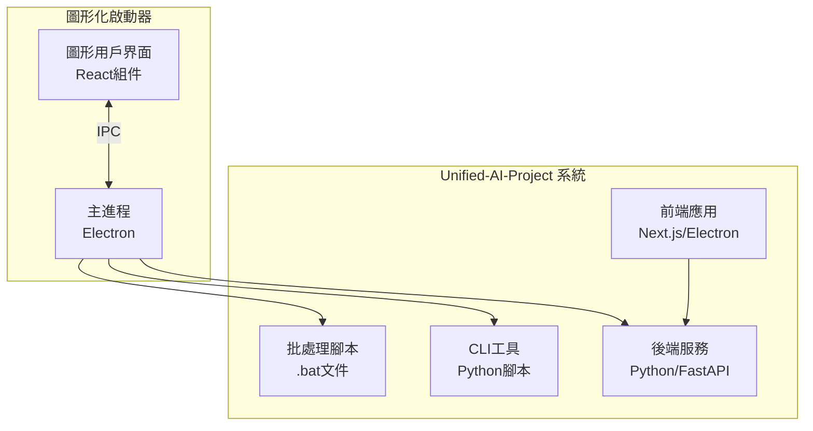
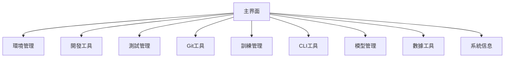
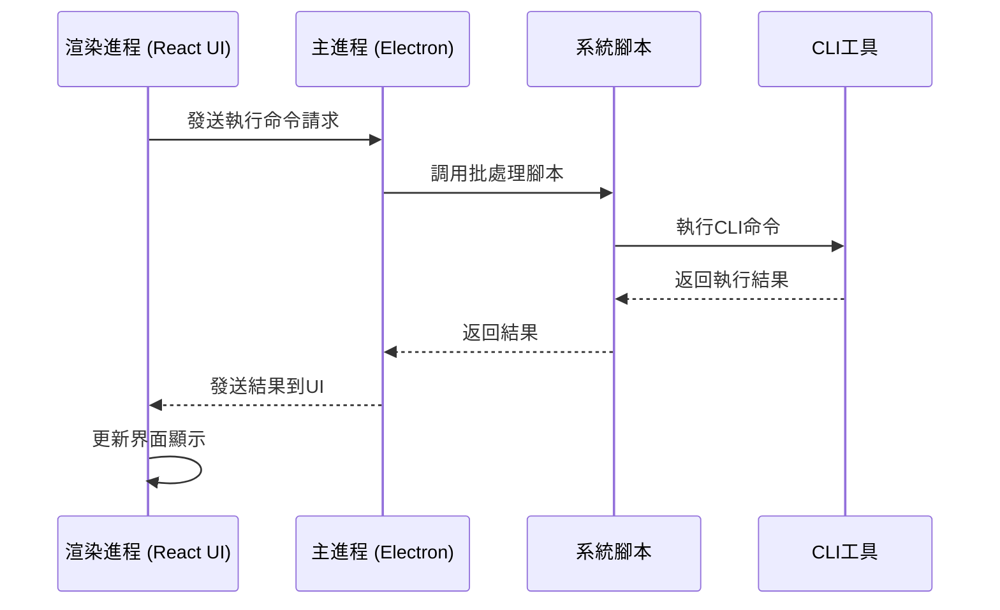

# Unified AI Project 圖形化啟動器/安裝器設計文檔

## 檔案位置總覽

在進行詳細設計之前，我們首先對 Unified-AI-Project 的相關檔案位置進行了全面的梳理，以便更好地整合到圖形化啟動器中：

1. **桌面應用組件**:
   - 位置: `apps/desktop-app/electron_app/`
   - 主進程文件: `apps/desktop-app/electron_app/main.js`
   - 預加載腳本: `apps/desktop-app/electron_app/preload.js`
   - 啟動腳本: `apps/desktop-app/start-desktop-app.bat`

2. **CLI工具組件**:
   - 位置: `cli/`
   - 主入口: `cli/main.py`
   - 命令目錄: `cli/commands/`
   - 工具目錄: `cli/utils/`

3. **批處理腳本組件**:
   - 位置: `tools/` 和 `scripts/`
   - 主要腳本: `unified-ai.bat` (根目錄)
   - 工具腳本: `tools/*.bat`
   - 開發腳本: `scripts/*.bat`

4. **前端儀表板**:
   - 位置: `apps/frontend-dashboard/`

5. **後端服務**:
   - 位置: `apps/backend/`

6. **訓練相關**:
   - 訓練腳本: `tools/train-manager.bat`
   - 訓練數據: `training/`

7. **測試相關**:
   - 測試腳本: `tools/run-tests.bat`
   - 測試文件: `tests/`

8. **配置文件**:
   - 主配置: `apps/backend/configs/`
   - 應用配置: 各應用目錄下的配置文件

## 1. 概述

### 1.1 項目背景
Unified-AI-Project 是一個面向 AGI（Level 3-4）的混合式 AI 生態系統，採用 monorepo 架構。本項目旨在為 Unified-AI-Project 開發一個圖形化啟動器/安裝器，提供直觀易用的圖形界面來訪問項目的所有功能，包括 CLI 工具、腳本、批處理腳本、前端應用等。

### 1.2 目標
開發一個圖形化啟動器/安裝器，實現以下目標：
- 提供直觀的圖形用戶界面，替代命令行操作
- 集成 Unified-AI-Project 的所有核心功能
- 通過按鈕點擊方式執行各種操作，類似傳統軟件安裝界面
- 直接與後端系統通信，實現功能調用

### 1.3 核心功能
- 環境檢查與設置
- 開發服務啟動
- 測試執行
- Git 管理
- 訓練環境設置與管理
- CLI 工具訪問
- AI 模型管理
- 數據分析與處理
- 系統信息查看

### 1.4 設計原則
- **模塊化設計**：各功能模塊獨立開發和維護
- **用戶友好**：簡潔直觀的界面設計
- **一致性**：與 Unified-AI-Project 整體設計風格保持一致
- **可擴展性**：支持未來功能擴展
- **穩定性**：完善的錯誤處理和日誌記錄機制

## 2. 系統架構

### 2.1 整體架構
圖形化啟動器將基於 Electron 框架開發，採用主進程與渲染進程分離的架構模式。啟動器將作為 Unified-AI-Project 的統一入口，通過 IPC 通信調用現有的批處理腳本和 CLI 工具。



### 2.2 技術棧
- **前端框架**: Electron + React
- **UI組件庫**: Material-UI 或 Ant Design
- **狀態管理**: Redux 或 Context API
- **進程間通信**: Electron IPC
- **構建工具**: Webpack + Babel
- **包管理**: pnpm

### 2.3 目錄結構
```
graphic-launcher/
├── main/                 # 主進程代碼
│   ├── main.js           # 主進程入口
│   ├── preload.js        # 預加載腳本
│   └── ipc-handlers.js   # IPC 處理器
├── renderer/             # 渲染進程代碼
│   ├── src/              # React 源碼
│   │   ├── components/   # UI 組件
│   │   ├── pages/        # 頁面組件
│   │   ├── store/        # 狀態管理
│   │   └── utils/        # 工具函數
│   └── public/           # 靜態資源
├── scripts/              # 啟動器專用腳本
├── configs/              # 配置文件
└── package.json          # 項目配置文件
```

### 2.4 相關檔案位置
根據項目結構分析，圖形化啟動器需要與以下現有組件進行整合：

1. **桌面應用組件**:
   - 位置: `apps/desktop-app/electron_app/`
   - 主進程文件: `apps/desktop-app/electron_app/main.js`
   - 預加載腳本: `apps/desktop-app/electron_app/preload.js`
   - 啟動腳本: `apps/desktop-app/start-desktop-app.bat`

2. **CLI工具組件**:
   - 位置: `cli/`
   - 主入口: `cli/main.py`
   - 命令目錄: `cli/commands/`
   - 工具目錄: `cli/utils/`

3. **批處理腳本組件**:
   - 位置: `tools/` 和 `scripts/`
   - 主要腳本: `unified-ai.bat` (根目錄)
   - 工具腳本: `tools/*.bat`
   - 開發腳本: `scripts/*.bat`

4. **前端儀表板**:
   - 位置: `apps/frontend-dashboard/`

5. **後端服務**:
   - 位置: `apps/backend/`

## 3. 功能模塊設計

### 3.1 主界面設計
主界面將採用卡片式佈局，展示所有可用的功能模塊：



### 3.2 環境管理模塊
對應 `unified-ai.bat` 中的選項 1(Health Check) 和 2(Setup Environment)

功能點：
- 環境健康檢查 (調用 `tools/health-check.bat`)
- 依賴安裝與設置 (調用 `scripts/setup_env.bat`)
- Python 虛擬環境管理
- Node.js 環境檢查

交互設計：
- 提供一鍵檢查按鈕
- 顯示詳細的環境狀態信息
- 提供修復建議和自動修復功能

### 3.3 開發工具模塊
對應 `unified-ai.bat` 中的選項 3(Start Development)

功能點：
- 啟動後端 API 服務 (調用 `apps/backend/start_chroma_server.py` 和 `apps/backend/src/services/main_api_server.py`)
- 啟動前端儀表板 (調用 `apps/frontend-dashboard/` 相關服務)
- 啟動桌面應用 (調用 `apps/desktop-app/electron_app/main.js`)
- 服務狀態監控

增強功能：
- 服務進程管理（啟動、停止、重啟）
- 實時日誌查看
- 端口占用檢查
- 自動重啟機制

### 3.4 測試管理模塊
對應 `unified-ai.bat` 中的選項 4(Run Tests)

功能點：
- 執行所有測試 (調用 `tools/run-tests.bat`)
- 執行前端測試 (調用 `apps/frontend-dashboard/` 中的測試)
- 執行後端測試 (調用 `apps/backend/` 中的測試)
- 執行單元測試
- 執行集成測試
- 測試報告查看

增強功能：
- 測試進度實時顯示
- 失敗測試用例高亮顯示
- 測試結果導出功能
- 自動重試失敗測試

### 3.5 Git 工具模塊
對應 `unified-ai.bat` 中的選項 5(Git Management)

功能點：
- Git 狀態檢查
- 安全 Git 清理 (調用 `tools/safe-git-cleanup.bat`)
- 錯誤日誌查看 (調用 `tools/view-error-logs.bat`)
- 緊急 Git 修復 (調用 `tools/emergency-git-fix.bat`)

增強功能：
- 圖形化 Git 狀態顯示
- 分支管理界面
- 提交歷史查看
- 衝突解決輔助工具

### 3.6 訓練管理模塊
對應 `unified-ai.bat` 中的選項 6(Training Setup) 和 7(Training Manager)

功能點：
- 訓練環境設置 (調用 `tools/setup-training.bat`)
- 訓練任務管理（啟動、暫停、繼續、停止）(調用 `tools/train-manager.bat`)
- 訓練進度查看
- 訓練結果查看
- 訓練數據管理
- 協作式訓練
- 實時訓練監控

增強功能：
- 訓練參數可視化配置
- 訓練曲線實時繪製
- 模型版本管理
- 訓練資源使用監控（CPU、內存、GPU）
- 分布式訓練支持

### 3.7 CLI 工具模塊
對應 `unified-ai.bat` 中的選項 8(CLI Tools)

功能點：
- 訪問 Unified AI CLI 工具 (調用 `cli/main.py`)
- 命令執行與結果顯示

增強功能：
- CLI 命令歷史記錄
- 命令自動補全
- 參數可視化配置
- 命令模板管理

### 3.8 模型管理模塊
對應 `unified-ai.bat` 中的選項 9(Model Management)

功能點：
- AI 模型列表查看
- 模型健康檢查
- DNA 鏈管理
- 模型性能報告

增強功能：
- 模型可視化展示
- 模型版本對比
- 模型導入/導出功能
- 模型性能基準測試

相關文件位置：
- AI 模型文件: `training/`
- CLI 模型管理工具: `cli/ai_models_cli.py`

### 3.9 數據工具模塊
對應 `unified-ai.bat` 中的選項 10(Data Analysis) 和 11(Data Pipeline)

功能點：
- 數據分析
- 自動化數據處理流水線運行 (調用 `tools/run_data_pipeline.bat`)

增強功能：
- 數據可視化圖表
- 數據質量檢查
- 數據預處理配置
- 數據流水線調度管理

相關文件位置：
- 數據處理腳本: `tools/automated_data_pipeline.py`
- 數據文件: `training/` 和 `test_data/`

### 3.10 系統工具模塊
對應 `unified-ai.bat` 中的選項 12-14

功能點：
- 緊急 Git 修復 (調用 `tools/emergency-git-fix.bat`)
- 依賴問題修復 (調用 `tools/fix-dependencies.bat`)
- 系統信息查看

增強功能：
- 系統資源監控（CPU、內存、磁盤）
- 系統性能基線測試
- 自動化備份與恢復 (調用 `tools/automated-backup.bat`)
- 安全掃描與漏洞檢測 (調用 `tools/project-security-check.bat`)

## 4. 用戶界面設計

### 4.1 主界面佈局
```
+---------------------------------------------------+
| Unified AI Project 圖形化啟動器                  |
+----------------------+----------------------------+
| 功能導航面板         | 主內容區域                 |
|                      |                            |
| [環境管理]           | 根據選中功能顯示對應界面   |
| [開發工具]           |                            |
| [測試管理]           |                            |
| [Git工具]            |                            |
| [訓練管理]           |                            |
| [CLI工具]            |                            |
| [模型管理]           |                            |
| [數據工具]           |                            |
| [系統工具]           |                            |
+----------------------+----------------------------+
| 狀態欄: 服務狀態、進度指示等                     |
+---------------------------------------------------+
```

### 4.2 功能界面設計示例

#### 環境管理界面
```
+---------------------------------------------------+
| 環境管理                                          |
+---------------------------------------------------+
| [健康檢查] [設置環境] [查看日誌]                  |
+---------------------------------------------------+
| 環境狀態:                                         |
| ✓ Node.js v18.17.0                                |
| ✓ Python 3.9.16                                   |
| ✓ pnpm 8.6.12                                     |
| ✓ 虛擬環境: 已激活                                |
|                                                   |
| 系統信息:                                         |
| OS: Windows 11                                    |
| 記憶體: 16GB                                      |
| 可用空間: 256GB                                   |
+---------------------------------------------------+
```

#### 訓練管理界面
```
+---------------------------------------------------+
| 訓練管理                                          |
+---------------------------------------------------+
| [開始訓練] [暫停訓練] [停止訓練] [查看結果]       |
+---------------------------------------------------+
| 訓練狀態: 進行中                                  |
| 模型: concept_models                              |
| 進度: ██████████░░░░░ 65%                         |
| 預計完成時間: 2小時 15分鐘                        |
|                                                   |
| 訓練歷史:                                         |
| - concept_models (已完成)                         |
| - math_model (已完成)                             |
| - logic_model (進行中)                            |
+---------------------------------------------------+
```

### 4.3 用戶體驗優化
- **響應式設計**：適配不同屏幕尺寸
- **主題支持**：支持深色/淺色主題切換
- **快捷鍵支持**：提供常用功能快捷鍵
- **進度反饋**：耗時操作提供明確進度指示
- **錯誤恢復**：操作失敗時提供恢復選項

## 5. IPC 通信設計

### 5.1 通信架構
主進程負責與系統底層交互，調用批處理腳本和 CLI 工具，渲染進程通過 IPC 與主進程通信。



### 5.2 主要 IPC 通道設計
| 通道名稱 | 功能描述 | 請求參數 | 響應數據 |
|---------|---------|---------|---------|
| `run-script` | 執行批處理腳本 | `{script: '腳本名', args: ['參數1', '參數2']}` | `{success: true, output: '執行輸出'}` |
| `run-cli-command` | 執行CLI命令 | `{command: '命令', args: ['參數1', '參數2']}` | `{success: true, output: '執行輸出'}` |
| `get-system-info` | 獲取系統信息 | 無 | `{os: '系統信息', memory: '記憶體信息'}` |
| `check-environment` | 檢查環境狀態 | 無 | `{node: true, python: true, pnpm: true}` |

### 5.3 通信安全設計
- **參數驗證**：對所有 IPC 請求參數進行嚴格驗證
- **命令白名單**：僅允許執行預定義的腳本和命令
- **權限控制**：限制文件系統訪問權限
- **錯誤處理**：統一的錯誤處理和日誌記錄機制

## 6. 錯誤處理與日誌記錄

### 6.1 錯誤處理策略
- 前端錯誤：在界面中顯示錯誤信息和解決建議
- 後端錯誤：記錄到日誌文件並通過 IPC 傳遞給前端顯示
- 腳本執行錯誤：捕獲錯誤輸出並提供詳細的錯誤信息

### 6.2 日誌記錄
- 所有操作記錄到統一日誌文件
- 錯誤信息包含時間戳和詳細描述
- 日誌文件輪換機制，避免文件過大

### 6.3 錯誤恢復機制
- **自動重試**：對臨時性錯誤實現自動重試
- **狀態恢復**：應用重啟後恢復到之前狀態
- **數據備份**：關鍵數據定期備份
- **回滾機制**：失敗操作支持回滾

## 7. 安全性設計

### 7.1 權限控制
- 主進程限制文件系統訪問權限
- 禁止執行任意系統命令
- 僅允許調用預定義的腳本和CLI工具

### 7.2 數據安全
- 不存儲敏感信息
- 配置文件加密存儲
- 通信過程中的數據保護

### 7.3 應用安全
- **代碼簽名**：發布版本進行數字簽名
- **沙箱機制**：渲染進程運行在沙箱環境中
- **更新驗證**：自動更新時驗證更新包完整性
- **安全審計**：定期進行安全漏洞掃描

## 8. 性能優化

### 8.1 啟動優化
- 延遲加載非必要模塊
- 預加載常用組件
- 服務進程預啟動

### 8.2 響應優化
- 異步執行耗時操作
- 進度反饋機制
- 結果緩存機制

### 8.3 資源管理
- **內存優化**：及時釋放不用的資源
- **CPU 使用優化**：合理分配計算任務
- **網絡優化**：減少不必要的網絡請求
- **渲染優化**：虛擬滾動和組件懶加載

## 9. 測試策略

### 9.1 單元測試
- React 組件測試
- IPC 通信測試
- 工具函數測試

### 9.2 集成測試
- 功能模塊集成測試
- 與系統腳本的集成測試
- 與CLI工具的集成測試

### 9.3 用戶界面測試
- 界面佈局測試
- 交互流程測試
- 兼容性測試

### 9.4 自動化測試
- **端到端測試**：模擬用戶操作的完整流程測試
- **回歸測試**：確保新功能不破壞現有功能
- **性能測試**：驗證應用在不同負載下的表現
- **安全測試**：檢測潛在的安全漏洞

## 10. 部署與分發

### 10.1 構建流程
- 使用 Electron-builder 打包應用
- 支持 Windows、macOS 和 Linux 平台
- 自動化構建流程

### 10.2 分發方式
- 可執行文件分發
- 安裝包分發
- 便攜版分發

### 10.3 更新機制
- 自動檢查更新
- 增量更新支持
- 回滾機制

### 10.4 部署策略
- **灰度發布**：逐步向用戶推送新版本
- **A/B測試**：對比不同版本的用戶體驗
- **版本管理**：完善的版本控制和發布流程
- **監控反饋**：實時監控應用運行狀態和用戶反饋

### 10.5 遺漏功能補充
在設計過程中，我們發現以下可能需要補充的功能：

1. **日誌查看器**：
   - 集成現有的日誌查看功能 (調用 `tools/view-error-logs.bat`)
   - 提供日誌過濾和搜索功能
   - 支持實時日誌監控

2. **配置管理**：
   - 圖形化配置文件編輯器
   - 支持 Unified-AI-Project 各組件的配置管理
   - 配置驗證和備份功能

3. **幫助與文檔**：
   - 集成項目文檔查看功能
   - 提供功能使用說明和最佳實踐
   - 連結到在線資源和社區支持

4. **通知系統**：
   - 系統級通知支持
   - 任務完成提醒
   - 錯誤和警告通知

5. **導出/導入功能**：
   - 配置導出/導入
   - 訓練結果導出
   - 日誌導出功能