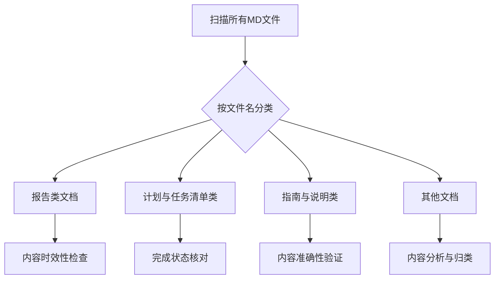
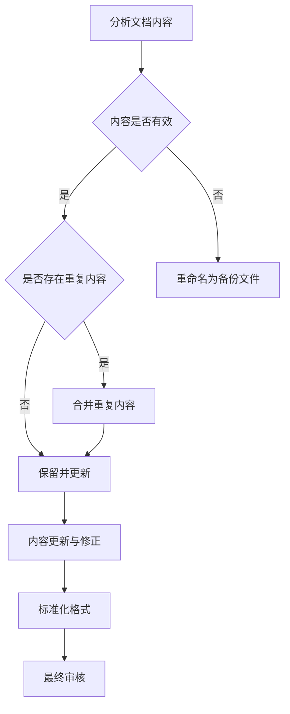

# Markdown文件组织与更新计划

## 1. 概述

本计划旨在对项目中的所有Markdown文档进行系统性整理和更新，确保文档内容的准确性、一致性和完整性。我们将采取以下策略：

1. 不直接删除任何现有MD文件
2. 对失效或过时的MD文件进行备份并标记
3. 对内容有错误或遗漏的MD文件进行修正和补充
4. 对存在重复内容的MD文件进行合并和优化
5. 建立标准化的文档维护流程

## 2. 文档分类与处理策略

### 2.1 报告类文档
- **特征**: 以"REPORT"、"SUMMARY"、"ANALYSIS"等词结尾的文件
- **处理策略**:
  - 检查内容时效性，过时的标记为备份
  - 合并内容重复的报告
  - 补充缺失的数据和结论

### 2.2 计划与任务清单类文档
- **特征**: 以"PLAN"、"TASK_LIST"、"IMPLEMENTATION"等词开头或结尾的文件
- **处理策略**:
  - 对照实际完成情况更新状态
  - 合并功能相似的计划文档
  - 标准化任务清单格式

### 2.3 指南与说明类文档
- **特征**: 以"GUIDE"、"README"、"TEMPLATE"等词结尾的文件
- **处理策略**:
  - 更新过时的操作步骤
  - 补充缺失的说明内容
  - 统一文档结构和格式

## 3. 具体实施步骤

### 3.1 文档识别与分类

### 3.2 内容分析与处理

### 3.3 文档更新与维护
1. **备份处理**:
   - 对失效或过时的文档重命名为`原文件名.backup`格式
   - 在备份文件中添加注释说明备份原因和日期

2. **内容更新**:
   - 根据项目实际进展更新任务完成状态
   - 修正错误信息和技术细节
   - 补充缺失的内容和说明

3. **重复内容合并**:
   - 识别内容高度相似的文档
   - 保留信息最完整、结构最清晰的版本
   - 将其他文档中的补充信息整合到主文档中
   - 删除或备份被合并的文档

## 4. 文档标准化规范

### 4.1 命名规范
- 使用英文命名，单词间用下划线分隔
- 报告类文档以`_report.md`结尾
- 计划类文档以`_plan.md`结尾
- 任务清单以`_task_list.md`结尾
- 指南类文档以`_guide.md`结尾

### 4.2 结构规范
1. **标题层级**:
   - # 一级标题(文档名称)
   - ## 二级标题(主要章节)
   - ### 三级标题(子章节)
   - #### 四级标题(具体内容)

2. **内容组织**:
   - 每个文档应包含概述或简介部分
   - 重要内容使用列表或表格形式展示
   - 技术内容配以适当的代码示例或图表

### 4.3 维护规范
- 每月定期检查文档时效性
- 重要变更发生后及时更新相关文档
- 新增功能需同步创建相应文档

## 5. 质量保证措施

### 5.1 内容审核机制
- 建立文档审核流程，确保准确性
- 定期组织文档评审会议
- 设置文档负责人制度

### 5.2 版本控制
- 所有文档变更纳入Git版本控制
- 重要文档变更需提交说明
- 建立文档版本发布机制

### 5.3 自动化检查
- 开发文档格式检查工具
- 建立文档链接有效性检查机制
- 实现文档内容重复度检测

## 6. 实施时间计划

| 阶段 | 时间 | 主要任务 | 交付物 |
|------|------|---------|--------|
| 第一阶段 | 第1周 | 文档识别与分类 | 文档分类清单 |
| 第二阶段 | 第2-3周 | 内容分析与处理 | 更新后的文档集合 |
| 第三阶段 | 第4周 | 重复内容合并 | 合并后的文档集 |
| 第四阶段 | 第5周 | 标准化与审核 | 标准化文档集 |
| 第五阶段 | 第6周 | 质量检查与发布 | 最终文档库 |

## 7. 风险评估与应对

| 风险 | 影响 | 应对措施 |
|------|------|---------|
| 文档内容不准确 | 影响项目理解和使用 | 建立多重审核机制 |
| 重要信息遗漏 | 造成误解或错误操作 | 设置交叉验证流程 |
| 更新不及时 | 文档与实际不符 | 建立定期更新机制 |
| 格式不统一 | 影响阅读体验 | 制定并执行格式规范 |

## 8. 后续维护机制

### 8.1 定期维护
- 每月进行一次文档时效性检查
- 每季度进行一次全面内容审核
- 每年进行一次文档结构优化

### 8.2 变更管理
- 建立文档变更申请流程
- 重要文档变更需经过评审
- 变更记录需完整保存

### 8.3 团队协作
- 指定文档维护责任人
- 建立文档贡献激励机制
- 定期组织文档编写培训

