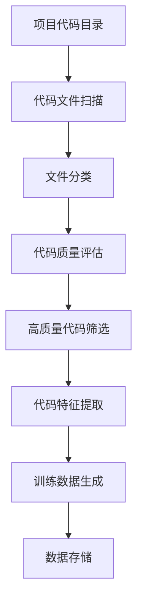
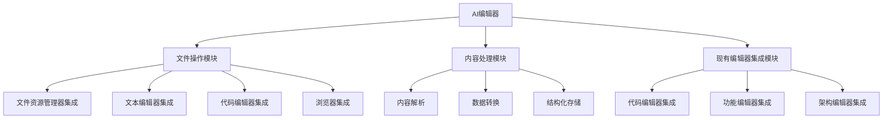

# 项目数据处理与AI集成设计文档

## 1. 概述

本文档旨在分析Unified AI Project中当前的Markdown文档处理为训练数据的现状，并扩展功能以支持将项目代码处理为训练数据。同时，探讨如何让项目更好地使用终端以及相应的安全机制设计。此外，还将设计AI编辑器功能，使AI能够利用计算机中的软件打开和管理文件。还将集成项目中现有的编辑器相关功能。

## 2. 当前数据处理现状分析

### 2.1 Markdown文档处理现状

当前项目中存在专门处理Markdown文档为训练数据的流程：

1. **概念模型训练数据生成**：
   - `tools/prepare_concept_models_training_data.py`：从项目文档创建训练样本
   - `tools/generate_minimal_training_data.py`：创建最小化训练数据用于测试

2. **数据管理器**：
   - `training/data_manager.py`：负责自动检测、分类和处理训练数据，支持多种数据类型（文本、代码、图像等）

### 2.2 当前代码处理现状

项目中存在一些处理代码为训练数据的功能，但尚未形成完整的体系：

1. **数据分类支持**：
   - DataManager支持代码文件分类（`.py`, `.js`, `.java`, `.cpp`等）
   - 可以评估代码质量，包括行数、注释比例、代码行长度等指标

2. **模型数据映射**：
   - `code_model`明确映射到`code`类型数据
   - 其他概念模型也支持代码类型数据

## 3. 扩展功能设计

### 3.1 将项目代码处理为训练数据

#### 3.1.1 功能需求

1. 提取项目中的源代码文件
2. 分析代码结构和内容
3. 将代码转换为适合训练的格式
4. 生成专门针对代码模型的训练数据

#### 3.1.2 设计方案



#### 3.1.3 实现细节

1. **代码扫描模块**：
   - 扩展`training/data_manager.py`中的文件扫描功能
   - 增加对项目代码目录的专门处理

2. **代码特征提取**：
   - 提取函数/方法定义
   - 提取类定义和继承关系
   - 提取注释和文档字符串
   - 提取代码依赖关系

3. **训练数据格式**：
   ```json
   {
     "id": "code_sample_001",
     "source_file": "path/to/file.py",
     "code_snippet": "def example_function():\n    pass",
     "language": "python",
     "type": "function_definition",
     "comments": "This is an example function",
     "dependencies": ["import os", "import sys"],
     "metadata": {
       "line_count": 2,
       "complexity": "low"
     }
   }
   ```

### 3.2 终端集成设计

#### 3.2.1 当前终端使用情况

项目中已存在一些终端集成功能：

1. **CLI工具**：
   - `cli/main.py`：统一命令行界面
   - 支持开发环境管理、测试、Git操作等

2. **执行监控**：
   - `execution_monitor.py`：监控终端响应性和进程状态
   - `execution_manager.py`：统一执行监控和管理系统

#### 3.2.2 增强终端集成方案

1. **统一终端接口**：
   - 扩展CLI工具，增加数据处理相关命令
   - 提供训练数据生成、质量评估等命令

2. **交互式终端模式**：
   - 实现交互式数据处理界面
   - 支持实时查看处理进度和结果

### 3.3 AI编辑器设计

#### 3.3.1 功能需求

1. 通过编辑器打开文件资源管理器并整理文件
2. 通过编辑器打开Markdown文件并编辑
3. 通过编辑器打开Python文件并编辑代码
4. 通过编辑器打开记事本并编辑文本
5. 通过编辑器打开浏览器并使用搜索功能
6. 将软件内容处理成AI能理解的数据格式
7. 集成项目中现有的编辑器功能（代码编辑器、功能编辑器、架构编辑器）

#### 3.3.2 设计方案



#### 3.3.3 实现细节

1. **文件操作模块**：
   - 集成系统文件资源管理器，支持文件浏览和管理
   - 集成文本编辑器（如记事本）用于简单文本编辑
   - 集成代码编辑器用于代码文件编辑
   - 集成浏览器用于网络搜索和网页浏览

2. **现有编辑器集成模块**：
   - 集成项目中现有的代码编辑器（位于`apps/frontend-dashboard/src/app/quest/code-editor/`）
   - 集成项目中现有的功能编辑器（位于`apps/frontend-dashboard/src/app/quest/function-editor/`）
   - 集成项目中现有的架构编辑器（位于`apps/frontend-dashboard/src/app/quest/architecture-editor/`）
   - 提供统一的API接口访问这些编辑器功能

3. **内容处理模块**：
   - 解析不同软件的内容格式
   - 将内容转换为AI可理解的结构化数据
   - 存储处理后的数据用于训练或其他AI任务

4. **数据格式**：
   ```json
   {
     "id": "content_sample_001",
     "source": "notepad",
     "content": "这是从记事本中提取的文本内容",
     "type": "text",
     "metadata": {
       "extraction_time": "2025-04-05T10:30:00Z",
       "source_app": "notepad.exe",
       "file_path": "C:\\temp\\example.txt"
     }
   }
   ```

#### 3.3.4 现有编辑器功能集成设计

##### 3.3.4.1 集成需求

1. **代码编辑器集成**：
   - 支持多种编程语言的代码编辑（TypeScript, JavaScript, Python, HTML, CSS, JSON, Markdown等）
   - 提供项目管理功能，支持创建、编辑、保存代码文件
   - 支持代码文件的搜索和过滤功能

2. **功能编辑器集成**：
   - 支持AI功能的创建、编辑和管理
   - 提供参数定义和功能实现编辑功能
   - 支持功能测试和示例管理

3. **架构编辑器集成**：
   - 支持系统架构的可视化设计
   - 提供模块节点的创建、编辑和连接功能
   - 支持架构配置的保存和导出

##### 3.3.4.2 集成方案

1. **适配器模式**：
   - 为每个现有编辑器开发适配器，将其功能封装为统一接口
   - 适配器负责处理AI编辑器与现有编辑器之间的数据转换和通信

2. **统一API接口**：
   - 提供统一的RESTful API接口访问所有编辑器功能
   - 实现基于角色的访问控制，确保安全访问

3. **数据同步机制**：
   - 实现编辑器状态的实时同步
   - 提供数据持久化和版本控制功能

##### 3.3.4.3 实现细节

1. **代码编辑器适配器**：
   - 封装文件操作功能（创建、读取、保存、删除）
   - 提供代码内容的获取和更新接口
   - 支持项目级别的操作（创建、切换、删除项目）

2. **功能编辑器适配器**：
   - 封装AI功能的CRUD操作
   - 提供参数管理和功能测试接口
   - 支持功能分类和搜索功能

3. **架构编辑器适配器**：
   - 封装模块节点的管理功能
   - 提供连接线的创建和删除接口
   - 支持架构配置的导入和导出

4. **统一访问接口**：
   ```javascript
   // 统一编辑器访问接口示例
   const editorAPI = {
     codeEditor: {
       listProjects: () => Promise<Project[]>,
       createProject: (projectData) => Promise<Project>,
       updateProject: (projectId, projectData) => Promise<Project>,
       deleteProject: (projectId) => Promise<boolean>,
       listFiles: (projectId) => Promise<CodeFile[]>,
       updateFile: (fileId, content) => Promise<CodeFile>
     },
     functionEditor: {
       listFunctions: () => Promise<AIFunction[]>,
       createFunction: (functionData) => Promise<AIFunction>,
       updateFunction: (functionId, functionData) => Promise<AIFunction>,
       deleteFunction: (functionId) => Promise<boolean>,
       testFunction: (functionId, testData) => Promise<TestResult>
     },
     architectureEditor: {
       listArchitectures: () => Promise<ArchitectureConfig[]>,
       createArchitecture: (configData) => Promise<ArchitectureConfig>,
       updateArchitecture: (configId, configData) => Promise<ArchitectureConfig>,
       deleteArchitecture: (configId) => Promise<boolean>,
       exportArchitecture: (configId) => Promise<Blob>
     }
   };
   ```

#### 3.3.4.4 模型到编辑器数据流设计

1. **数据流向**：
   - 模型训练结果 → 后端API → 前端编辑器
   - AI生成内容 → 编辑器显示和编辑
   - 编辑器修改内容 → 模型再训练

2. **数据格式转换**：
   - 模型输出标准化为JSON格式
   - 编辑器接收并解析JSON数据
   - 编辑器修改后数据序列化为训练数据格式

3. **实时同步机制**：
   - 使用WebSocket实现实时数据同步
   - 编辑器状态变更即时通知相关模型
   - 模型更新即时反映到编辑器界面

#### 3.3.4.5 编辑器与项目结合细节

1. **项目结构映射**：
   - 编辑器节点与项目模块一一对应
   - 模块间关系通过连接线表示
   - 支持项目模块的增删改查操作

2. **数据持久化**：
   - 编辑器配置保存到项目配置文件
   - 架构设计图导出为JSON格式
   - 支持项目级别的导入导出功能

3. **版本控制集成**：
   - 编辑器变更记录到Git版本控制
   - 支持架构设计的历史版本回溯
   - 提供变更差异对比功能

## 4. 安全机制设计

### 4.1 数据处理安全

#### 4.1.1 代码处理安全

1. **沙箱执行**：
   - 使用`sandbox_executor.py`在隔离环境中执行代码分析
   - 限制代码执行时间和资源使用

2. **内容过滤**：
   - 过滤敏感信息（密码、密钥等）
   - 移除个人信息和隐私数据

#### 4.1.2 数据存储安全

1. **访问控制**：
   - 限制对训练数据的访问权限
   - 实施基于角色的访问控制

2. **数据加密**：
   - 对敏感训练数据进行加密存储
   - 使用安全的密钥管理机制

### 4.2 终端安全

#### 4.2.1 命令执行安全

1. **输入验证**：
   - 对所有终端输入进行严格验证
   - 防止命令注入攻击

2. **权限控制**：
   - 实施最小权限原则
   - 限制危险命令的执行

#### 4.2.2 执行监控安全

1. **资源监控**：
   - 监控CPU、内存、磁盘使用情况
   - 防止资源耗尽攻击

2. **终端状态监控**：
   - 检测终端无响应或卡住状态
   - 自动恢复机制

### 4.3 编辑器安全

#### 4.3.1 文件访问安全

1. **访问权限控制**：
   - 限制AI编辑器对文件系统的访问权限
   - 实施基于路径的访问控制策略

2. **内容安全检查**：
   - 检查打开文件的内容安全性
   - 防止执行恶意代码

#### 4.3.2 系统集成安全

1. **应用调用安全**：
   - 限制可调用的外部应用程序
   - 验证应用程序调用参数

2. **数据传输安全**：
   - 确保在不同应用程序间传输数据的安全性
   - 实施数据完整性校验

## 5. 实施计划

### 5.1 阶段一：代码处理功能实现

1. 扩展`training/data_manager.py`以支持项目代码扫描
2. 实现代码特征提取模块
3. 开发代码训练数据生成器

### 5.2 阶段二：终端集成增强

1. 扩展CLI工具，添加数据处理命令
2. 实现交互式终端模式
3. 集成执行监控功能

### 5.3 阶段三：AI编辑器实现

1. 开发文件操作模块，集成文件资源管理器、文本编辑器、代码编辑器和浏览器
2. 实现内容处理模块，支持内容解析和数据转换
3. 开发数据存储和管理功能
4. 集成现有编辑器功能（代码编辑器、功能编辑器、架构编辑器）
   - 开发现有编辑器适配器
   - 实现统一API接口
   - 集成代码编辑器功能
   - 集成功能编辑器功能
   - 集成架构编辑器功能
5. 实现模型到编辑器数据流
   - 开发数据格式转换模块
   - 实现实时同步机制
   - 集成WebSocket通信功能
6. 完善编辑器与项目结合细节
   - 实现项目结构映射功能
   - 开发数据持久化机制
   - 集成版本控制功能

### 5.4 阶段四：安全机制实施

1. 实施代码处理安全措施
2. 增强终端执行安全
3. 实施数据存储安全机制
4. 实施编辑器安全机制

## 6. 测试策略

### 6.1 单元测试

1. 代码扫描功能测试
2. 特征提取模块测试
3. 训练数据生成器测试
4. 文件操作模块测试
5. 内容处理模块测试

### 6.2 集成测试

1. CLI工具集成测试
2. 终端交互测试
3. 编辑器功能集成测试
4. 现有编辑器功能集成测试
   - 代码编辑器适配器测试
   - 功能编辑器适配器测试
   - 架构编辑器适配器测试
   - 统一API接口测试
5. 模型到编辑器数据流测试
   - 数据格式转换测试
   - 实时同步机制测试
   - WebSocket通信测试
6. 编辑器与项目结合细节测试
   - 项目结构映射测试
   - 数据持久化测试
   - 版本控制集成测试
7. 安全机制测试

### 6.3 性能测试

1. 大规模代码库处理性能测试
2. 终端响应性能测试
3. 资源使用监控测试
4. 编辑器操作性能测试
5. 现有编辑器功能集成性能测试
   - 适配器响应时间测试
   - 统一接口并发访问测试
   - 数据同步性能测试
6. 模型到编辑器数据流性能测试
   - 数据转换性能测试
   - 实时同步延迟测试
   - WebSocket通信性能测试
7. 编辑器与项目结合性能测试
   - 项目结构映射性能测试
   - 数据持久化性能测试
   - 版本控制操作性能测试