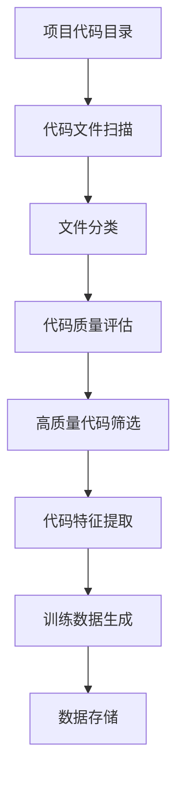

# 项目数据处理与终端集成设计文档

## 1. 概述

本文档旨在分析Unified AI Project中当前的Markdown文档处理为训练数据的现状，并扩展功能以支持将项目代码处理为训练数据。同时，探讨如何让项目更好地使用终端以及相应的安全机制设计。

## 2. 当前数据处理现状分析

### 2.1 Markdown文档处理现状

当前项目中存在专门处理Markdown文档为训练数据的流程：

1. **文档处理脚本**：
   - `scripts/data_processing/process_copilot_logs.py`：处理Copilot活动历史CSV文件，提取相关数据并过滤
   - `scripts/data_processing/ingest_processed_logs_to_ham.py`：将处理后的对话数据存入HAMMemoryManager

2. **概念模型训练数据生成**：
   - `tools/prepare_concept_models_training_data.py`：从项目文档创建训练样本
   - `tools/generate_minimal_training_data.py`：创建最小化训练数据用于测试

3. **数据管理器**：
   - `training/data_manager.py`：负责自动检测、分类和处理训练数据，支持多种数据类型（文本、代码、图像等）

### 2.2 当前代码处理现状

项目中存在一些处理代码为训练数据的功能，但尚未形成完整的体系：

1. **数据分类支持**：
   - DataManager支持代码文件分类（`.py`, `.js`, `.java`, `.cpp`等）
   - 可以评估代码质量，包括行数、注释比例、代码行长度等指标

2. **模型数据映射**：
   - `code_model`明确映射到`code`类型数据
   - 其他概念模型也支持代码类型数据

## 3. 扩展功能设计

### 3.1 将项目代码处理为训练数据

#### 3.1.1 功能需求

1. 提取项目中的源代码文件
2. 分析代码结构和内容
3. 将代码转换为适合训练的格式
4. 生成专门针对代码模型的训练数据

#### 3.1.2 设计方案



#### 3.1.3 实现细节

1. **代码扫描模块**：
   - 扩展`training/data_manager.py`中的文件扫描功能
   - 增加对项目代码目录的专门处理

2. **代码特征提取**：
   - 提取函数/方法定义
   - 提取类定义和继承关系
   - 提取注释和文档字符串
   - 提取代码依赖关系

3. **训练数据格式**：
   ```json
   {
     "id": "code_sample_001",
     "source_file": "path/to/file.py",
     "code_snippet": "def example_function():\n    pass",
     "language": "python",
     "type": "function_definition",
     "comments": "This is an example function",
     "dependencies": ["import os", "import sys"],
     "metadata": {
       "line_count": 2,
       "complexity": "low"
     }
   }
   ```

### 3.2 终端集成设计

#### 3.2.1 当前终端使用情况

项目中已存在一些终端集成功能：

1. **CLI工具**：
   - `cli/main.py`：统一命令行界面
   - 支持开发环境管理、测试、Git操作等

2. **执行监控**：
   - `execution_monitor.py`：监控终端响应性和进程状态
   - `execution_manager.py`：统一执行监控和管理系统

#### 3.2.2 增强终端集成方案

1. **统一终端接口**：
   - 扩展CLI工具，增加数据处理相关命令
   - 提供训练数据生成、质量评估等命令

2. **交互式终端模式**：
   - 实现交互式数据处理界面
   - 支持实时查看处理进度和结果

## 4. 安全机制设计

### 4.1 数据处理安全

#### 4.1.1 代码处理安全

1. **沙箱执行**：
   - 使用`sandbox_executor.py`在隔离环境中执行代码分析
   - 限制代码执行时间和资源使用

2. **内容过滤**：
   - 过滤敏感信息（密码、密钥等）
   - 移除个人信息和隐私数据

#### 4.1.2 数据存储安全

1. **访问控制**：
   - 限制对训练数据的访问权限
   - 实施基于角色的访问控制

2. **数据加密**：
   - 对敏感训练数据进行加密存储
   - 使用安全的密钥管理机制

### 4.2 终端安全

#### 4.2.1 命令执行安全

1. **输入验证**：
   - 对所有终端输入进行严格验证
   - 防止命令注入攻击

2. **权限控制**：
   - 实施最小权限原则
   - 限制危险命令的执行

#### 4.2.2 执行监控安全

1. **资源监控**：
   - 监控CPU、内存、磁盘使用情况
   - 防止资源耗尽攻击

2. **终端状态监控**：
   - 检测终端无响应或卡住状态
   - 自动恢复机制

## 5. 实施计划

### 5.1 阶段一：代码处理功能实现

1. 扩展`training/data_manager.py`以支持项目代码扫描
2. 实现代码特征提取模块
3. 开发代码训练数据生成器

### 5.2 阶段二：终端集成增强

1. 扩展CLI工具，添加数据处理命令
2. 实现交互式终端模式
3. 集成执行监控功能

### 5.3 阶段三：安全机制实施

1. 实施代码处理安全措施
2. 增强终端执行安全
3. 实施数据存储安全机制

## 6. 测试策略

### 6.1 单元测试

1. 代码扫描功能测试
2. 特征提取模块测试
3. 训练数据生成器测试

### 6.2 集成测试

1. CLI工具集成测试
2. 终端交互测试
3. 安全机制测试

### 6.3 性能测试

1. 大规模代码库处理性能测试
2. 终端响应性能测试
3. 资源使用监控测试


