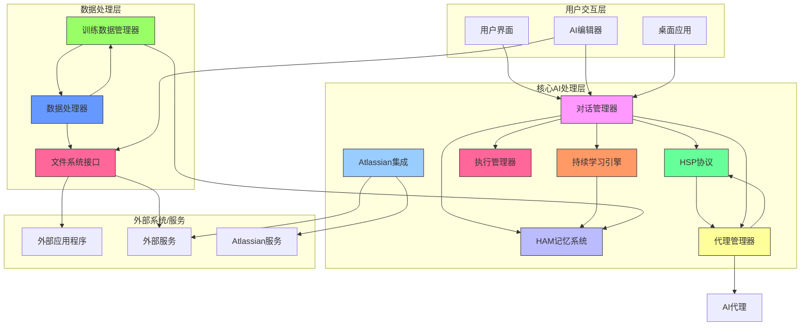
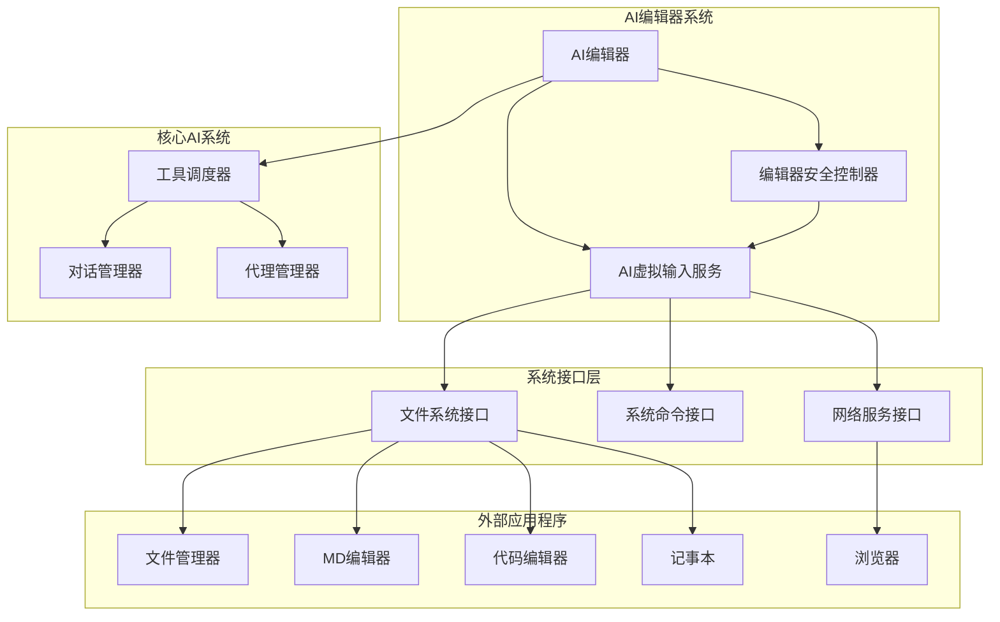
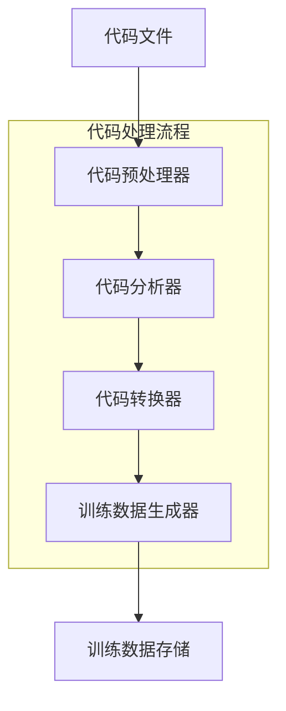
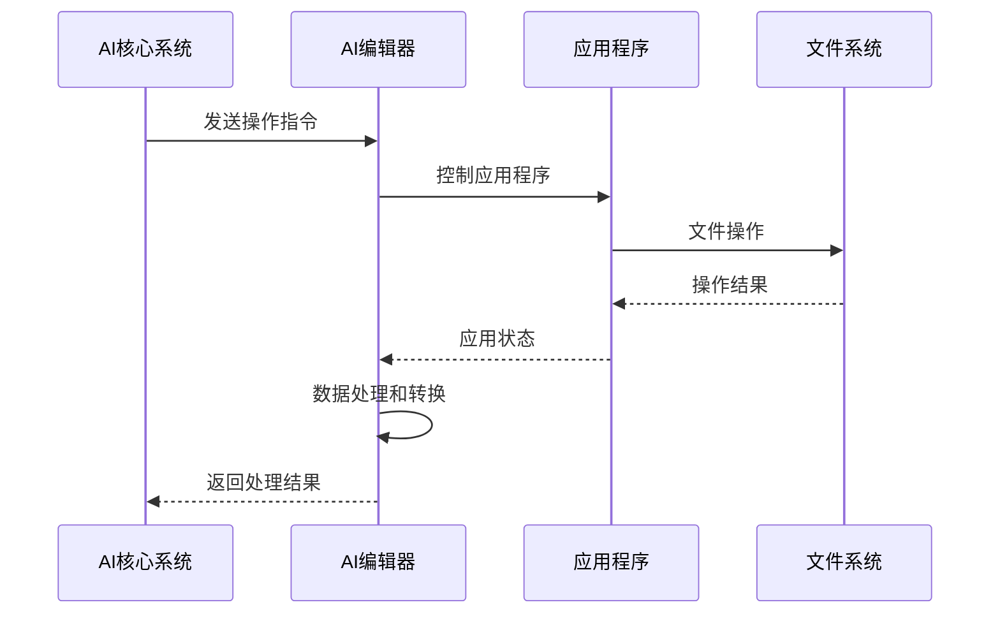
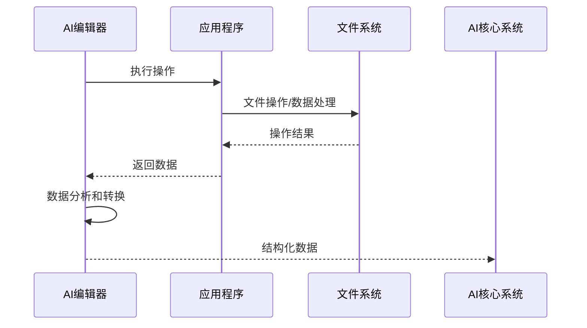
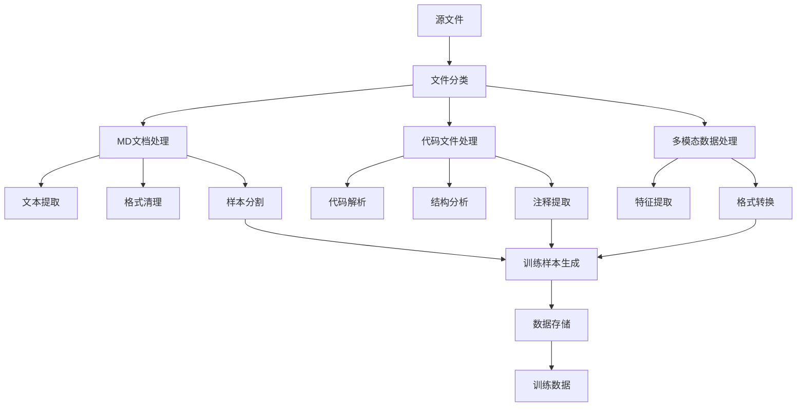
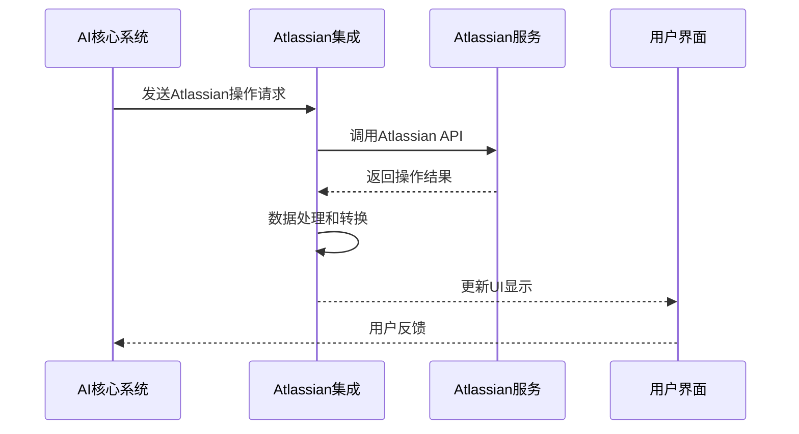

# 项目功能扩展与编辑器集成设计文档

## 1. 概述

本文档旨在设计和规划Unified-AI-Project的功能扩展，特别是增强项目中将项目MD文档和代码处理成训练数据的能力，集成AI编辑器功能，以及设计相应的安全机制。该设计将涵盖编辑器与系统软件的集成、数据处理流程、安全控制以及与现有AI系统的整合。

### 1.1 项目背景

Unified-AI-Project是一个综合性的AI系统，包含多个核心组件：
- HAM记忆系统：用于分层抽象记忆管理
- HSP协议：实现内部模块与外部AI实体的高速通信
- 多LLM服务：提供多种大语言模型的统一访问
- 代理管理器：负责动态启动、监控和管理专用AI代理
- 训练数据管理系统：自动化处理和管理训练数据
- 执行管理器：统一的执行监控和管理
- Atlassian集成：与Confluence、Jira等Atlassian产品的集成

### 1.2 设计目标

1. 增强训练数据处理能力，支持将项目MD文档和代码文件处理成训练数据
2. 集成AI编辑器，使AI能够通过编辑器操作系统的软件（文件管理器、MD编辑器、代码编辑器、记事本、浏览器等）
3. 设计完善的安全机制，确保AI操作的安全性
4. 实现编辑器与项目AI系统的深度集成
5. 建立清晰的数据流和返回数据流机制
6. 补充和完善项目中的交互层、测试层和训练层
7. 整合项目中现有的各组件，确保系统的一致性和完整性
8. 加强系统监控和性能优化能力

## 2. 系统架构

### 2.1 整体架构

### 2.2 编辑器集成架构

## 3. 功能设计

### 3.1 训练数据处理增强

#### 3.1.1 MD文档处理增强

当前系统已经具备将项目MD文档处理成训练数据的能力，通过`prepare_concept_models_training_data.py`脚本实现。该脚本的主要功能包括：
- 从Markdown文件中提取纯文本内容
- 移除Markdown格式符号（代码块、链接、图片、标题等）
- 将长文本分割成较小的段落作为训练样本
- 生成专门的训练数据（环境模拟器、因果推理、自适应学习等）

增强功能将包括：
1. 改进文本提取算法，更好地保留文档结构信息
2. 增加对更多Markdown元素的支持
3. 优化训练样本分割策略，提高训练效果

#### 3.1.2 代码文件处理

新增代码文件处理功能，将项目中的代码文件处理成训练数据：

主要处理步骤：
1. 代码预处理器：读取代码文件，识别编程语言类型
2. 代码分析器：分析代码结构，提取函数、类、注释等信息
3. 代码转换器：将代码转换为适合训练的格式
4. 训练数据生成器：生成训练样本，包括代码片段和相关注释

#### 3.1.3 多模态数据处理

系统还支持处理多种类型的数据：
- 图像数据：支持JPG、PNG、GIF等格式
- 音频数据：支持WAV、MP3、FLAC等格式
- 视频数据：支持MP4、AVI、MOV等格式
- 文档数据：支持PDF、DOC、PPT等格式
- 数据文件：支持CSV、JSON、XML等格式

### 3.2 AI编辑器集成

#### 3.2.1 编辑器核心功能

AI编辑器将具备以下核心功能：
1. 文件操作：创建、打开、编辑、保存、删除文件
2. 应用程序控制：启动和控制外部应用程序
3. 系统命令执行：执行系统命令和脚本
4. 数据处理：处理应用程序中的数据并转换为AI可理解的格式

#### 3.2.2 与系统软件集成

编辑器将能够与以下系统软件集成：
- 文件管理器：浏览、管理和组织文件系统
- MD编辑器：编辑Markdown文档
- 代码编辑器：编写和修改代码
- 记事本：简单的文本编辑
- 浏览器：网络搜索和信息获取

#### 3.2.3 数据处理能力

编辑器将具备将软件内容处理成AI能理解的数据的功能：
1. 屏幕内容分析：分析应用程序界面内容
2. 数据提取：从应用程序中提取结构化数据
3. 格式转换：将提取的数据转换为标准格式
4. 语义理解：理解数据的含义和上下文

### 3.3 Atlassian集成

系统具备与Atlassian产品的深度集成能力：
1. Confluence集成：能够访问和操作Confluence空间和页面
2. Jira集成：能够管理和操作Jira项目和问题
3. Rovo Dev集成：能够与Rovo Dev代理和任务进行交互
4. 数据同步：实现与Atlassian云服务的数据同步

### 3.4 安全机制设计

#### 3.4.1 权限控制

实现多层次权限控制：
1. 操作权限：控制AI可以执行的操作类型
2. 文件权限：控制AI可以访问的文件和目录
3. 网络权限：控制AI可以访问的网络资源
4. 应用权限：控制AI可以启动和控制的应用程序

#### 3.4.2 操作审计

记录所有AI操作：
1. 操作日志：记录所有执行的操作
2. 文件变更日志：记录文件的创建、修改和删除
3. 系统命令日志：记录执行的系统命令
4. 安全事件日志：记录安全相关的事件

#### 3.4.3 沙箱环境

为AI操作提供沙箱环境：
1. 隔离文件系统：限制AI对文件系统的访问
2. 限制系统命令：限制AI可以执行的系统命令
3. 网络隔离：限制AI的网络访问
4. 资源限制：限制AI使用的系统资源

## 4. 数据流设计

### 4.1 项目模型到编辑器的数据流

### 4.2 编辑器返回数据流

### 4.3 训练数据处理流程

### 4.4 Atlassian集成数据流

## 5. 系统层次分析

### 5.1 交互层

当前项目在交互层方面相对完善，已有以下组件：
1. Web仪表板：提供图形化用户界面
2. 桌面应用：提供桌面客户端
3. CLI工具：提供命令行接口
4. AI编辑器：新增的交互组件

建议增强：
1. 统一各交互层的用户体验
2. 增强AI编辑器的功能
3. 实现跨平台一致性
4. 加强Atlassian集成界面

### 5.2 测试层

项目已具备较完善的测试层：
1. 单元测试：针对各模块的单元测试
2. 集成测试：测试模块间的集成
3. 系统测试：测试整个系统的功能
4. 性能测试：测试系统性能

建议增强：
1. 增加AI编辑器的测试用例
2. 增加安全机制的测试
3. 增加训练数据处理的测试
4. 增加Atlassian集成测试

### 5.3 训练层

项目已具备较完善的训练层：
1. 数据管理器：自动检测、分类和处理训练数据
2. 自动训练管理器：自动化训练流程
3. 增量学习管理器：支持增量学习
4. 协作训练管理器：支持模型间协作训练

建议增强：
1. 增加代码文件处理能力
2. 优化训练数据质量评估
3. 增强训练过程监控
4. 增加多模态数据训练支持

### 5.4 监控层

项目具备完善的监控能力：
1. 系统健康监控：监控各服务的运行状态
2. 性能监控：监控系统资源使用情况
3. 执行监控：监控任务执行状态
4. Atlassian集成监控：监控与Atlassian服务的连接状态

建议增强：
1. 增加AI代理监控
2. 增强实时性能分析
3. 加强错误追踪和报告

### 5.5 安全层

项目具备基础的安全机制：
1. 权限控制：控制AI操作权限
2. 操作审计：记录AI操作日志
3. 沙箱环境：隔离AI操作

建议增强：
1. 增加数据加密功能
2. 加强网络安全防护
3. 实现更细粒度的权限控制
4. 增加安全事件响应机制

## 6. 实施计划

### 6.1 阶段一：增强训练数据处理（2周）

1. 改进MD文档处理算法
2. 实现代码文件处理功能
3. 优化训练样本生成策略
4. 增加处理过程的测试用例

### 6.2 阶段二：AI编辑器核心功能开发（3周）

1. 实现基础文件操作功能
2. 实现应用程序控制功能
3. 实现系统命令执行功能
4. 实现数据处理和转换功能

### 6.3 阶段三：Atlassian集成开发（2周）

1. 实现Confluence集成
2. 实现Jira集成
3. 实现Rovo Dev集成
4. 增加集成测试用例

### 6.4 阶段四：安全机制实现（2周）

1. 实现权限控制系统
2. 实现操作审计功能
3. 实现沙箱环境
4. 增加安全测试用例

### 6.5 阶段五：系统集成和测试（4周）

1. 集成各组件
2. 进行端到端测试
3. 优化性能
4. 完善文档
5. 进行用户验收测试

## 7. 风险评估和缓解措施

### 7.1 技术风险

1. **AI编辑器与应用程序集成复杂性**
   - 风险：不同应用程序的接口和行为差异较大
   - 缓解：采用标准化接口，提供适配器模式

2. **安全机制实现难度**
   - 风险：安全机制可能影响系统性能
   - 缓解：采用轻量级安全机制，提供配置选项

3. **Atlassian集成复杂性**
   - 风险：Atlassian API变化可能导致集成失效
   - 缓解：实现抽象层，便于适配API变化

### 7.2 进度风险

1. **功能开发时间超出预期**
   - 风险：项目延期
   - 缓解：采用敏捷开发方法，分阶段交付

2. **测试发现问题较多**
   - 风险：修复时间不可控
   - 缓解：提前进行单元测试，持续集成

### 7.3 运维风险

1. **系统监控不足**
   - 风险：问题发现不及时
   - 缓解：建立完善的监控体系，设置告警机制

2. **性能瓶颈**
   - 风险：系统在高负载下性能下降
   - 缓解：进行压力测试，优化关键路径

## 8. 总结

本设计文档详细规划了Unified-AI-Project的功能扩展和编辑器集成方案。通过增强训练数据处理能力、集成AI编辑器、设计完善的安全机制，项目将具备更强大的AI能力和更安全的操作环境。实施计划分为五个阶段，预计总共需要13周时间完成。风险评估和缓解措施确保项目能够按时高质量完成。

通过本次设计，我们补充和完善了项目中的各个层次，特别是增加了监控层和安全层，加强了测试层和训练层的功能。同时，通过整合Atlassian集成和执行管理器等组件，确保了系统的完整性和一致性。