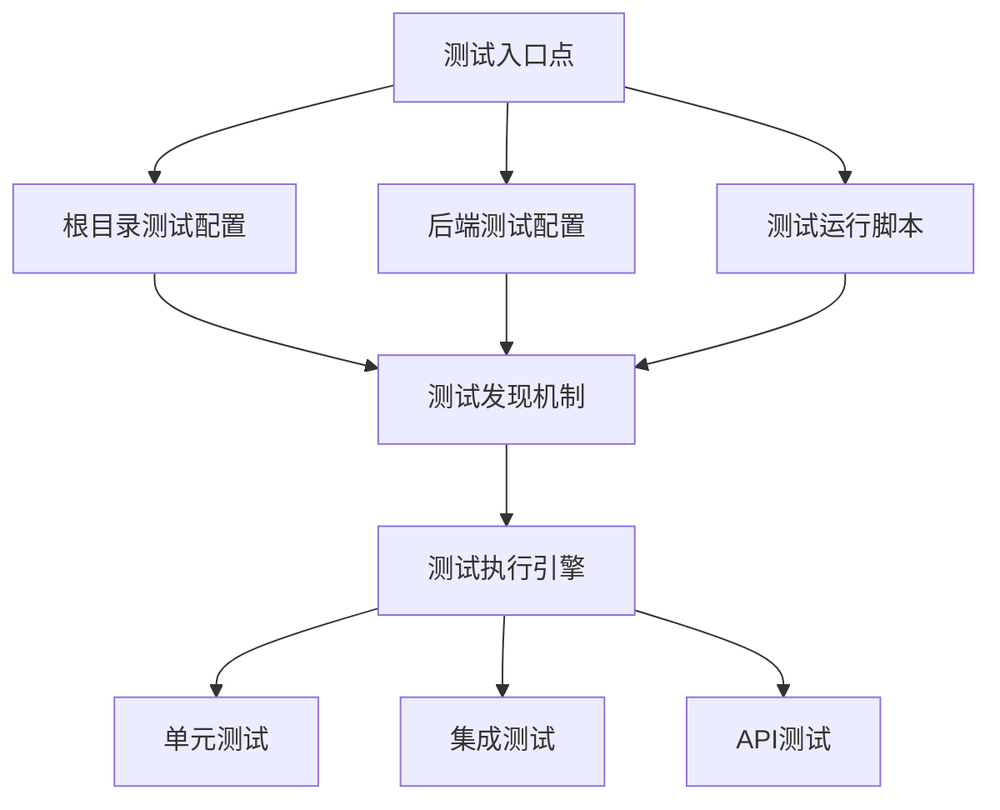
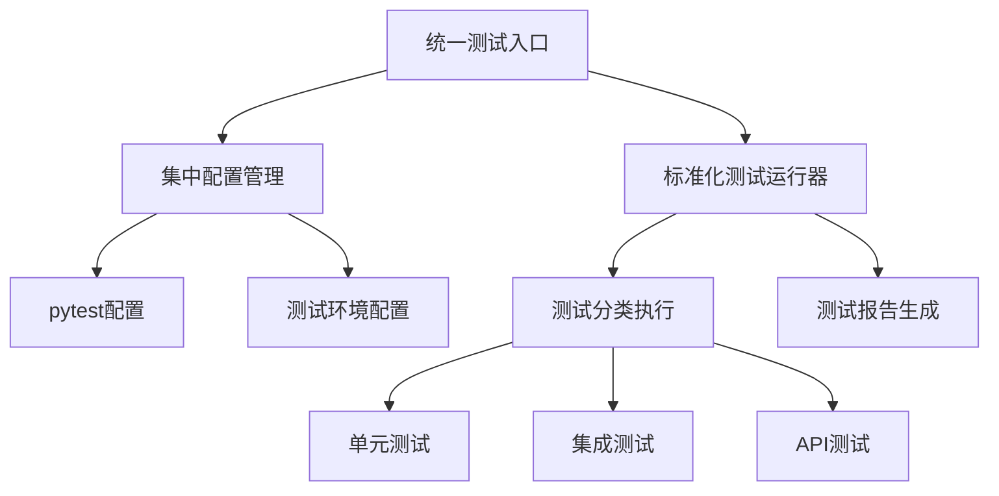

# 项目问题解决设计文档 - 多个测试入口问题

## 1. 概述

### 1.1 问题背景
Unified-AI-Project 项目中存在多个测试入口，导致测试执行混乱、维护困难和资源浪费。这些测试入口包括：
- 根目录的 pytest.ini 配置
- apps/backend 目录下的 pytest.ini 配置
- 多个测试运行脚本（run_backend_tests.bat, run-component-tests.bat 等）
- 不同目录下的测试文件和测试套件

### 1.2 问题影响
1. 测试执行不一致：不同入口可能运行不同的测试集
2. 维护困难：修改测试配置需要在多个地方进行
3. 资源浪费：重复运行相同测试或遗漏测试
4. 团队协作问题：开发人员可能使用不同的测试入口

## 2. 系统架构分析

### 2.1 当前测试架构

### 2.2 现有测试入口分析

| 测试入口 | 位置 | 功能 | 问题 |
|---------|------|------|------|
| pytest.ini (根目录) | ./pytest.ini | 全局测试配置 | 配置分散，与后端配置重复 |
| pytest.ini (后端) | apps/backend/pytest.ini | 后端测试配置 | 与根目录配置重复 |
| run_backend_tests.bat | scripts/run_backend_tests.bat | 后端测试运行器 | 功能重复，维护困难 |
| run-component-tests.bat | apps/backend/run-component-tests.bat | 组件测试运行器 | 与上一个脚本功能重叠 |
| run_test_fixes.bat | apps/backend/run_test_fixes.bat | 测试修复脚本 | 位置不当，功能不明确 |

## 3. 问题详细分析

### 3.1 测试配置重复
项目中存在两个 pytest.ini 配置文件，分别位于根目录和 apps/backend 目录下，造成配置重复和维护困难。

### 3.2 测试运行脚本冗余
存在多个功能相似的测试运行脚本，增加了维护成本和使用复杂度。

### 3.3 测试发现机制不统一
不同测试入口使用不同的测试发现机制，可能导致测试覆盖不完整或重复运行。

## 4. 解决方案设计

### 4.1 设计目标
1. 统一测试入口：提供单一、明确的测试运行方式
2. 简化配置管理：集中管理测试配置
3. 提高可维护性：减少重复代码和配置
4. 增强可扩展性：支持未来测试需求的扩展

### 4.2 解决方案架构

### 4.3 具体改进措施

#### 4.3.1 统一测试配置
- 保留并完善根目录的 pytest.ini 作为全局配置
- 移除 apps/backend/pytest.ini，将其配置合并到根目录配置中
- 在根目录配置中添加后端特定的配置选项

#### 4.3.2 整合测试运行脚本
- 保留 scripts/run_backend_tests.bat 作为主要测试运行器
- 移除 apps/backend/run-component-tests.bat，将其功能整合到主运行器中
- 更新 apps/backend/run_test_fixes.bat 的位置和功能

#### 4.3.3 标准化测试目录结构
- 统一测试目录结构，明确各类型测试的位置
- 建立清晰的测试命名规范
- 提供测试分类标记（markers）以支持选择性运行

## 5. 实施计划

### 5.1 第一阶段：配置整合
1. 分析现有两个 pytest.ini 文件的差异
2. 将后端配置合并到根目录配置中
3. 更新测试路径配置以兼容新的结构
4. 验证配置合并后的测试发现机制

### 5.2 第二阶段：脚本整合
1. 分析 run_backend_tests.bat 和 run-component-tests.bat 的功能差异
2. 将组件测试功能整合到 run_backend_tests.bat 中
3. 更新脚本参数以支持所有原有功能
4. 移除冗余的 run-component-tests.bat 脚本

### 5.3 第三阶段：目录结构调整
1. 重新组织测试目录结构
2. 更新测试文件的导入路径
3. 验证所有测试能够正常运行
4. 更新相关文档说明

### 5.4 第四阶段：验证和文档更新
1. 全面测试所有测试入口点
2. 验证测试覆盖率是否完整
3. 更新项目文档中的测试说明
4. 编写测试运行指南

## 6. 风险评估与缓解措施

### 6.1 风险识别
| 风险 | 描述 | 影响程度 | 发生概率 |
|------|------|----------|----------|
| 测试失败 | 配置合并可能导致部分测试失败 | 高 | 中 |
| 兼容性问题 | 脚本整合可能影响现有CI/CD流程 | 中 | 高 |
| 遗漏测试 | 目录结构调整可能导致部分测试被遗漏 | 高 | 低 |

### 6.2 缓解措施
1. 在实施前创建完整备份
2. 逐步实施变更，每次变更后进行充分测试
3. 提供回滚方案以应对严重问题
4. 更新文档以反映变更

## 7. 测试策略

### 7.1 验证测试
- 验证所有现有测试能够正常运行
- 验证新的统一入口能够运行所有测试类型
- 验证测试报告生成功能正常

### 7.2 回归测试
- 运行完整的测试套件确保无功能退化
- 验证CI/CD流程中的测试步骤仍然有效
- 检查开发人员本地测试流程不受影响

## 8. 预期效果

### 8.1 直接收益
1. 减少测试配置文件数量：从2个减少到1个
2. 减少测试运行脚本数量：从3个减少到1个主要脚本
3. 提高测试执行一致性

### 8.2 长期收益
1. 降低维护成本
2. 提高开发效率
3. 减少因测试入口混乱导致的错误