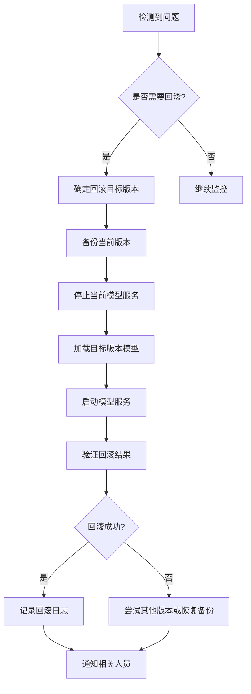

# 模型版本控制与回滚机制设计文档

## 1. 当前实现分析

### 1.1 现有版本管理功能

通过分析代码，我们发现当前系统已经实现了部分版本管理功能：

1. **ModelManager类**：在[incremental_learning_manager.py](file:///d:/Projects/Unified-AI-Project/training/incremental_learning_manager.py)中实现了基础的模型版本管理
2. **版本信息存储**：使用JSON文件[model_versions.json](file:///d:/Projects/Unified-AI-Project/training/model_versions.json)存储模型版本信息
3. **版本保存**：支持保存增量更新的模型版本
4. **版本清理**：支持自动清理旧版本模型

### 1.2 现有实现的不足

1. **缺乏标准化的版本命名规范**：当前版本命名仅使用时间戳，缺乏语义化信息
2. **缺少版本元数据**：没有记录版本的详细信息如性能指标、训练数据、变更说明等
3. **缺乏回滚机制**：没有提供方便的回滚接口和操作流程
4. **缺少版本比较功能**：无法方便地比较不同版本之间的差异
5. **缺少版本标记功能**：没有稳定版本、测试版本等标记机制

## 2. 版本控制规范设计

### 2.1 版本命名规范

我们将采用语义化版本控制规范（Semantic Versioning）并结合时间戳：

```
{模型名称}_v{主版本号}.{次版本号}.{修订号}_{时间戳}.{文件扩展名}
```

示例：
- `concept_models_v1.0.0_20250918_143022.pth`
- `vision_service_v2.1.3_20250918_154501.pth`

版本号含义：
- **主版本号**：重大功能更新或不兼容的API修改时递增
- **次版本号**：向后兼容的功能性新增时递增
- **修订号**：向后兼容的问题修正时递增

### 2.2 版本元数据规范

每个模型版本将包含以下元数据信息：

```json
{
  "version": "v1.0.0_20250918_143022",
  "path": "/path/to/model.pth",
  "created_at": "2025-09-18T14:30:22",
  "model_name": "concept_models",
  "version_type": "release", // release, beta, alpha
  "performance_metrics": {
    "accuracy": 0.95,
    "loss": 0.05,
    "training_time": 3600
  },
  "training_data": {
    "data_count": 1000,
    "data_types": ["text", "json"],
    "data_quality_score": 85
  },
  "change_log": "初始版本发布",
  "tags": ["stable", "production"],
  "dependencies": [],
  "size_bytes": 1024000,
  "hash": "abc123def456"
}
```

### 2.3 版本类型定义

1. **Release版本**：稳定版本，经过充分测试，可用于生产环境
2. **Beta版本**：测试版本，功能相对稳定但可能存在问题
3. **Alpha版本**：开发版本，功能可能不完整，仅用于内部测试

### 2.4 版本标签系统

支持为版本添加标签，便于分类和查找：
- `stable`：稳定版本
- `production`：生产环境使用版本
- `experimental`：实验性版本
- `deprecated`：已废弃版本
- `backup`：备份版本

## 3. 回滚操作流程设计

### 3.1 回滚触发条件

1. **性能下降**：新版本模型性能明显下降
2. **功能异常**：新版本模型出现严重功能问题
3. **用户请求**：用户主动请求回滚到指定版本
4. **自动检测**：系统自动检测到异常并触发回滚

### 3.2 回滚操作流程



### 3.3 回滚策略

1. **快速回滚**：回滚到上一个稳定版本
2. **指定版本回滚**：回滚到用户指定的版本
3. **渐进式回滚**：逐步将流量切换到旧版本

## 4. 实现方案

### 4.1 增强ModelManager类

在现有[ModelManager](file:///d:/Projects/Unified-AI-Project/training/incremental_learning_manager.py#L223-L316)类基础上增加以下功能：

1. **版本比较功能**：比较不同版本的性能指标
2. **版本标记功能**：为版本添加标签
3. **版本查询功能**：按条件查询版本
4. **回滚功能**：实现一键回滚接口

### 4.2 创建VersionControlManager类

创建一个新的版本控制管理器类，专门负责版本控制和回滚操作：

```python
class VersionControlManager:
    def __init__(self, models_dir: str = None):
        self.models_dir = Path(models_dir) if models_dir else MODELS_DIR
        self.version_file = self.models_dir / "model_versions.json"
        self.versions = {}
        self._load_versions()
    
    def create_version(self, model_name: str, model_path: Path, metadata: Dict[str, Any]) -> str:
        """创建新版本"""
        pass
    
    def rollback_to_version(self, model_name: str, version: str) -> bool:
        """回滚到指定版本"""
        pass
    
    def get_version_history(self, model_name: str) -> List[Dict[str, Any]]:
        """获取版本历史"""
        pass
    
    def compare_versions(self, model_name: str, version1: str, version2: str) -> Dict[str, Any]:
        """比较两个版本"""
        pass
    
    def tag_version(self, model_name: str, version: str, tags: List[str]) -> bool:
        """为版本添加标签"""
        pass
```

### 4.3 集成到现有系统

1. 在[CollaborativeTrainingManager](file:///d:/Projects/Unified-AI-Project/training/collaborative_training_manager.py#L33-L180)中集成版本控制功能
2. 在[AutoTrainingManager](file:///d:/Projects/Unified-AI-Project/training/auto_training_manager.py#L36-L180)中集成版本控制功能
3. 在[IncrementalLearningManager](file:///d:/Projects/Unified-AI-Project/training/incremental_learning_manager.py#L223-L316)中增强版本管理功能

## 5. 预期效果

1. **标准化版本管理**：所有模型版本遵循统一的命名和元数据规范
2. **便捷的回滚操作**：提供一键回滚功能，降低回滚操作的复杂度
3. **完善的版本信息**：记录详细的版本元数据，便于问题追踪和分析
4. **灵活的版本查询**：支持按多种条件查询和筛选版本
5. **增强的版本安全性**：通过版本备份和验证机制确保回滚操作的安全性